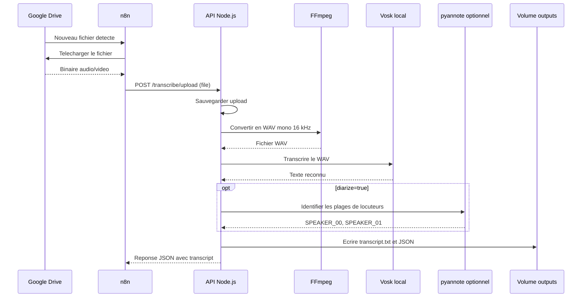
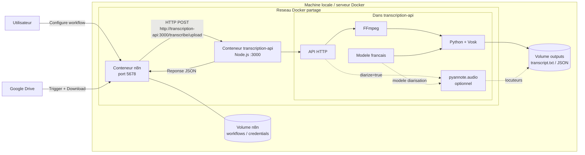
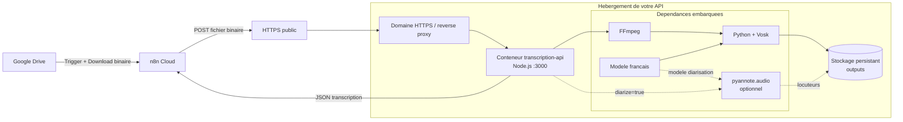

# Architecture de composants

## Vue d'ensemble

```mermaid
flowchart LR
    subgraph Sources["Sources de fichiers"]
        Drive["Google Drive<br/>fichier audio ou video"]
        Local["Fichier local<br/>test curl"]
    end

    subgraph Orchestration["Orchestration"]
        Trigger["Google Drive Trigger"]
        Download["Google Drive Download<br/>binaire"]
        N8N["n8n<br/>local ou cloud"]
        Curl["curl.exe<br/>multipart/form-data"]
    end

    subgraph Service["Conteneur Docker : transcription-api"]
        API["API Node.js<br/>server.js"]
        Upload["Reception fichier<br/>upload.js"]
        Pipeline["Orchestration<br/>transcribe.js"]
        FFmpeg["FFmpeg<br/>audio.js"]
        WAV["WAV mono 16 kHz"]
        VoskLauncher["Lanceur local<br/>localTranscriber.js"]
        Vosk["Vosk + modele francais<br/>vosk_transcribe.py"]
        Diarization["Diarisation optionnelle<br/>pyannote.audio"]
        Results["Resultats<br/>transcript.txt / JSON / metadata"]
    end

    subgraph Storage["Stockage et sortie"]
        Volume["Volume Docker<br/>./outputs"]
        Consumer["n8n / Google Drive / Docs / Email"]
    end

    Drive --> Trigger --> Download --> N8N
    Local --> Curl
    N8N -->|"POST /transcribe/upload<br/>fichier binaire"| API
    Curl -->|"POST /transcribe/upload<br/>fichier binaire"| API
    API --> Upload --> Pipeline
    Pipeline --> FFmpeg --> WAV --> VoskLauncher --> Vosk
    WAV -. "si diarize=true" .-> Diarization
    Vosk --> Results
    Diarization -. "locuteurs" .-> Results
    Results --> Volume
    Results --> API
    API -->|"JSON + transcription"| N8N
    N8N --> Consumer
```

## Flux de traitement

## Vue des conteneurs - n8n local

Dans cette configuration, `n8n` et `transcription-api` sont sur le meme reseau Docker. n8n appelle directement le nom du service `transcription-api`, sans exposer l'API sur Internet.

## Vue des conteneurs - n8n Cloud

Dans cette configuration, seul le conteneur `transcription-api` vous appartient. n8n Cloud envoie le fichier sur une URL HTTPS publique; il n'a pas acces a `localhost` ou aux volumes Docker de votre machine.

## Composants techniques

| Composant | Role | Fichier |
| --- | --- | --- |
| API HTTP | Recoit les appels de test ou de n8n | `src/server.js` |
| Gestion upload | Sauvegarde les fichiers multipart/base64 | `src/upload.js` |
| Pipeline | Orchestre conversion, transcription et sortie | `src/transcribe.js` |
| Conversion audio | Produit un WAV exploitable par Vosk | `src/audio.js` |
| Lanceur moteur | Execute le transcripteur local | `src/localTranscriber.js` |
| Moteur STT | Reconnaissance vocale sans LLM | `scripts/vosk_transcribe.py` |
| Diarisation | Attribution optionnelle des mots aux locuteurs | `scripts/vosk_transcribe.py`, `pyannote.audio` |
| Deploiement | Installe FFmpeg, Vosk et expose l'API | `Dockerfile`, `docker-compose.yml` |
