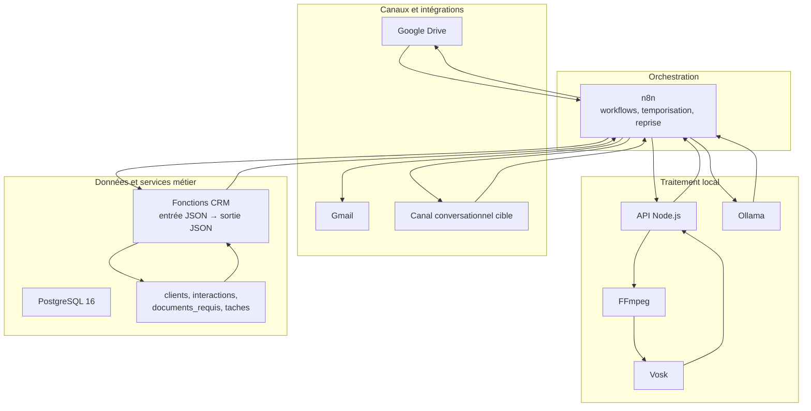
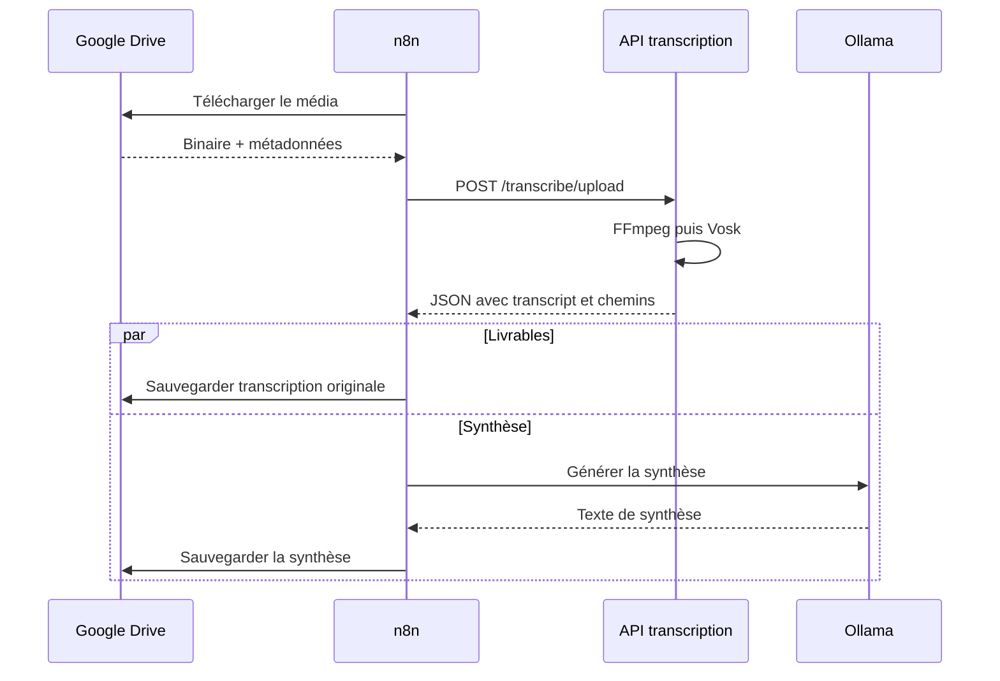
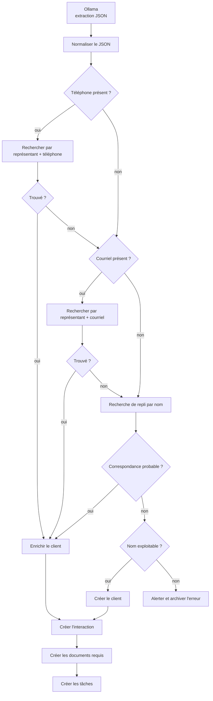
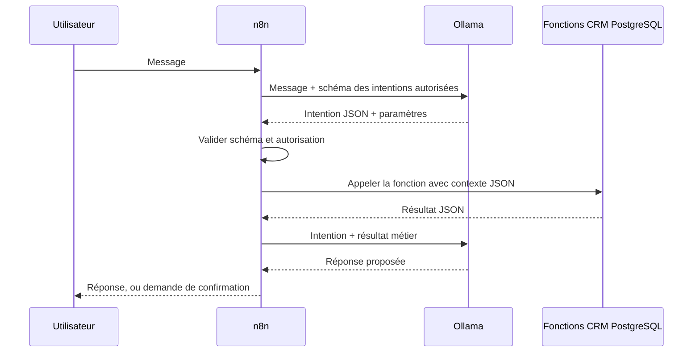

# Architecture v2

## Objectif

L'architecture fait évoluer une chaîne de transcription automatisée vers un
agent conversationnel hypothécaire. Elle conserve les composants locaux déjà
validés et établit trois frontières :

- PostgreSQL porte les services et invariants métier CRM;
- n8n orchestre les appels et les intégrations;
- Ollama comprend les intentions, structure l'information et formule les
  réponses, sans devenir une source de vérité.

## État vérifié dans le dépôt

| Capacité | État | Preuve |
| --- | --- | --- |
| API HTTP de transcription | Existant | `src/server.js`, routes `/health`, `/transcribe`, `/transcribe/upload` |
| Conversion et STT local | Existant | FFmpeg, Vosk, `src/transcribe.js`, `scripts/vosk_transcribe.py` |
| Workflow transcription | Existant | `n8n-workflows/Transcription_Local_2026-06-03-0702.json` |
| Workflow Drive en lot + CRM | Validé et exporté | `n8n-workflows/transcription_local_batch_google_drive.json` |
| Modèle CRM PostgreSQL | Existant | migrations `database/001` à `003` |
| RLS CRM | Existant | `database/002_access_control.sql` |
| Fonctions métier retournant du JSON | Architecture cible | à ajouter dans une migration; actuellement les nœuds n8n exécutent du SQL direct |
| Agent conversationnel multicanal | Feuille de route | non implémenté |

Cette distinction évite de confondre une décision d'architecture avec un
composant déjà déployé.

## Vue des composants



### API de transcription

L'API n'a aucune responsabilité CRM. Elle accepte un chemin local, un fichier
base64 ou un upload multipart, normalise l'audio, lance le transcripteur et
retourne les chemins produits ainsi que le texte. `transcript.txt` demeure la
source humaine; `transcription.json` contient les détails d'exécution et
`metadata.json` les métadonnées techniques.

### Ollama

Ollama intervient à deux niveaux :

- aujourd'hui : synthèse et extraction d'une fiche client JSON depuis la
  transcription;
- cible conversationnelle : classification de l'intention et génération d'une
  réponse fondée sur le résultat JSON des services CRM.

Une sortie Ollama est non fiable par nature. n8n valide sa forme et PostgreSQL
valide les règles métier. Ollama n'accède pas directement aux tables et ne
décide pas seul d'une écriture.

### n8n

n8n gère les déclencheurs, le séquencement, les appels HTTP/SQL, les branches,
les notifications et les erreurs. Il transporte des documents JSON entre les
composants. Il ne doit pas dupliquer les règles de déduplication ou de sécurité
dans plusieurs workflows.

### PostgreSQL

PostgreSQL est à la fois le système d'enregistrement CRM et la couche de services
métier. Les fonctions prévues reçoivent un document JSON, travaillent dans une
transaction, appliquent les contraintes et retournent un document JSON. Les
tables ne sont pas le contrat d'intégration public.

Le modèle actuel contient :

- `app_users` et les rôles `admin`, `representant`, `client`;
- `representants` avec un code métier à dix chiffres commençant par une année;
- `clients`, dédupliqués par représentant + téléphone ou courriel;
- `interactions`, une ligne par appel;
- `documents_requis` et `taches`;
- des politiques RLS sur les tables sensibles.

## Flux de transcription existant



## Flux CRM validé

Le workflow en lot ajoute l'extraction Ollama puis exécute la logique suivante :



Invariants validés :

- aucune création si le nom est vide, `null` ou `undefined`;
- l'ordre d'identification est téléphone, courriel, puis nom comme repli;
- une mise à jour n'efface pas une donnée existante avec une valeur absente;
- chaque appel réussi crée une interaction;
- une extraction incomplète est visible et archivée.

Le workflow actuel implémente ces étapes avec plusieurs nœuds PostgreSQL. La
version cible remplace cette chaîne par un appel atomique, par exemple
`crm.enregistrer_interaction(payload jsonb) returns jsonb`.

## Contrat JSON interne

Tous les échanges métier utilisent une enveloppe versionnée :

```json
{
  "schema_version": "1.0",
  "request_id": "uuid",
  "operation": "crm.enregistrer_interaction",
  "context": {
    "role": "representant",
    "representant_id": "uuid",
    "code_representant": "2026999999"
  },
  "data": {},
  "meta": {
    "source": "n8n",
    "occurred_at": "2026-07-28T12:00:00Z"
  }
}
```

Une réponse de service utilise la même discipline :

```json
{
  "ok": true,
  "operation": "crm.enregistrer_interaction",
  "data": {
    "client_id": "uuid",
    "interaction_id": "uuid",
    "client_action": "updated"
  },
  "warnings": [],
  "error": null
}
```

Le détail est défini dans [docs/SERVICES_POSTGRESQL.md](./docs/SERVICES_POSTGRESQL.md)
et la décision dans [ADR-003](./docs/ADR/ADR-003-json-format-interne.md).

## Flux conversationnel cible



Les opérations sensibles doivent exiger confirmation, être idempotentes lorsque
possible et laisser une trace corrélée par `request_id`.

## Sécurité, fiabilité et observabilité

- n8n transmet le contexte d'accès; les fonctions PostgreSQL appliquent les
  autorisations et la RLS.
- Les secrets restent dans les credentials n8n ou les variables
  d'environnement, jamais dans les exports ou la documentation.
- Toute écriture métier est transactionnelle.
- Les appels rejouables portent une clé d'idempotence.
- Les logs propagent `request_id`, `workflow_execution_id`, `client_id` et
  `interaction_id` lorsque connus.
- La transcription brute et le résultat JSON source sont conservés pour audit.
- Les erreurs techniques peuvent être réessayées; les erreurs de validation
  métier retournent un JSON explicite et ne sont pas masquées par un retry.

## Décisions et documents liés

- [ADR-001 — PostgreSQL comme couche métier](./docs/ADR/ADR-001-postgresql-couche-metier.md)
- [ADR-002 — n8n comme orchestrateur](./docs/ADR/ADR-002-n8n-orchestrateur.md)
- [ADR-003 — JSON comme format interne](./docs/ADR/ADR-003-json-format-interne.md)
- [Workflows n8n](./docs/WORKFLOWS_N8N.md)
- [Feuille de route](./docs/ROADMAP.md)
