# Architecture de la plateforme IA hypothécaire

**Dernière mise à jour :** 2026-08-09

**Statut :** architecture de référence du MVP

**Branche de travail :** `feature/reprise-travaux-crm`

Ce document distingue volontairement :

- l’architecture actuellement implantée et testée;
- les éléments préparés dans le dépôt, mais pas encore déployés;
- l’architecture cible du MVP.

Les sections placées avant l’annexe sont autoritatives. L’annexe conserve les
détails utiles du pipeline historique de transcription.

## Principes d’architecture validés

1. PostgreSQL porte la logique métier CRM.
2. Les fonctions du schéma `crm` constituent l’API interne.
3. Toutes les fonctions métier retournent du `jsonb`.
4. n8n orchestre les services et ne lit pas directement les tables.
5. Ollama reçoit seulement le contexte JSON nécessaire à la réponse.
6. Ollama et les agents IA ne disposent d’aucun accès direct à PostgreSQL.
7. L’identité du représentant doit être contrôlée techniquement par l’API et
   PostgreSQL, jamais par une instruction donnée au modèle.
8. L’interface Web ne communique jamais directement avec PostgreSQL.

## Architecture actuelle implantée

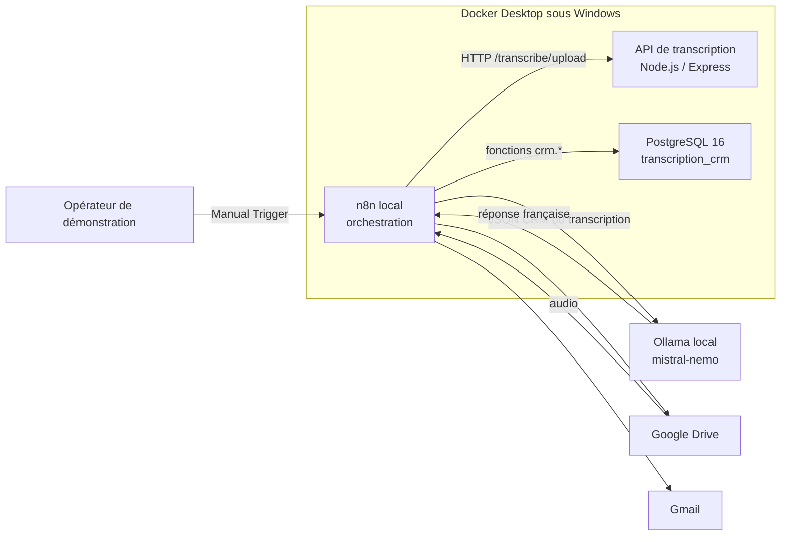

### Composants confirmés

| Composant | État | Responsabilité |
| --- | --- | --- |
| Docker Desktop | Fonctionnel | Exécution locale des conteneurs |
| `transcription-api` | Fonctionnel | Conversion audio et transcription locale |
| PostgreSQL `transcription_crm` | Fonctionnel | Données CRM et services métier |
| n8n local | Fonctionnel | Orchestration des workflows |
| Ollama `mistral-nemo` | Fonctionnel | Compréhension et génération en français |
| Workflow de transcription | Existant | Audio vers transcription, synthèse et sorties |
| Workflow CRM `CrmEtatDossierV1` | Validé | Consultation d’un état de dossier et résumé IA |
| Interface Web React | Version MVP construite | Point d’entrée responsive du représentant |
| Authentification API | Non implantée | Identification et autorisation |

## Couche de services PostgreSQL

Les tables restent dans le schéma `public`. Le schéma `crm` expose les services
que n8n, l’API REST et les futurs agents sont autorisés à appeler.

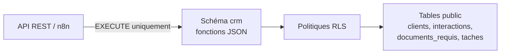

### Services versionnés

| Fonction | Paramètre | Responsabilité |
| --- | --- | --- |
| `crm.rechercher_clients` | `p_terme text` | Recherche par nom, téléphone ou courriel |
| `crm.obtenir_client` | `p_client_id uuid` | Profil complet du client |
| `crm.obtenir_interactions` | `p_client_id uuid` | Historique des interactions |
| `crm.obtenir_documents` | `p_client_id uuid` | Documents requis et documents manquants |
| `crm.obtenir_taches` | `p_client_id uuid` | Tâches et tâches ouvertes |
| `crm.obtenir_etat_dossier` | `p_client_id uuid` | Composition de l’état complet du dossier |
| `crm.obtenir_derniers_clients` | aucun | Dix clients visibles les plus récemment créés |
| `crm.rechercher_clients_agent` | `p_terme text` | Recherche minimisée avec `code_client`, sans UUID |
| `crm.obtenir_documents_client` | `p_code_client text` | Documents d’un client désigné par son code métier |
| `crm.obtenir_taches_client` | `p_code_client text` | Tâches d’un client désigné par son code métier |
| `crm.obtenir_dossier_client` | `p_reference_client text` | Dossier complet visible par code ou nom, sans UUID |

Le contrat de sortie est toujours du `jsonb`. `crm.obtenir_etat_dossier()`
compose les cinq autres services et fournit notamment :

```json
{
  "trouve": true,
  "client": {},
  "etat": "Nouveau",
  "resume_dossier": {
    "nombre_interactions": 4,
    "nombre_documents_manquants": 3,
    "nombre_taches_ouvertes": 1
  },
  "derniere_interaction": {},
  "documents_manquants": [],
  "taches_ouvertes": [],
  "prochaine_action": "Transfert des documents requis le lundi 8 juin"
}
```

Les définitions sont versionnées dans
[`database/004_crm_services.sql`](./database/004_crm_services.sql).

### Identifiant métier client

La migration
[`database/008_code_client_metier.sql`](./database/008_code_client_metier.sql)
ajoute `clients.code_client`, un identifiant lisible, unique et immuable :

```text
CLI-2026-OB-000012
│   │    │  └─ séquence globale sur six chiffres
│   │    └──── initiales normalisées du client
│   └───────── année de création de la fiche
└───────────── type d’entité Client
```

L’UUID `client_id` demeure la clé primaire interne et continue de porter les
relations SQL. Le `code_client` est affichable et sert à chaîner les outils de
l’agent, mais ne constitue jamais une preuve d’autorisation. L’accès reste
filtré par l’identité authentifiée du représentant et les politiques RLS.

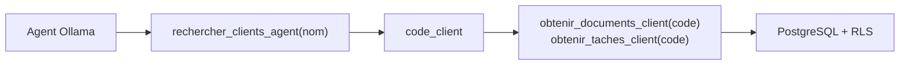

## Workflow CRM validé

Le workflow `CRM - État du dossier - Validation`, identifié dans n8n par
`CrmEtatDossierV1`, a été importé et exécuté avec succès le 2026-07-30.
Il reste volontairement non publié : son `Manual Trigger` sert aux essais dans
l’éditeur et ne constitue pas un déclencheur de production. Cette configuration
évite les tentatives d’activation répétées au démarrage de n8n.

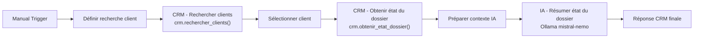

### Résultat de validation Tremblay

| Élément | Valeur confirmée |
| --- | --- |
| Correspondances de recherche | 3 |
| Dossier sélectionné pour le test | `Tremblay` |
| État | `Nouveau` |
| Interactions | 4 |
| Documents manquants | 3 |
| Tâches ouvertes | 1 |
| Prochaine action | Transfert des documents requis le lundi 8 juin |

Le prompt de résumé a été retesté le 6 août 2026 avec cet état JSON réel. La
génération s’est terminée normalement, sans UUID ni champ interne, en une
phrase complète de 264 caractères couvrant l’état, les trois documents, la
tâche ouverte et la prochaine action.

Les trois noms `Tremblay`, `Guylaine Tremblay` et `Tremblay, Guylaine`
représentent une ambiguïté réelle des données de démonstration. La sélection
automatique du workflow est réservée au scénario de validation. L’agent cible
devra demander une clarification lorsqu’il ne trouve pas exactement un client
unique.

L’export assaini et réimportable se trouve dans
[`n8n-workflows/crm_etat_dossier_valide.json`](./n8n-workflows/crm_etat_dossier_valide.json).

Depuis l’application de la migration `005_crm_runtime_security.sql`, ce
workflow manuel initialise `app.role = representant` et
`app.representant_id` dans la même requête que chaque appel `crm.*`. Pour le
scénario Tremblay, l’identifiant du représentant est une valeur locale de test.
Dans l’agent cible, cette valeur doit provenir exclusivement du JWT validé par
l’API et ne doit jamais être fournie librement par le navigateur ou Ollama.
Le prompt associé est versionné dans
[`prompts/crm_resume_etat_dossier.md`](./prompts/crm_resume_etat_dossier.md).

## Workflow de transcription existant

Le pipeline de transcription reste un flux distinct du workflow de consultation
CRM.

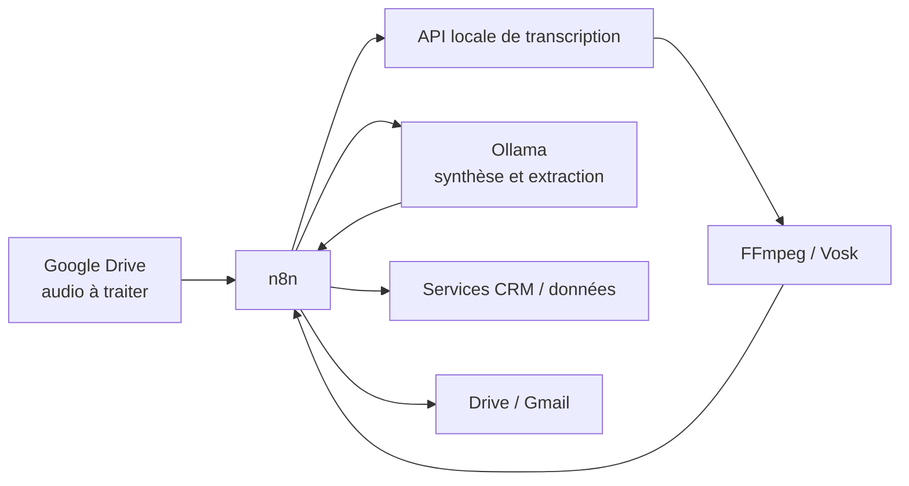

Le workflow historique fonctionne, mais certains de ses nœuds PostgreSQL
effectuent encore des requêtes directes. Ces nœuds sont considérés comme une
dette technique : toute évolution doit les remplacer par des fonctions du
schéma `crm`.

## Entrée texte pour le MVP

Le workflow `CRM - Analyse transcription texte`, identifié par
`CrmAnalyseTexteV1`, permet de contourner la transcription audio lorsqu’une
plateforme de réunion fournit déjà un texte.

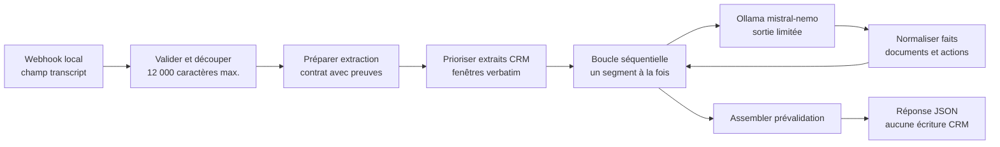

Contrat d’entrée :

```json
{
  "source": "transcription-reunion.vtt",
  "transcript": "Texte intégral de la rencontre..."
}
```

Principes :

- aucun texte de démonstration ou renseignement personnel n’est versionné;
- chaque valeur non nulle doit être accompagnée d’un extrait justificatif;
- les exemples généraux du courtier ne sont pas des faits client;
- les informations ambiguës vont dans `points_a_valider`;
- les conversations distinctes doivent être signalées;
- les segments sont envoyés séquentiellement à Ollama afin d’éviter la
  saturation du modèle local et les délais causés par cinq requêtes concurrentes;
- de courtes fenêtres verbatim centrées sur les mots-clés CRM sont recopiées au
  début du prompt; l’emploi, la profession et les études sont prioritaires sur
  les autres catégories, sans que cette priorité constitue une validation;
- l’assemblage vérifie que chaque preuve proposée apparaît réellement dans le
  segment source;
- une liste blanche rejette les champs hors contrat CRM, notamment les taux,
  primes, taxes et frais;
- les preuves issues d’un exemple ou d’une hypothèse explicite sont rejetées;
- l’auto-description du courtier n’est jamais considérée comme une profession
  client;
- les objets produits dans `emploi`, `revenus`, `dettes`, `documents_requis`,
  `taches` et `prochaines_actions` sont normalisés en candidats `faits` avant
  cette vérification;
- les formulations explicites de type « Nom lui est profession » disposent
  d’une règle de haute précision qui conserve le sujet, la valeur et la preuve
  verbatim lorsque le modèle omet le fait;
- un segment dont la sortie Ollama n’est pas un JSON complet est signalé comme
  invalide sans interrompre l’assemblage des autres segments;
- les suggestions sans preuve vérifiable sont isolées dans
  `suggestions_modele_non_validees` et ne sont pas utilisables par le CRM;
- le workflow retourne une prévalidation et n’écrit rien dans PostgreSQL.

Le workflow est importé, publié et actif dans n8n. Le test complet du 6 août
2026 a traité 57 445 caractères en cinq segments, sans JSON invalide. Il a
retourné huit faits prévalidés : la profession de Gabriel, le doctorat terminé
de Marianne, cinq documents requis et l’envoi du courriel. Les champs hors
contrat et les suggestions dont la preuve ne correspond pas au segment ont été
rejetés. Le résultat exige toujours une validation humaine et aucune écriture
PostgreSQL n’est exécutée. Les appels d’extraction disposent d’un délai maximal
de 30 minutes pour permettre l’analyse locale de plusieurs segments par
`mistral-nemo`. Son export est versionné dans
[`n8n-workflows/crm_analyse_transcription_texte.json`](./n8n-workflows/crm_analyse_transcription_texte.json)
et son prompt dans
[`prompts/crm_extraction_segment.md`](./prompts/crm_extraction_segment.md).

## Sécurité et isolation par représentant

### Implanté dans la base

- toutes les données CRM portent un `representant_id`;
- les tables `clients`, `interactions`, `documents_requis` et `taches` ont la
  Row-Level Security activée et forcée;
- les politiques utilisent `app.role`, `app.representant_id` et
  `app.client_id`;
- les comptes applicatifs sont représentés par `app_users`.

### État du déploiement local

La migration de sécurité a été appliquée durablement le 6 août 2026. Les rôles
`crm_service_owner` et `crm_runtime` existent, ne sont ni superutilisateurs ni
`BYPASSRLS`, et le test transactionnel d’isolation entre représentants passe.

La migration
[`database/005_crm_runtime_security.sql`](./database/005_crm_runtime_security.sql)
implante :

- `crm_service_owner`, propriétaire non connecté des fonctions;
- `crm_runtime`, compte d’exécution sans privilège élevé;
- la révocation de l’accès direct de `crm_runtime` aux tables;
- l’autorisation d’exécuter uniquement les fonctions `crm.*`.

Le workflow manuel Tremblay utilise encore l’identifiant administratif local
`Postgres account` et initialise le contexte `admin` dans la même requête que
l’appel `crm.*`. Cette exception maintient le scénario de validation existant;
elle ne doit pas être reprise par l’agent conversationnel. Le secret de
`crm_runtime` doit rester hors du dépôt et son contexte représentant doit
provenir d’une authentification fiable.

Le mot de passe local de `crm_runtime` est maintenant défini et l’identifiant
n8n `Postgres CRM Runtime` est associé aux outils et aux appels déterministes
du MVP. Aucun secret n’est versionné.

## Architecture cible du MVP

Le MVP sera présenté avec une interface Web authentifiée. L’API existante
Node.js/Express sera étendue; l’introduction d’un deuxième backend FastAPI
n’est pas retenue à ce stade.

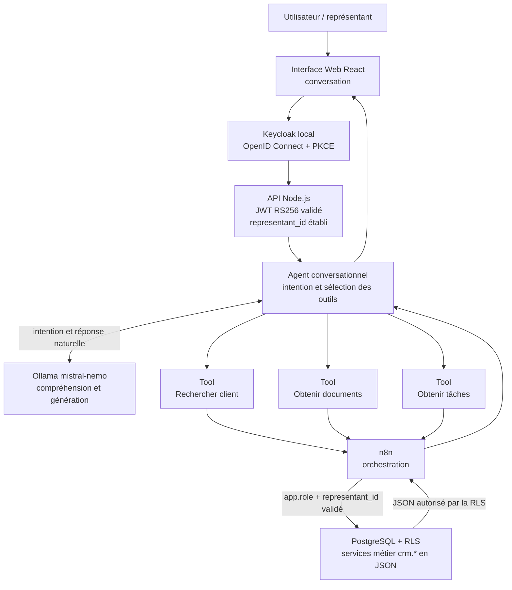

L’agent conversationnel est une couche logique contrôlée par l’API Node.js.
Keycloak est la source d’identité. React utilise le flux Authorization Code
avec PKCE et conserve le jeton uniquement en mémoire. Le navigateur transmet
le JWT, mais ne choisit jamais le `representant_id`. Après validation de la
signature RS256, de l’issuer, de l’audience `crm-api`, du rôle `representant`
et de l’attribut `representant_id`, l’API propage l’identité aux outils. Chaque
outil possède un contrat JSON précis et délègue son exécution à n8n; n8n appelle
uniquement les fonctions PostgreSQL `crm.*`. L’agent et Ollama ne disposent
d’aucun accès direct aux tables.

### Frontières de confiance

| Couche | Peut faire | Ne doit jamais faire |
| --- | --- | --- |
| Keycloak | Authentifier, gérer les sessions, signer les rôles et attributs | Porter la logique métier CRM |
| Interface Web | Utiliser OIDC/PKCE et envoyer le jeton d’accès | Choisir un `representant_id` arbitraire ou conserver le jeton sur disque |
| API REST | Valider signature, issuer, audience, rôle et identité | Faire confiance à un identifiant fourni par le navigateur |
| n8n | Orchestrer des appels de services | Porter les règles métier ou autoriser un accès |
| PostgreSQL | Appliquer métier et isolation | Accepter une connexion applicative superutilisateur |
| Ollama | Comprendre l’intention et formuler la réponse | Lire les tables ou décider des autorisations |

### Contrat conversationnel cible

Entrée API minimale :

```json
{
  "question": "Quels documents manquent pour Tremblay?"
}
```

L’identité du représentant provient du jeton authentifié, pas du corps de la
requête.

Sortie minimale :

```json
{
  "statut": "succes",
  "reponse": "Il manque trois documents au dossier Tremblay...",
  "clarification_requise": false
}
```

Cas obligatoires :

- aucun client trouvé : réponse explicite sans appel de dossier;
- plusieurs clients : liste minimale et demande de clarification;
- client unique : appel du service approprié;
- question hors périmètre : réponse contrôlée;
- service indisponible : erreur fonctionnelle sans fuite technique.

## Limites connues

1. Le workflow CRM utilise encore un `Manual Trigger` et le terme fixe
   `Tremblay`.
2. La première version du workflow `CRM - Agent conversationnel` est
   versionnée et importée comme brouillon non publié depuis
   [`n8n-workflows/crm_agent_conversationnel_mvp.json`](./n8n-workflows/crm_agent_conversationnel_mvp.json),
   avec un déclencheur de discussion réservé aux essais locaux. Le routeur
   déterministe couvre les clients récents, les documents et les tâches; le
   chemin conversationnel conserve Ollama et les cinq outils. Tous les
   appels PostgreSQL utilisent l’identifiant restreint
   `Postgres CRM Runtime`.
3. L’interface React et la route `POST /api/agent/messages` sont implantées.
   Le workflow Webhook n8n a été publié temporairement le 2026-08-09 dans
   l’environnement local isolé, sans JWT, après autorisation explicite pour
   tester le MVP. Cette publication doit être retirée après la démonstration
   ou remplacée par l’authentification cible.
4. L’intégration Keycloak, la validation API et la propagation dynamique du
   `representant_id` sont versionnées, mais le realm et le compte local doivent
   encore être initialisés avant leur activation. Le workflow publié utilise
   donc toujours l’ancienne version tant que cette bascule n’est pas validée.
5. Les trois variantes Tremblay doivent être dédoublonnées ou gérées par
   clarification.
6. Le prompt génère du texte naturel; l’enveloppe JSON conversationnelle stable
   reste à implanter.
7. Le workflow de transcription historique contient encore de la logique SQL
   directe à migrer vers les services PostgreSQL.
8. Les chemins structurés Clients récents, Documents et Tâches appellent
   désormais leurs services PostgreSQL de façon déterministe. Les questions
   libres utilisent encore l’agent Ollama; leurs temps de réponse dépendent du
   modèle et de la machine locale.
9. Dans l’éditeur n8n, le déclencheur de discussion de test peut être brièvement
   désenregistré entre deux sessions. Il faut attendre l’état d’écoute avant
   d’envoyer le premier message; ce comportement ne concerne pas les webhooks
   publiés.

### Interface Web MVP

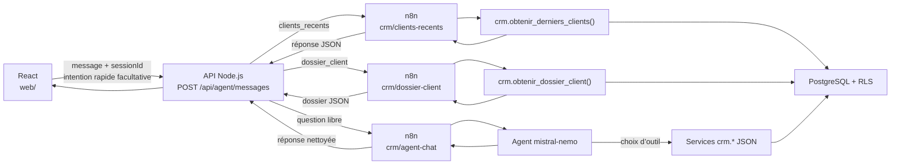

La route serveur limite chaque message à 1 000 caractères, applique un délai
d’attente et masque les erreurs internes. La route dossier accepte un nom ou un
`code_client` et ne retourne aucun UUID. Les commandes « afficher le dossier »
sont routées de façon déterministe afin de ne pas dépendre du choix d’outil par
le modèle. Le build React est produit dans `web/dist` puis servi par la même API,
ce qui évite CORS et empêche le navigateur de connaître l’adresse n8n.

Le workflow `CRM - Agent Web - MVP` est versionné dans
[`n8n-workflows/crm_agent_webhook_mvp.json`](./n8n-workflows/crm_agent_webhook_mvp.json).
Il est publié temporairement dans l’environnement local isolé pour la
validation du MVP. Le `representant_id` qu’il initialise est celui du jeu de
démonstration et ne peut pas être fourni par le navigateur. Sans JWT, ce
webhook ne doit pas être exposé sur Internet et doit être désactivé après la
démonstration.

### Agent conversationnel MVP versionné

Le brouillon manuel versionné et importé sépare maintenant les demandes
structurées du dialogue libre :

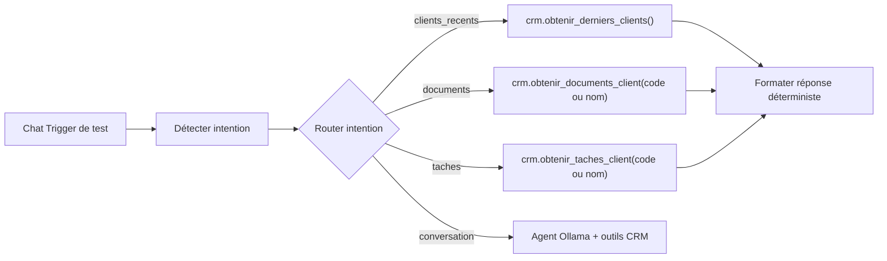

Les composants principaux sont les suivants :

| Nœud | Responsabilité | Service autorisé |
| --- | --- | --- |
| `Détecter intention` | Normaliser le message et reconnaître clients récents, documents, tâches ou conversation | Aucun accès aux données |
| `Router intention` | Diriger la demande vers l’un des quatre chemins | Aucun accès aux données |
| `CRM - Derniers clients` | Exécuter systématiquement l’action `clients_recents` | `crm.obtenir_derniers_clients()` |
| `CRM - Documents déterministe` | Résoudre le client et lire ses documents | `crm.obtenir_documents_client(text)` |
| `CRM - Tâches déterministe` | Résoudre le client et lire ses tâches | `crm.obtenir_taches_client(text)` |
| `Formater réponse déterministe` | Produire une réponse française stable et gérer absence ou ambiguïté | Aucun accès aux données |
| `Agent conversationnel CRM` | Choisir l’outil et formuler une réponse française | Aucun accès aux données |
| `Ollama - mistral-nemo` | Comprendre l’intention et générer la réponse | Aucun accès PostgreSQL |
| `Tool - Rechercher client` | Résoudre un nom ou un terme sans exposer d’UUID | `crm.rechercher_clients_agent(text)` |
| `Tool - Obtenir documents` | Résoudre le message ou le `code_client`, puis lire les documents | `crm.obtenir_documents_client(text)` |
| `Tool - Obtenir tâches` | Résoudre le message ou le `code_client`, puis lire les tâches | `crm.obtenir_taches_client(text)` |
| `Tool - Derniers clients` | Lister au maximum dix nouvelles fiches visibles | `crm.obtenir_derniers_clients()` |
| `Tool - Obtenir dossier` | Afficher ou résumer le dossier complet d’un client | `crm.obtenir_dossier_client(text)` |

Les appels ont été validés sous le rôle restreint `crm_runtime`, les plus
récents le 9 août 2026. Ils initialisent le contexte RLS et appellent uniquement
une fonction `crm.*`; ils ne lisent aucune table directement. Le test manuel a
retourné les dix clients récents, trois documents dont deux manquants et une
tâche ouverte pour Olivier Bergeron. Le chemin de conversation libre a aussi
produit une réponse française via `mistral-nemo`. L’identifiant de
représentant actuellement présent dans le brouillon est exclusivement une
valeur de test local. Il sera remplacé par l’identité établie côté serveur
après validation du JWT.

### Jeu de démonstration local

[`database/seeds/001_mvp_demo.sql`](./database/seeds/001_mvp_demo.sql) fournit
12 clients fictifs et un petit ensemble d’interactions, documents et tâches.
Les UUID réservés au jeu d’essai rendent le chargement réexécutable sans créer
de doublons. Ce fichier n’est pas une migration de production et doit être
chargé uniquement dans une base locale ou de démonstration avec
[`scripts/charger_donnees_demo.ps1`](./scripts/charger_donnees_demo.ps1).

## Priorités de livraison du MVP

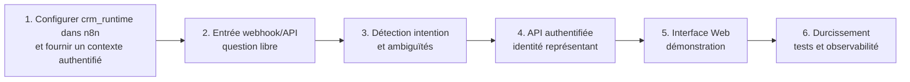

La valeur démontrable prioritaire est le parcours suivant :

```text
Connexion du représentant
→ question en français
→ recherche limitée à sa clientèle
→ lecture du dossier par les services crm.*
→ réponse naturelle produite par Ollama
```

## Sources de vérité techniques

| Sujet | Source |
| --- | --- |
| Modèle relationnel | `database/001_crm_postgresql.sql` |
| RLS actuelle | `database/002_access_control.sql` |
| Services CRM | `database/004_crm_services.sql` |
| Rôle d’exécution préparé | `database/005_crm_runtime_security.sql` |
| Test Tremblay | `tests/sql/tremblay_acceptance_test.sql` |
| Test d’isolation | `tests/sql/representant_isolation_test.sql` |
| Workflow CRM validé | `n8n-workflows/crm_etat_dossier_valide.json` |
| Prompt CRM | `prompts/crm_resume_etat_dossier.md` |
| Contexte permanent | `CONTEXTE_PROJET.md` |

---

# Annexe — architecture historique de transcription

Les sections suivantes documentent le pipeline historique en détail. En cas de
contradiction, les principes et l’état courant décrits ci-dessus prévalent.

## Vue d'ensemble

```mermaid
flowchart LR
    subgraph Sources["Sources de fichiers"]
        DriveTodo["Google Drive<br/>01_A_TRAITER"]
        DriveDone["Google Drive<br/>02_TRAITES"]
        DriveError["Google Drive<br/>03_ERREURS"]
        Local["Fichier local<br/>test curl"]
    end

    subgraph Orchestration["Orchestration"]
        Trigger["Manual / Schedule Trigger"]
        Search["Google Drive Search<br/>fichiers a traiter"]
        Loop["Loop Over Items<br/>1 fichier a la fois"]
        Download["Google Drive Download<br/>fichier courant"]
        KeepId["Edit Fields<br/>fileIdOriginal"]
        N8N["n8n<br/>local ou cloud"]
        Curl["curl.exe<br/>multipart/form-data"]
    end

    subgraph Service["Conteneur Docker : transcription-api"]
        API["API Node.js<br/>server.js"]
        Upload["Reception fichier<br/>upload.js"]
        Pipeline["Orchestration<br/>transcribe.js"]
        FFmpeg["FFmpeg<br/>audio.js"]
        WAV["WAV mono 16 kHz"]
        VoskLauncher["Lanceur local<br/>localTranscriber.js"]
        Vosk["Vosk + modele francais<br/>vosk_transcribe.py"]
        Diarization["Diarisation optionnelle<br/>pyannote.audio"]
        Results["Resultats<br/>transcript.txt / JSON / metadata"]
    end

    subgraph Intelligence["Couche IA locale"]
        Ollama["Ollama local<br/>mistral-nemo:latest"]
        Synthese["Synthese appel<br/>texte exploitable"]
        Extraction["Extraction JSON client<br/>fiche hypothecaire"]
        Parse["Parse JSON client<br/>normalisation n8n"]
    end

    subgraph Storage["Stockage et sortie"]
        Volume["Volume Docker<br/>./outputs"]
        DriveOut["Google Drive<br/>transcription / synthese"]
        Gmail["Gmail<br/>courriel courtier"]
        CRM["Conteneur postgres-crm<br/>clients / representants / interactions"]
        FollowUp["Suivi CRM<br/>documents requis / taches"]
        Access["Isolation des acces<br/>Row Level Security"]
    end

    DriveTodo --> Trigger --> Search --> Loop --> Download --> KeepId --> N8N
    Local --> Curl
    N8N -->|"POST /transcribe/upload<br/>fichier binaire"| API
    Curl -->|"POST /transcribe/upload<br/>fichier binaire"| API
    API --> Upload --> Pipeline
    Pipeline --> FFmpeg --> WAV --> VoskLauncher --> Vosk
    WAV -. "si diarize=true" .-> Diarization
    Vosk --> Results
    Diarization -. "locuteurs" .-> Results
    Results --> Volume
    Results --> API
    API -->|"JSON + transcription"| N8N
    N8N -->|"transcript"| Ollama
    Ollama --> Synthese
    Ollama --> Extraction --> Parse
    Synthese --> DriveOut
    Synthese --> Gmail
    Parse --> CRM
    CRM --> FollowUp
    CRM --> Access
    N8N --> DriveOut
    Gmail -->|"succes"| MergeId["Merge<br/>recuperer ID original"]
    KeepId --> MergeId
    MergeId -->|"Move file"| DriveDone
    N8N -. "erreur a traiter" .-> DriveError
```

## Flux de traitement

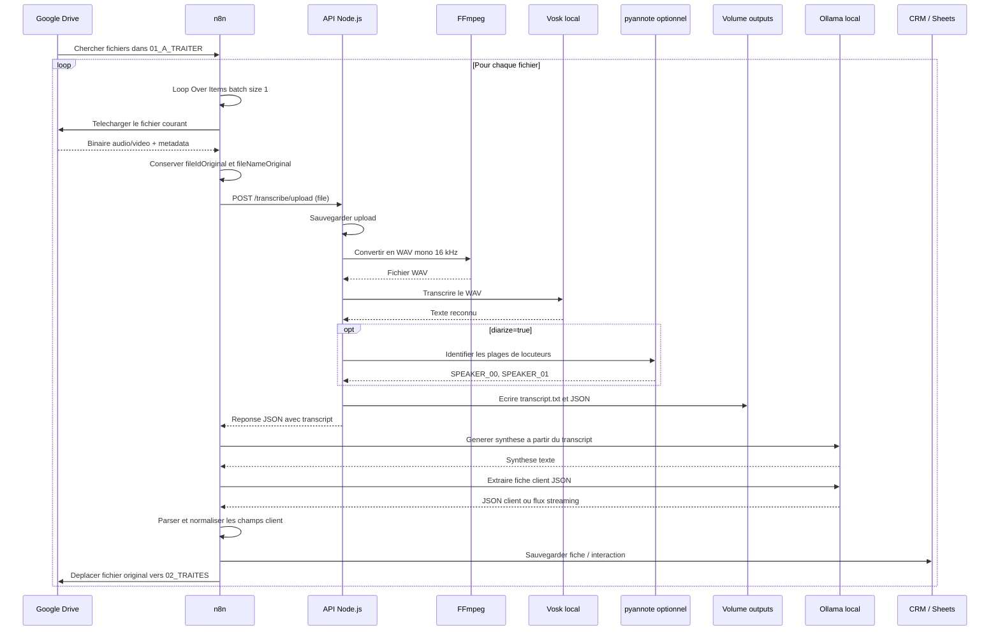

## Vue des conteneurs - n8n local

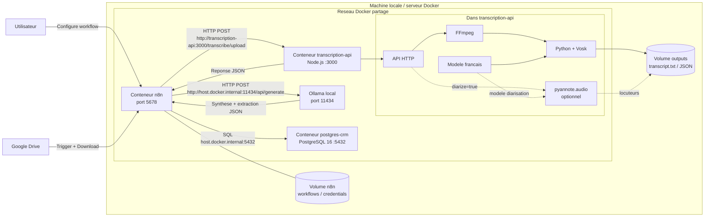

Dans cette configuration, `n8n` appelle l'API de transcription, Ollama et PostgreSQL depuis le reseau local. Si n8n est dans Docker et qu'Ollama ou PostgreSQL sont exposes par Windows, les adresses recommandees sont:

```text
Ollama:    http://host.docker.internal:11434/api/generate
PostgreSQL host: host.docker.internal
PostgreSQL port: 5432
```

## Vue des conteneurs - n8n Cloud

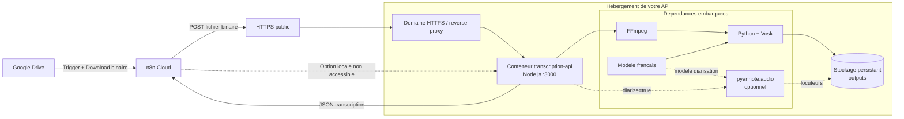

Dans cette configuration, seul le conteneur `transcription-api` vous appartient. n8n Cloud envoie le fichier sur une URL HTTPS publique; il n'a pas acces a `localhost` ou aux volumes Docker de votre machine. Si Ollama reste local, n8n Cloud ne peut pas l'appeler directement sans tunnel ou API publique securisee.

## Composants techniques

| Composant | Role | Fichier |
| --- | --- | --- |
| API HTTP | Recoit les appels de test ou de n8n | `src/server.js` |
| Gestion upload | Sauvegarde les fichiers multipart/base64 | `src/upload.js` |
| Pipeline | Orchestre conversion, transcription et sortie | `src/transcribe.js` |
| Conversion audio | Produit un WAV exploitable par Vosk | `src/audio.js` |
| Lanceur moteur | Execute le transcripteur local | `src/localTranscriber.js` |
| Moteur STT | Reconnaissance vocale sans LLM | `scripts/vosk_transcribe.py` |
| Diarisation | Attribution optionnelle des mots aux locuteurs | `scripts/vosk_transcribe.py`, `pyannote.audio` |
| Deploiement | Installe FFmpeg, Vosk et expose l'API | `Dockerfile`, `docker-compose.yml` |

## Couche n8n et assistant hypothecaire

| Noeud n8n | Role | Entree | Sortie |
| --- | --- | --- | --- |
| `Download file` | Recupere l'audio depuis Google Drive | Fichier Drive | `binary.data` |
| `Edit Fields` | Conserve l'identifiant original du fichier | `binary.data`, metadata Drive | `fileIdOriginal`, `fileNameOriginal` |
| `API - Transcription` | Envoie le binaire a l'API locale | `binary.data` | `transcript`, chemins fichiers |
| `Convert Transcription Originale` | Convertit la transcription brute en `.txt` | `transcript` | `binary.data` |
| `Transcription Original` | Sauvegarde la transcription brute | `binary.data` | `webViewLink` |
| `HTTP Request` | Produit une synthese metier via Ollama | `transcript` | `response` |
| `Transcription AI Convert to File` | Convertit la synthese en `.txt` | `response` | `binary.data` |
| `Transcription AI` | Sauvegarde la synthese dans Drive | `binary.data` | `webViewLink` |
| `Send a message` | Envoie la synthese par Gmail | `response` | message envoye |
| `Ollama - Extraction JSON client` | Extrait la fiche client hypothecaire | `transcript` | `response` ou `data` |
| `Parse JSON client` | Normalise la sortie Ollama | JSON brut/stream | champs client |
| `Construire metadata JSON` | Construit le contrat d'echange vers le CRM | champs client, transcription, metadata Drive | `metadata.database_payload` |
| `IF - Telephone vide` | Determine si la recherche par telephone est possible | `client_record.telephone` | branche recherche ou repli |
| `IF - Courriel vide` | Determine si la recherche par courriel est possible | `client_record.courriel` | branche recherche ou repli |
| `Postgres - Rechercher client telephone` | Cherche un client du representant par telephone | code representant, telephone | client existant ou item vide |
| `Postgres - Rechercher client courriel` | Cherche un client du representant par courriel | code representant, courriel | client existant ou item vide |
| `Postgres - Rechercher client nom` | Recherche de secours lorsque telephone et courriel sont absents | code representant, nom normalise | client probable ou item vide |
| `IF - Nom client valide` | Bloque la creation des fiches sans nom exploitable | `nom_client` | creation ou branche d'erreur |
| `Postgres - Creer client` | Cree une nouvelle fiche client rattachee au representant | `client_record` | `client_id` |
| `Postgres - Mettre a jour client` | Met a jour un client existant sans ecraser les valeurs par `null` | `client_id`, `client_record` | client mis a jour |
| `Postgres - Creer interaction` | Ajoute l'appel a l'historique du client | client, representant, fichier, fiche JSON | `interaction_id` |
| `Postgres - Creer documents requis` | Cree une ligne par document demande | `follow_up_record.documents_requis` | documents `A recevoir` |
| `Postgres - Creer taches` | Cree les actions de suivi | `follow_up_record.prochaines_actions` | taches `A faire` |
| `Gmail - Alerte extraction incomplete` | Avertit lorsqu'aucun nom valide n'est extrait | transcription et fichier source | courriel d'alerte |
| `Google Drive - Upload erreur extraction` | Archive le diagnostic d'extraction | fichier texte `binary.data` | fichier dans `03_ERREURS_EXTRACTION` |
| `Recuperer ID fichier original` | Combine Gmail et metadata fichier | `Send a message`, `Edit Fields` | `fileIdOriginal`, `id`, `threadId` |
| `Move file` | Marque le fichier comme traite | `fileIdOriginal` | fichier deplace vers `02_TRAITES` |

## Flux CRM valide dans n8n

Le flux CRM est execute apres `Parse JSON client` et `Construire metadata JSON`.

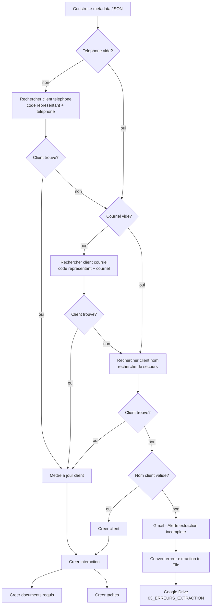

La recherche principale utilise le code metier du representant:

```text
code_representant = 2026999999
```

La jointure avec `representants` recupere ensuite le `representant_id` UUID utilise par les relations PostgreSQL.

Ordre de deduplication:

```text
1. code_representant + telephone
2. code_representant + courriel
3. code_representant + nom normalise, uniquement comme recherche de secours
4. creation seulement si le nom client est valide
```

Chaque nouvel appel cree toujours une nouvelle ligne dans `interactions`, meme lorsque la fiche `clients` est seulement mise a jour.

## Traitement en lot Google Drive

Le workflow en lot repose sur trois dossiers Google Drive:

```text
01_A_TRAITER
02_TRAITES
03_ERREURS
```

Le dossier `01_A_TRAITER` contient les audios a traiter. n8n recherche les fichiers, les traite un par un avec `Loop Over Items`, puis deplace chaque fichier reussi vers `02_TRAITES`.

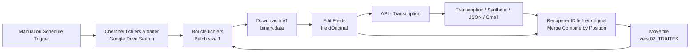

Points importants:

- `Chercher fichiers a traiter` doit filtrer seulement les fichiers audio/video telechargeables.
- `Boucle fichiers` doit traiter un item a la fois.
- `Edit Fields` doit creer `fileIdOriginal` et `fileNameOriginal` avant l'appel API.
- `Send a message` ne conserve pas les champs precedents; le noeud `Merge` recupere donc `fileIdOriginal` depuis `Edit Fields`.
- `Move file` utilise `$json.fileIdOriginal` pour deplacer le fichier original vers `02_TRAITES`.
- Le retour de `Move file` vers `Boucle fichiers` permet de passer au fichier suivant.

## Schema de donnees client extrait

Le workflow extrait une fiche client orientee courtage hypothecaire. Les champs actuels sont:

```text
nom_client
prenom_client
date_naissance
telephone
courriel
type_emploi
poste
employeur
salaire_mensuel
heures_semaine
taux_horaire
revenu_annuel
revenu_conjoint
type_transaction
prix_achat
valeur_propriete
solde_hypothecaire
montant_financement
annees_restantes
mise_de_fonds
pourcentage_mise_de_fonds
provenance_mise_de_fonds
dettes_totales
objectif
etat_civil
situation_matrimoniale
date_rappel
informations_fiscales
documents_requis
points_a_valider
prochaines_actions
niveau_confiance
resume
```

## Modele metadata JSON n8n

Le workflow n8n doit produire un fichier de metadonnees a jour pour chaque audio traite.

Ce fichier complete le `metadata.json` technique produit par l'API. Il ajoute les informations metier, CRM et audit du traitement n8n.

Role des fichiers produits:

```text
transcription-originale.txt : lecture humaine de la transcription brute.
synthese-ai.txt             : lecture humaine et courriel au representant.
metadata.json               : source structuree pour alimenter PostgreSQL.
```

Nom recommande:

```text
metadata-YYYY-MM-DD-HH-mm.json
```

Structure attendue:

```json
{
  "schema_version": "1.0",
  "processed_at": "2026-06-20T12:00:00.000Z",
  "source": {
    "file_name_original": "appel-client.m4a",
    "file_id_original": "google-drive-file-id",
    "mime_type": "audio/x-m4a"
  },
  "transcription": {
    "output_dir": "/app/outputs/...",
    "transcript_path": "/app/outputs/.../transcript.txt",
    "json_path": "/app/outputs/.../transcription.json",
    "metadata_path": "/app/outputs/.../metadata.json",
    "transcript_length": 12345
  },
  "client": {
    "nom_client": "Tremblay",
    "prenom_client": "Guylaine",
    "telephone": null,
    "courriel": null,
    "type_transaction": "Refinancement",
    "niveau_confiance": "moyen"
  },
  "suivi": {
    "documents_requis": "CV d'emploi, Etat civil",
    "points_a_valider": "telephone, courriel",
    "prochaines_actions": "Rappel lundi 8 juin"
  },
  "access_context": {
    "representant_id": "UUID_REPRESENTANT",
    "code_representant": "2026999999",
    "client_id": "UUID_CLIENT",
    "role_traitement": "workflow_n8n"
  },
  "database_payload": {
    "client_record": {
      "representant_id": "UUID_REPRESENTANT",
      "code_representant": "2026999999",
      "nom_client": "Tremblay",
      "telephone": null,
      "courriel": null,
      "type_transaction": "Refinancement"
    },
    "interaction_record": {
      "representant_id": "UUID_REPRESENTANT",
      "fichier_original_nom": "appel-client.m4a",
      "transcription_originale_url": "https://drive.google.com/...",
      "synthese_url": "https://drive.google.com/...",
      "resume": "Client souhaite refinancer une propriete.",
      "niveau_confiance": "moyen"
    },
    "follow_up_record": {
      "documents_requis": "CV d'emploi, Etat civil",
      "points_a_valider": "telephone, courriel",
      "prochaines_actions": "Rappel lundi 8 juin"
    }
  }
}
```

Emplacement n8n recommande:

```text
Parse JSON client
-> Construire metadata JSON
-> Convert to JSON file
-> Upload metadata JSON
-> PostgreSQL
```

Regle importante:

```text
Le noeud Construire metadata JSON doit etre dans le chemin direct venant de Edit Fields et API - Transcription.
```

Cela garantit que `fileIdOriginal`, `fileNameOriginal`, `transcriptPath`, `jsonPath` et `metadataPath` restent accessibles sans erreur d'expression n8n.

## Regles de qualite

- La transcription brute reste la source de verite.
- Ollama ne doit pas inventer de nom, telephone, courriel, montant ou date.
- Les informations absentes restent `null`.
- Les textes `undefined`, `null` et les chaines vides sont normalises en vrai `NULL` avant toute ecriture PostgreSQL.
- Un client n'est jamais cree si `nom_client` est absent, `null` ou `undefined`.
- Une extraction sans nom valide declenche un courriel d'alerte et un fichier de diagnostic dans `03_ERREURS_EXTRACTION`.
- Une mise a jour conserve la valeur existante lorsqu'une nouvelle extraction ne fournit pas de telephone, de courriel ou d'autre information exploitable.
- Les informations incertaines sont marquees `A valider` ou ajoutees dans `points_a_valider`.
- Les champs `documents_requis`, `points_a_valider`, `prochaines_actions`, `niveau_confiance` et `resume` servent a prioriser le suivi du representant.
- Le noeud `Parse JSON client` accepte deux formats de retour Ollama: `response` lorsque `stream=false` fonctionne, ou `data` lorsque n8n recoit un flux streaming.

## Modele relationnel CRM

Le CRM PostgreSQL repose sur un modele relationnel centre sur trois notions:

```text
Utilisateur applicatif -> representant ou client
Representant -> portefeuille de clients
Client -> interactions, documents requis et taches
```

Diagramme relationnel:

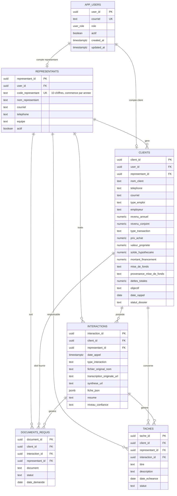

### Tables et responsabilites

| Table | Responsabilite | Cle principale | Cles de rattachement |
| --- | --- | --- | --- |
| `app_users` | Comptes applicatifs et roles d'acces | `user_id` | aucune |
| `representants` | Conseillers hypothecaires | `representant_id` | `user_id` |
| `clients` | Fiches clients courantes | `client_id` | `user_id`, `representant_id` |
| `interactions` | Historique des appels et traitements | `interaction_id` | `client_id`, `representant_id` |
| `documents_requis` | Documents demandes ou manquants | `document_id` | `client_id`, `interaction_id`, `representant_id` |
| `taches` | Actions de suivi | `tache_id` | `client_id`, `interaction_id`, `representant_id` |

### Cardinalites importantes

```text
Un representant peut avoir plusieurs clients.
Un client appartient a un seul representant principal.
Un client peut avoir plusieurs interactions.
Une interaction peut generer plusieurs documents requis.
Une interaction peut generer plusieurs taches.
Un compte app_users peut etre rattache a un representant ou a un client.
```

### Identifiant representant

Le modele distingue deux identifiants:

```text
representant_id   : cle technique interne UUID utilisee par les relations SQL.
code_representant : identifiant metier visible, 10 chiffres, par exemple 2026999999.
```

Le format du `code_representant` est controle par PostgreSQL:

```text
10 chiffres
les 4 premiers chiffres doivent correspondre a une annee entre 2020 et 2099
```

### Contraintes de deduplication

La deduplication principale se fait par representant:

```text
representant_id + telephone
representant_id + courriel
```

Lorsque le telephone et le courriel sont absents, le workflow peut effectuer une recherche de secours par:

```text
code_representant + nom_client normalise
```

Cette recherche par nom sert seulement a orienter le workflow vers une mise a jour probable. Elle doit etre consideree moins fiable qu'une correspondance par telephone ou courriel.

Contraintes PostgreSQL:

```sql
create unique index if not exists ux_clients_representant_telephone
on clients (representant_id, telephone)
where telephone is not null and btrim(telephone) <> '';

create unique index if not exists ux_clients_representant_courriel
on clients (representant_id, lower(courriel))
where courriel is not null and btrim(courriel) <> '';
```

Resultat attendu:

```text
Deux representants peuvent avoir deux clients avec le meme nom.
Un representant ne peut pas creer deux fois le meme client avec le meme telephone.
Un representant ne peut pas creer deux fois le meme client avec le meme courriel.
```

### Cycle de vie des donnees CRM

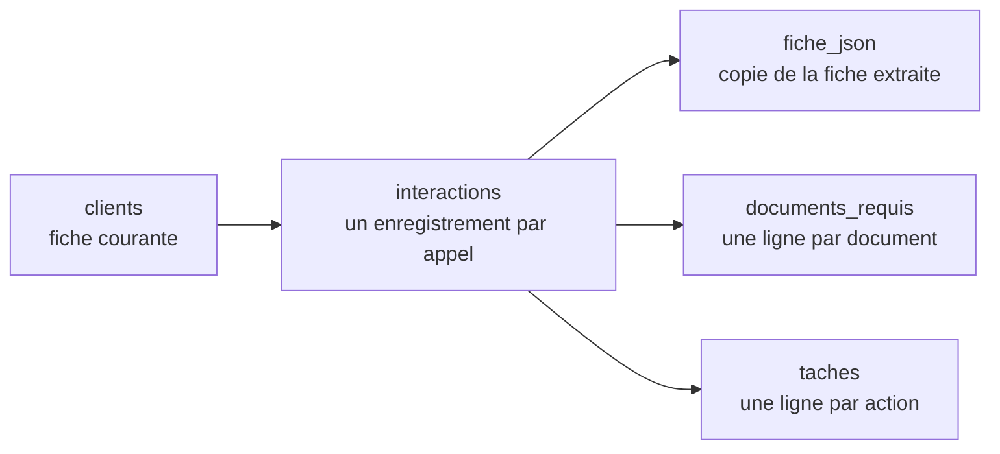

Regles:

```text
Une creation client produit un nouveau client_id.
Une mise a jour conserve le meme client_id.
Chaque appel reussi produit un nouvel interaction_id.
Les documents et les taches sont rattaches au client, au representant et a l'interaction.
Le fichier metadata JSON est le contrat structure qui alimente ces ecritures.
```

Les relations ne sont actuellement pas toutes configurees avec `ON DELETE CASCADE`. Pour supprimer un client de test, les donnees doivent donc etre supprimees dans cet ordre:

```text
documents_requis
taches
interactions
clients
```

## Isolation des acces CRM

La base PostgreSQL du CRM est concue pour separer les donnees par utilisateur.

Roles applicatifs:

| Role | Acces autorise |
| --- | --- |
| `admin` | Toutes les donnees CRM |
| `representant` | Seulement les clients, interactions, documents et taches de son portefeuille |
| `client` | Seulement sa fiche client, ses interactions, ses documents et ses taches |

Tables de securite:

```text
app_users
representants.user_id
clients.user_id
```

Tables protegees par Row Level Security:

```text
clients
interactions
documents_requis
taches
```

Regle principale:

```text
representant_id limite l'acces du representant.
client_id limite l'acces du client.
```

La migration correspondante est:

```text
database/002_access_control.sql
```
