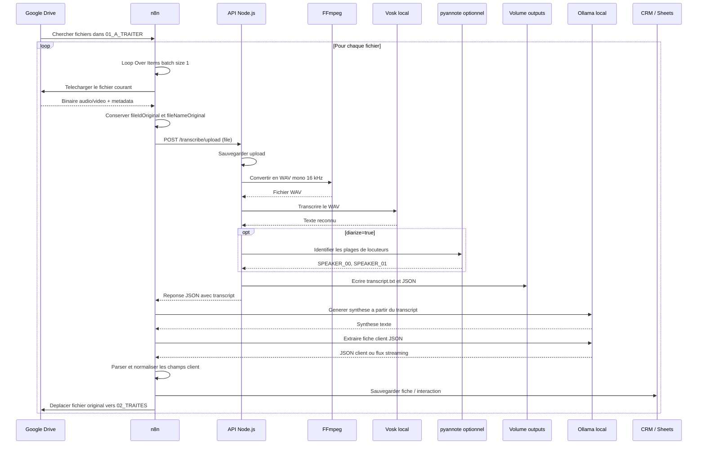
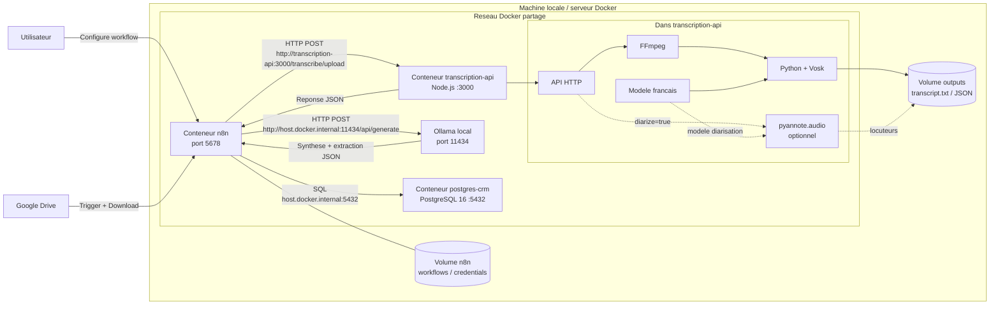
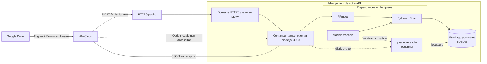
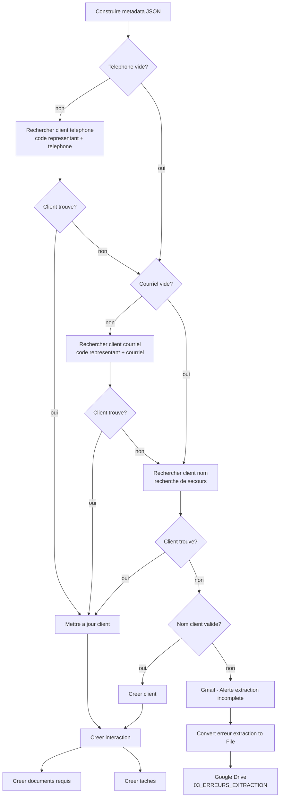
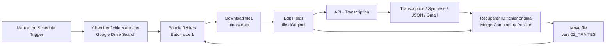
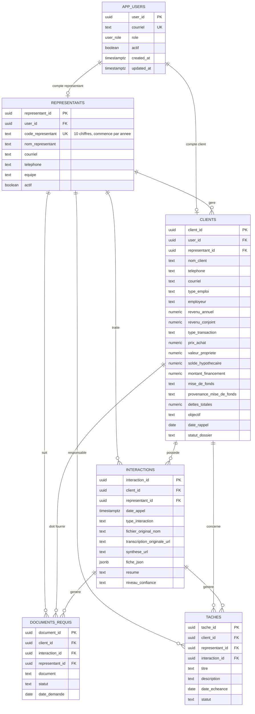
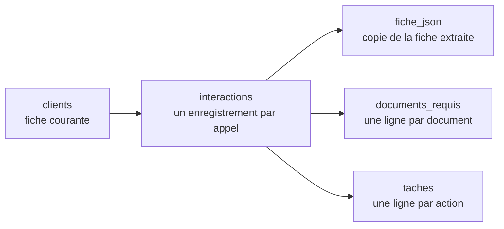

# Architecture de composants

## Vue d'ensemble

```mermaid
flowchart LR
    subgraph Sources["Sources de fichiers"]
        DriveTodo["Google Drive<br/>01_A_TRAITER"]
        DriveDone["Google Drive<br/>02_TRAITES"]
        DriveError["Google Drive<br/>03_ERREURS"]
        Local["Fichier local<br/>test curl"]
    end

    subgraph Orchestration["Orchestration"]
        Trigger["Manual / Schedule Trigger"]
        Search["Google Drive Search<br/>fichiers a traiter"]
        Loop["Loop Over Items<br/>1 fichier a la fois"]
        Download["Google Drive Download<br/>fichier courant"]
        KeepId["Edit Fields<br/>fileIdOriginal"]
        N8N["n8n<br/>local ou cloud"]
        Curl["curl.exe<br/>multipart/form-data"]
    end

    subgraph Service["Conteneur Docker : transcription-api"]
        API["API Node.js<br/>server.js"]
        Upload["Reception fichier<br/>upload.js"]
        Pipeline["Orchestration<br/>transcribe.js"]
        FFmpeg["FFmpeg<br/>audio.js"]
        WAV["WAV mono 16 kHz"]
        VoskLauncher["Lanceur local<br/>localTranscriber.js"]
        Vosk["Vosk + modele francais<br/>vosk_transcribe.py"]
        Diarization["Diarisation optionnelle<br/>pyannote.audio"]
        Results["Resultats<br/>transcript.txt / JSON / metadata"]
    end

    subgraph Intelligence["Couche IA locale"]
        Ollama["Ollama local<br/>mistral-nemo:latest"]
        Synthese["Synthese appel<br/>texte exploitable"]
        Extraction["Extraction JSON client<br/>fiche hypothecaire"]
        Parse["Parse JSON client<br/>normalisation n8n"]
    end

    subgraph Storage["Stockage et sortie"]
        Volume["Volume Docker<br/>./outputs"]
        DriveOut["Google Drive<br/>transcription / synthese"]
        Gmail["Gmail<br/>courriel courtier"]
        CRM["Conteneur postgres-crm<br/>clients / representants / interactions"]
        FollowUp["Suivi CRM<br/>documents requis / taches"]
        Access["Isolation des acces<br/>Row Level Security"]
    end

    DriveTodo --> Trigger --> Search --> Loop --> Download --> KeepId --> N8N
    Local --> Curl
    N8N -->|"POST /transcribe/upload<br/>fichier binaire"| API
    Curl -->|"POST /transcribe/upload<br/>fichier binaire"| API
    API --> Upload --> Pipeline
    Pipeline --> FFmpeg --> WAV --> VoskLauncher --> Vosk
    WAV -. "si diarize=true" .-> Diarization
    Vosk --> Results
    Diarization -. "locuteurs" .-> Results
    Results --> Volume
    Results --> API
    API -->|"JSON + transcription"| N8N
    N8N -->|"transcript"| Ollama
    Ollama --> Synthese
    Ollama --> Extraction --> Parse
    Synthese --> DriveOut
    Synthese --> Gmail
    Parse --> CRM
    CRM --> FollowUp
    CRM --> Access
    N8N --> DriveOut
    Gmail -->|"succes"| MergeId["Merge<br/>recuperer ID original"]
    KeepId --> MergeId
    MergeId -->|"Move file"| DriveDone
    N8N -. "erreur a traiter" .-> DriveError
```



## Flux de traitement



## Vue des conteneurs - n8n local



Dans cette configuration, `n8n` appelle l'API de transcription, Ollama et PostgreSQL depuis le reseau local. Si n8n est dans Docker et qu'Ollama ou PostgreSQL sont exposes par Windows, les adresses recommandees sont:

```text
Ollama:    http://host.docker.internal:11434/api/generate
PostgreSQL host: host.docker.internal
PostgreSQL port: 5432
```

## Vue des conteneurs - n8n Cloud



Dans cette configuration, seul le conteneur `transcription-api` vous appartient. n8n Cloud envoie le fichier sur une URL HTTPS publique; il n'a pas acces a `localhost` ou aux volumes Docker de votre machine. Si Ollama reste local, n8n Cloud ne peut pas l'appeler directement sans tunnel ou API publique securisee.

## Composants techniques

| Composant | Role | Fichier |
| --- | --- | --- |
| API HTTP | Recoit les appels de test ou de n8n | `src/server.js` |
| Gestion upload | Sauvegarde les fichiers multipart/base64 | `src/upload.js` |
| Pipeline | Orchestre conversion, transcription et sortie | `src/transcribe.js` |
| Conversion audio | Produit un WAV exploitable par Vosk | `src/audio.js` |
| Lanceur moteur | Execute le transcripteur local | `src/localTranscriber.js` |
| Moteur STT | Reconnaissance vocale sans LLM | `scripts/vosk_transcribe.py` |
| Diarisation | Attribution optionnelle des mots aux locuteurs | `scripts/vosk_transcribe.py`, `pyannote.audio` |
| Deploiement | Installe FFmpeg, Vosk et expose l'API | `Dockerfile`, `docker-compose.yml` |

## Couche n8n et assistant hypothecaire

| Noeud n8n | Role | Entree | Sortie |
| --- | --- | --- | --- |
| `Download file` | Recupere l'audio depuis Google Drive | Fichier Drive | `binary.data` |
| `Edit Fields` | Conserve l'identifiant original du fichier | `binary.data`, metadata Drive | `fileIdOriginal`, `fileNameOriginal` |
| `API - Transcription` | Envoie le binaire a l'API locale | `binary.data` | `transcript`, chemins fichiers |
| `Convert Transcription Originale` | Convertit la transcription brute en `.txt` | `transcript` | `binary.data` |
| `Transcription Original` | Sauvegarde la transcription brute | `binary.data` | `webViewLink` |
| `HTTP Request` | Produit une synthese metier via Ollama | `transcript` | `response` |
| `Transcription AI Convert to File` | Convertit la synthese en `.txt` | `response` | `binary.data` |
| `Transcription AI` | Sauvegarde la synthese dans Drive | `binary.data` | `webViewLink` |
| `Send a message` | Envoie la synthese par Gmail | `response` | message envoye |
| `Ollama - Extraction JSON client` | Extrait la fiche client hypothecaire | `transcript` | `response` ou `data` |
| `Parse JSON client` | Normalise la sortie Ollama | JSON brut/stream | champs client |
| `Construire metadata JSON` | Construit le contrat d'echange vers le CRM | champs client, transcription, metadata Drive | `metadata.database_payload` |
| `IF - Telephone vide` | Determine si la recherche par telephone est possible | `client_record.telephone` | branche recherche ou repli |
| `IF - Courriel vide` | Determine si la recherche par courriel est possible | `client_record.courriel` | branche recherche ou repli |
| `Postgres - Rechercher client telephone` | Cherche un client du representant par telephone | code representant, telephone | client existant ou item vide |
| `Postgres - Rechercher client courriel` | Cherche un client du representant par courriel | code representant, courriel | client existant ou item vide |
| `Postgres - Rechercher client nom` | Recherche de secours lorsque telephone et courriel sont absents | code representant, nom normalise | client probable ou item vide |
| `IF - Nom client valide` | Bloque la creation des fiches sans nom exploitable | `nom_client` | creation ou branche d'erreur |
| `Postgres - Creer client` | Cree une nouvelle fiche client rattachee au representant | `client_record` | `client_id` |
| `Postgres - Mettre a jour client` | Met a jour un client existant sans ecraser les valeurs par `null` | `client_id`, `client_record` | client mis a jour |
| `Postgres - Creer interaction` | Ajoute l'appel a l'historique du client | client, representant, fichier, fiche JSON | `interaction_id` |
| `Postgres - Creer documents requis` | Cree une ligne par document demande | `follow_up_record.documents_requis` | documents `A recevoir` |
| `Postgres - Creer taches` | Cree les actions de suivi | `follow_up_record.prochaines_actions` | taches `A faire` |
| `Gmail - Alerte extraction incomplete` | Avertit lorsqu'aucun nom valide n'est extrait | transcription et fichier source | courriel d'alerte |
| `Google Drive - Upload erreur extraction` | Archive le diagnostic d'extraction | fichier texte `binary.data` | fichier dans `03_ERREURS_EXTRACTION` |
| `Recuperer ID fichier original` | Combine Gmail et metadata fichier | `Send a message`, `Edit Fields` | `fileIdOriginal`, `id`, `threadId` |
| `Move file` | Marque le fichier comme traite | `fileIdOriginal` | fichier deplace vers `02_TRAITES` |

## Flux CRM valide dans n8n

Le flux CRM est execute apres `Parse JSON client` et `Construire metadata JSON`.



La recherche principale utilise le code metier du representant:

```text
code_representant = 2026999999
```

La jointure avec `representants` recupere ensuite le `representant_id` UUID utilise par les relations PostgreSQL.

Ordre de deduplication:

```text
1. code_representant + telephone
2. code_representant + courriel
3. code_representant + nom normalise, uniquement comme recherche de secours
4. creation seulement si le nom client est valide
```

Chaque nouvel appel cree toujours une nouvelle ligne dans `interactions`, meme lorsque la fiche `clients` est seulement mise a jour.

## Traitement en lot Google Drive

Le workflow en lot repose sur trois dossiers Google Drive:

```text
01_A_TRAITER
02_TRAITES
03_ERREURS
```

Le dossier `01_A_TRAITER` contient les audios a traiter. n8n recherche les fichiers, les traite un par un avec `Loop Over Items`, puis deplace chaque fichier reussi vers `02_TRAITES`.



Points importants:

- `Chercher fichiers a traiter` doit filtrer seulement les fichiers audio/video telechargeables.
- `Boucle fichiers` doit traiter un item a la fois.
- `Edit Fields` doit creer `fileIdOriginal` et `fileNameOriginal` avant l'appel API.
- `Send a message` ne conserve pas les champs precedents; le noeud `Merge` recupere donc `fileIdOriginal` depuis `Edit Fields`.
- `Move file` utilise `$json.fileIdOriginal` pour deplacer le fichier original vers `02_TRAITES`.
- Le retour de `Move file` vers `Boucle fichiers` permet de passer au fichier suivant.

## Schema de donnees client extrait

Le workflow extrait une fiche client orientee courtage hypothecaire. Les champs actuels sont:

```text
nom_client
prenom_client
date_naissance
telephone
courriel
type_emploi
poste
employeur
salaire_mensuel
heures_semaine
taux_horaire
revenu_annuel
revenu_conjoint
type_transaction
prix_achat
valeur_propriete
solde_hypothecaire
montant_financement
annees_restantes
mise_de_fonds
pourcentage_mise_de_fonds
provenance_mise_de_fonds
dettes_totales
objectif
etat_civil
situation_matrimoniale
date_rappel
informations_fiscales
documents_requis
points_a_valider
prochaines_actions
niveau_confiance
resume
```

## Modele metadata JSON n8n

Le workflow n8n doit produire un fichier de metadonnees a jour pour chaque audio traite.

Ce fichier complete le `metadata.json` technique produit par l'API. Il ajoute les informations metier, CRM et audit du traitement n8n.

Role des fichiers produits:

```text
transcription-originale.txt : lecture humaine de la transcription brute.
synthese-ai.txt             : lecture humaine et courriel au representant.
metadata.json               : source structuree pour alimenter PostgreSQL.
```

Nom recommande:

```text
metadata-YYYY-MM-DD-HH-mm.json
```

Structure attendue:

```json
{
  "schema_version": "1.0",
  "processed_at": "2026-06-20T12:00:00.000Z",
  "source": {
    "file_name_original": "appel-client.m4a",
    "file_id_original": "google-drive-file-id",
    "mime_type": "audio/x-m4a"
  },
  "transcription": {
    "output_dir": "/app/outputs/...",
    "transcript_path": "/app/outputs/.../transcript.txt",
    "json_path": "/app/outputs/.../transcription.json",
    "metadata_path": "/app/outputs/.../metadata.json",
    "transcript_length": 12345
  },
  "client": {
    "nom_client": "Tremblay",
    "prenom_client": "Guylaine",
    "telephone": null,
    "courriel": null,
    "type_transaction": "Refinancement",
    "niveau_confiance": "moyen"
  },
  "suivi": {
    "documents_requis": "CV d'emploi, Etat civil",
    "points_a_valider": "telephone, courriel",
    "prochaines_actions": "Rappel lundi 8 juin"
  },
  "access_context": {
    "representant_id": "UUID_REPRESENTANT",
    "code_representant": "2026999999",
    "client_id": "UUID_CLIENT",
    "role_traitement": "workflow_n8n"
  },
  "database_payload": {
    "client_record": {
      "representant_id": "UUID_REPRESENTANT",
      "code_representant": "2026999999",
      "nom_client": "Tremblay",
      "telephone": null,
      "courriel": null,
      "type_transaction": "Refinancement"
    },
    "interaction_record": {
      "representant_id": "UUID_REPRESENTANT",
      "fichier_original_nom": "appel-client.m4a",
      "transcription_originale_url": "https://drive.google.com/...",
      "synthese_url": "https://drive.google.com/...",
      "resume": "Client souhaite refinancer une propriete.",
      "niveau_confiance": "moyen"
    },
    "follow_up_record": {
      "documents_requis": "CV d'emploi, Etat civil",
      "points_a_valider": "telephone, courriel",
      "prochaines_actions": "Rappel lundi 8 juin"
    }
  }
}
```

Emplacement n8n recommande:

```text
Parse JSON client
-> Construire metadata JSON
-> Convert to JSON file
-> Upload metadata JSON
-> PostgreSQL
```

Regle importante:

```text
Le noeud Construire metadata JSON doit etre dans le chemin direct venant de Edit Fields et API - Transcription.
```

Cela garantit que `fileIdOriginal`, `fileNameOriginal`, `transcriptPath`, `jsonPath` et `metadataPath` restent accessibles sans erreur d'expression n8n.

## Regles de qualite

- La transcription brute reste la source de verite.
- Ollama ne doit pas inventer de nom, telephone, courriel, montant ou date.
- Les informations absentes restent `null`.
- Les textes `undefined`, `null` et les chaines vides sont normalises en vrai `NULL` avant toute ecriture PostgreSQL.
- Un client n'est jamais cree si `nom_client` est absent, `null` ou `undefined`.
- Une extraction sans nom valide declenche un courriel d'alerte et un fichier de diagnostic dans `03_ERREURS_EXTRACTION`.
- Une mise a jour conserve la valeur existante lorsqu'une nouvelle extraction ne fournit pas de telephone, de courriel ou d'autre information exploitable.
- Les informations incertaines sont marquees `A valider` ou ajoutees dans `points_a_valider`.
- Les champs `documents_requis`, `points_a_valider`, `prochaines_actions`, `niveau_confiance` et `resume` servent a prioriser le suivi du representant.
- Le noeud `Parse JSON client` accepte deux formats de retour Ollama: `response` lorsque `stream=false` fonctionne, ou `data` lorsque n8n recoit un flux streaming.

## Modele relationnel CRM

Le CRM PostgreSQL repose sur un modele relationnel centre sur trois notions:

```text
Utilisateur applicatif -> representant ou client
Representant -> portefeuille de clients
Client -> interactions, documents requis et taches
```

Diagramme relationnel:



### Tables et responsabilites

| Table | Responsabilite | Cle principale | Cles de rattachement |
| --- | --- | --- | --- |
| `app_users` | Comptes applicatifs et roles d'acces | `user_id` | aucune |
| `representants` | Conseillers hypothecaires | `representant_id` | `user_id` |
| `clients` | Fiches clients courantes | `client_id` | `user_id`, `representant_id` |
| `interactions` | Historique des appels et traitements | `interaction_id` | `client_id`, `representant_id` |
| `documents_requis` | Documents demandes ou manquants | `document_id` | `client_id`, `interaction_id`, `representant_id` |
| `taches` | Actions de suivi | `tache_id` | `client_id`, `interaction_id`, `representant_id` |

### Cardinalites importantes

```text
Un representant peut avoir plusieurs clients.
Un client appartient a un seul representant principal.
Un client peut avoir plusieurs interactions.
Une interaction peut generer plusieurs documents requis.
Une interaction peut generer plusieurs taches.
Un compte app_users peut etre rattache a un representant ou a un client.
```

### Identifiant representant

Le modele distingue deux identifiants:

```text
representant_id   : cle technique interne UUID utilisee par les relations SQL.
code_representant : identifiant metier visible, 10 chiffres, par exemple 2026999999.
```

Le format du `code_representant` est controle par PostgreSQL:

```text
10 chiffres
les 4 premiers chiffres doivent correspondre a une annee entre 2020 et 2099
```

### Contraintes de deduplication

La deduplication principale se fait par representant:

```text
representant_id + telephone
representant_id + courriel
```

Lorsque le telephone et le courriel sont absents, le workflow peut effectuer une recherche de secours par:

```text
code_representant + nom_client normalise
```

Cette recherche par nom sert seulement a orienter le workflow vers une mise a jour probable. Elle doit etre consideree moins fiable qu'une correspondance par telephone ou courriel.

Contraintes PostgreSQL:

```sql
create unique index if not exists ux_clients_representant_telephone
on clients (representant_id, telephone)
where telephone is not null and btrim(telephone) <> '';

create unique index if not exists ux_clients_representant_courriel
on clients (representant_id, lower(courriel))
where courriel is not null and btrim(courriel) <> '';
```

Resultat attendu:

```text
Deux representants peuvent avoir deux clients avec le meme nom.
Un representant ne peut pas creer deux fois le meme client avec le meme telephone.
Un representant ne peut pas creer deux fois le meme client avec le meme courriel.
```

### Cycle de vie des donnees CRM



Regles:

```text
Une creation client produit un nouveau client_id.
Une mise a jour conserve le meme client_id.
Chaque appel reussi produit un nouvel interaction_id.
Les documents et les taches sont rattaches au client, au representant et a l'interaction.
Le fichier metadata JSON est le contrat structure qui alimente ces ecritures.
```

Les relations ne sont actuellement pas toutes configurees avec `ON DELETE CASCADE`. Pour supprimer un client de test, les donnees doivent donc etre supprimees dans cet ordre:

```text
documents_requis
taches
interactions
clients
```

## Isolation des acces CRM

La base PostgreSQL du CRM est concue pour separer les donnees par utilisateur.

Roles applicatifs:

| Role | Acces autorise |
| --- | --- |
| `admin` | Toutes les donnees CRM |
| `representant` | Seulement les clients, interactions, documents et taches de son portefeuille |
| `client` | Seulement sa fiche client, ses interactions, ses documents et ses taches |

Tables de securite:

```text
app_users
representants.user_id
clients.user_id
```

Tables protegees par Row Level Security:

```text
clients
interactions
documents_requis
taches
```

Regle principale:

```text
representant_id limite l'acces du representant.
client_id limite l'acces du client.
```

La migration correspondante est:

```text
database/002_access_control.sql
```
