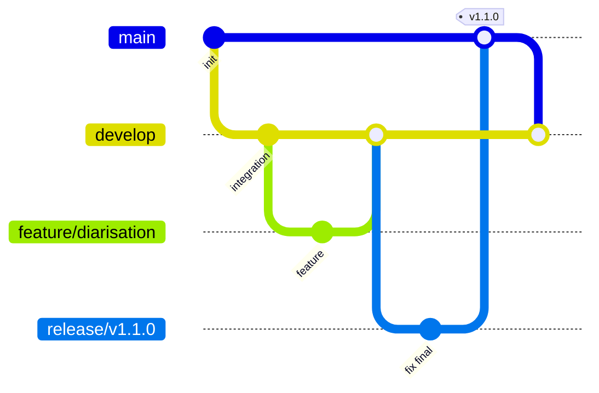

# Processus GitHub, environnements et sauvegardes

Ce document decrit une mise en place GitHub pour gerer le developpement, l'integration, les livraisons, les retours arriere et les sauvegardes de l'API de transcription.

## Branches principales



## Roles des branches

| Branche | Role | Protection recommandee |
| --- | --- | --- |
| `main` | Code stable de production | Pull Request obligatoire, tests obligatoires, tag de version |
| `develop` | Integration continue des equipes | Pull Request obligatoire, tests obligatoires |
| `feature/*` | Developpement d'une fonctionnalite | Branche temporaire |
| `release/*` | Stabilisation avant livraison | Correctifs mineurs seulement |
| `hotfix/*` | Correctif urgent depuis production | Merge vers `main` et `develop` |

## Environnements GitHub

Creer deux environnements dans GitHub:

1. `development`
2. `production`

Dans GitHub:

```text
Settings > Environments > New environment
```

### Environment `development`

Utilisation:

- deploiement automatique depuis `develop`;
- tests d'integration;
- validation interequipes.

Secrets recommandes:

```text
DEV_HOST
DEV_SSH_USER
DEV_SSH_KEY
DEV_DEPLOY_PATH
```

### Environment `production`

Utilisation:

- deploiement uniquement depuis `main` ou un tag `v*`;
- approbation manuelle avant deploiement;
- retention des versions deployees.

Secrets recommandes:

```text
PROD_HOST
PROD_SSH_USER
PROD_SSH_KEY
PROD_DEPLOY_PATH
```

Regles recommandees:

- Required reviewers: au moins 1 responsable;
- Deployment branches: `main` et tags `v*` seulement;
- Wait timer optionnel avant production.

## Processus global

### 1. Developpement

Chaque equipe cree une branche dediee depuis `develop`:

```powershell
git checkout develop
git pull
git checkout -b feature/nom-fonctionnalite
```

La branche contient une fonctionnalite ou un correctif clairement delimite.

Une fois le travail pret:

```powershell
git push -u origin feature/nom-fonctionnalite
```

Puis creer une Pull Request vers `develop`.

Validation recommandee avant merge:

- revue de code;
- tests automatises;
- verification Docker si la modification touche le conteneur;
- absence de secrets dans le code.

### 2. Integration

`develop` est la branche de convergence.

Chaque merge dans `develop` doit declencher:

- installation/verifications;
- tests unitaires ou syntaxiques;
- build Docker;
- deploiement automatique vers `development`, si configure.

Objectif:

- detecter rapidement les conflits;
- valider les integrations entre equipes;
- garder un environnement de test toujours a jour.

### 3. Preparation de livraison

Quand un ensemble de fonctionnalites est pret:

```powershell
git checkout develop
git pull
git checkout -b release/v1.1.0
git push -u origin release/v1.1.0
```

Dans `release/v1.1.0`, seules les corrections de stabilisation sont acceptees:

- bug mineur;
- ajustement de documentation;
- correction de configuration;
- validation finale.

Lorsque la release est validee:

```powershell
git checkout main
git pull
git merge --no-ff release/v1.1.0
git tag v1.1.0
git push origin main
git push origin v1.1.0
```

Puis synchroniser `develop`:

```powershell
git checkout develop
git pull
git merge --no-ff main
git push origin develop
```

### 4. Production

La production est deployee depuis:

- `main`;
- ou un tag versionne, par exemple `v1.1.0`.

Recommandation:

```text
1 version de production = 1 tag Git = 1 image Docker identifiee
```

Exemple d'image:

```text
ghcr.io/organisation/transcription-api:v1.1.0
```

## Versionnement

Utiliser le format SemVer:

```text
MAJOR.MINOR.PATCH
```

Exemples:

| Version | Signification |
| --- | --- |
| `v1.0.0` | Premiere version stable |
| `v1.1.0` | Nouvelle fonctionnalite compatible |
| `v1.1.1` | Correctif mineur |
| `v2.0.0` | Changement incompatible |

## Rollback

Le rollback consiste a redeployer une version precedente.

### Rollback par tag

Lister les tags:

```powershell
git tag
```

Revenir a une version connue:

```powershell
git checkout v1.0.0
docker compose up --build -d
```

En production, il est preferable de redeployer l'image Docker deja publiee:

```powershell
docker pull ghcr.io/organisation/transcription-api:v1.0.0
docker stop transcription-api
docker run -d --name transcription-api -p 3000:3000 ghcr.io/organisation/transcription-api:v1.0.0
```

### Rollback par commit

Si aucun tag n'existe:

```powershell
git log --oneline
git checkout <commit_sha>
docker compose up --build -d
```

## Sauvegardes

Les sauvegardes doivent couvrir trois elements:

1. code source GitHub;
2. fichiers de configuration et secrets;
3. donnees produites par l'application.

### Code source

Le code est sauvegarde par GitHub, mais il est recommande d'avoir un miroir:

```powershell
git clone --mirror https://github.com/organisation/transcription-api.git
```

Puis sauvegarder ce miroir dans un stockage externe.

### Configuration

Ne jamais committer les secrets dans Git.

Sauvegarder separement:

- variables d'environnement;
- configuration serveur;
- configuration reverse proxy;
- procedure de restauration;
- liste des versions deployees.

Exemple de fichiers a sauvegarder hors Git:

```text
.env.production
docker-compose.production.yml
certificats HTTPS
configuration proxy
```

### Donnees applicatives

Dans cette solution, les resultats sont ecrits dans:

```text
outputs/
```

En Docker Compose, ce dossier est monte comme volume:

```yaml
volumes:
  - ./outputs:/app/outputs
```

Sauvegarde simple:

```powershell
Compress-Archive -Path ".\outputs" -DestinationPath ".\backup\outputs-$(Get-Date -Format yyyyMMdd-HHmmss).zip"
```

Pour un serveur Linux:

```bash
tar -czf backups/outputs-$(date +%Y%m%d-%H%M%S).tar.gz outputs/
```

### Frequence recommandee

| Element | Frequence | Retention |
| --- | --- | --- |
| Code Git | Continu | Illimitee |
| Secrets/config production | A chaque changement | 12 mois minimum |
| Resultats `outputs/` | Quotidienne | 30 a 90 jours |
| Images Docker | A chaque release | Garder au moins les 5 dernieres versions |

## Hotfix production

Pour un correctif urgent:

```powershell
git checkout main
git pull
git checkout -b hotfix/correction-urgence
```

Apres correction:

```powershell
git push -u origin hotfix/correction-urgence
```

Creer une Pull Request vers `main`, puis taguer:

```powershell
git checkout main
git pull
git tag v1.1.1
git push origin v1.1.1
```

Reporter ensuite le correctif vers `develop`:

```powershell
git checkout develop
git pull
git merge --no-ff main
git push origin develop
```

## Regles de protection recommandees

Dans GitHub:

```text
Settings > Branches > Branch protection rules
```

Pour `main`:

- Require a pull request before merging;
- Require approvals;
- Require status checks to pass;
- Require branches to be up to date;
- Restrict who can push;
- Prevent force pushes.

Pour `develop`:

- Require a pull request before merging;
- Require status checks to pass;
- Prevent force pushes.

