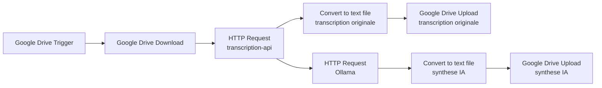

# Workflow n8n : transcription API + synthese Ollama

Ce guide decrit un workflow n8n qui:

1. detecte ou recoit un fichier audio/video;
2. envoie le fichier a l'API `transcription-api`;
3. recupere la transcription;
4. envoie la transcription a Ollama;
5. convertit la transcription originale en fichier texte;
6. produit une synthese exploitable;
7. convertit la synthese IA en fichier texte;
8. transfere les deux resultats dans Google Drive.

## Prerequis

- Le conteneur `transcription-api` doit etre demarre.
- Ollama doit etre demarre et accessible par n8n.
- Un modele Ollama doit etre telecharge, par exemple:

```powershell
ollama pull llama3.1
```

Verifier Ollama:

```powershell
curl.exe http://127.0.0.1:11434/api/tags
```

Verifier l'API de transcription:

```powershell
curl.exe http://127.0.0.1:3000/health
```

## URLs selon le mode d'execution

### n8n installe directement sur la machine

```text
API transcription: http://127.0.0.1:3000/transcribe/upload
Ollama: http://127.0.0.1:11434/api/generate
```

### n8n dans Docker sur Windows avec API/Ollama sur la machine hote

```text
API transcription: http://host.docker.internal:3000/transcribe/upload
Ollama: http://host.docker.internal:11434/api/generate
```

### n8n, transcription-api et Ollama dans le meme reseau Docker

```text
API transcription: http://transcription-api:3000/transcribe/upload
Ollama: http://ollama:11434/api/generate
```

## Workflow n8n recommande



La version exportee et validee du workflow est disponible dans:

```text
n8n-workflows/Transcription_Local_2026-06-03-0702.json
```

## Noeud 1 - Google Drive Trigger

Objectif: declencher le workflow quand un fichier est ajoute dans un dossier Google Drive.

Configuration typique:

```text
Event: File Created
Folder: dossier contenant les audios/videos
```

## Noeud 2 - Google Drive Download

Objectif: telecharger le fichier detecte en binaire.

Configuration typique:

```text
Operation: Download
File ID: valeur venant du trigger
Binary Property: data
```

Le nom `data` est important: il sera utilise par le noeud HTTP suivant.

## Noeud 3 - HTTP Request vers transcription-api

Objectif: envoyer le fichier binaire a l'API de transcription.

Configuration:

```text
Method: POST
URL: http://host.docker.internal:3000/transcribe/upload
Body Content Type: Form-Data
```

Dans le body:

```text
Parameter Type: n8n Binary File
Name: file
Input Data Field Name: data
```

Champs texte optionnels:

```text
language = fr
diarize = false
keepAudio = false
```

Avec diarisation:

```text
diarize = true
```

Sortie attendue:

```json
{
  "outputDir": "...",
  "transcriptPath": "...",
  "jsonPath": "...",
  "metadataPath": "...",
  "transcript": "texte transcrit..."
}
```

## Noeud 4 - HTTP Request vers Ollama

Objectif: generer une synthese a partir du champ `transcript`.

Configuration:

```text
Method: POST
URL: http://host.docker.internal:11434/api/generate
Body Content Type: JSON
```

Body JSON:

```json
{
  "model": "llama3.1",
  "stream": false,
  "prompt": "Tu es un assistant de synthese. Resume la transcription suivante en francais. Donne: 1) resume court, 2) points importants, 3) actions a faire, 4) decisions prises. Transcription: {{$json.transcript}}"
}
```

Sortie attendue d'Ollama:

```json
{
  "response": "Synthese..."
}
```

Dans n8n, le texte de synthese est disponible dans:

```text
{{$json.response}}
```

## Noeud 5 - Convertir la transcription originale

Objectif: convertir le champ `transcript` retourne par l'API en fichier `.txt`.

Configuration:

```text
Node: Convert Transcription Originale
Operation: Convert to Text File
Text Input Field: transcript
Put Output File in Field: data
```

Sortie attendue:

```text
binary.data
Mime Type: text/plain
File Size: superieur a 0 B
```

## Noeud 6 - Sauvegarder la transcription originale

Objectif: envoyer le fichier texte de transcription dans Google Drive.

Configuration:

```text
Node: Transcription Original
Resource: File
Operation: Upload
Input Data Field Name: data
File Name: ={{ "transcription-originale-" + $now.toFormat("yyyy-MM-dd-HH-mm") + ".txt" }}
Parent Drive: My Drive
Parent Folder: ID du dossier cible
```

Sortie attendue:

```text
id
name
webViewLink
```

## Noeud 7 - Convertir la synthese IA

Objectif: convertir la reponse Ollama `response` en fichier `.txt`.

Configuration:

```text
Node: Transcription AI Convert to File
Operation: Convert to Text File
Text Input Field: response
Put Output File in Field: data
```

Sortie attendue:

```text
binary.data
Mime Type: text/plain
File Size: superieur a 0 B
```

## Noeud 8 - Sauvegarder la synthese IA

Objectif: envoyer la synthese IA dans Google Drive.

Configuration:

```text
Node: Transcription AI
Resource: File
Operation: Upload
Input Data Field Name: data
File Name: ={{ "synthese-ai-" + $now.toFormat("yyyy-MM-dd-HH-mm") + ".txt" }}
Parent Drive: My Drive
Parent Folder: ID du dossier cible
```

Sortie attendue:

```text
id
name
webViewLink
```

## Resultats attendus dans Google Drive

Chaque execution reussie doit creer deux fichiers:

```text
transcription-originale-YYYY-MM-DD-HH-mm.txt
synthese-ai-YYYY-MM-DD-HH-mm.txt
```

## Test manuel sans Google Drive

Pour tester le milieu du workflow, remplacer temporairement Google Drive par un noeud `Read Binary File` ou executer un test curl:

```powershell
curl.exe -X POST "http://127.0.0.1:3000/transcribe/upload" -F "file=@C:\Users\Admin\Music\test.m4a"
```

Puis tester Ollama:

```powershell
curl.exe -X POST "http://127.0.0.1:11434/api/generate" `
  -H "Content-Type: application/json" `
  -d "{\"model\":\"llama3.1\",\"stream\":false,\"prompt\":\"Resume ceci en francais: Ceci est une reunion de test.\"}"
```
