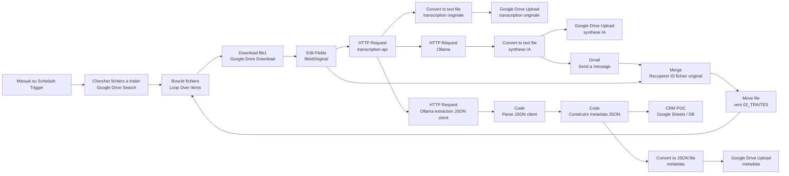
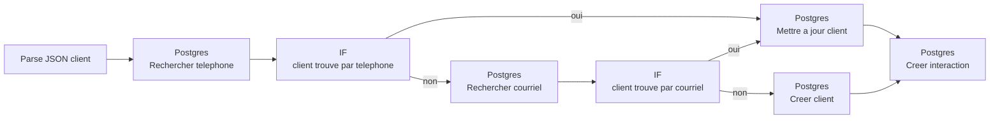

# Workflow n8n : transcription API + synthese Ollama

Ce guide decrit un workflow n8n qui:

1. cherche les fichiers audio/video dans un dossier Google Drive;
2. boucle fichier par fichier;
3. telecharge le fichier courant;
4. envoie le fichier a l'API `transcription-api`;
5. recupere la transcription;
6. envoie la transcription a Ollama;
7. convertit la transcription originale en fichier texte;
8. produit une synthese exploitable;
9. convertit la synthese IA en fichier texte;
10. transfere les deux resultats dans Google Drive;
11. extrait une fiche client hypothecaire en JSON;
12. prepare les donnees pour Google Sheets, PostgreSQL, Supabase ou un CRM;
13. deplace le fichier original vers `02_TRAITES`.

## Prerequis

- Le conteneur `transcription-api` doit etre demarre.
- Le conteneur `postgres-crm` doit etre demarre pour la Phase 2 CRM.
- Ollama doit etre demarre et accessible par n8n.
- Les modeles Ollama utilises dans le POC doivent etre telecharges:

```powershell
ollama pull llama3.2
ollama pull mistral-nemo
```

Verifier Ollama:

```powershell
curl.exe http://127.0.0.1:11434/api/tags
```

Verifier l'API de transcription:

```powershell
curl.exe http://127.0.0.1:3000/health
```

Verifier PostgreSQL dans Docker:

```powershell
docker exec -it postgres-crm psql -U transcription_user -d transcription_crm -c "\dt"
```

Resultat attendu:

```text
clients
documents_requis
interactions
representants
taches
```

## URLs selon le mode d'execution

### n8n installe directement sur la machine

```text
API transcription: http://127.0.0.1:3000/transcribe/upload
Ollama: http://127.0.0.1:11434/api/generate
```

### n8n dans Docker sur Windows avec API/Ollama sur la machine hote

```text
API transcription: http://host.docker.internal:3000/transcribe/upload
Ollama: http://host.docker.internal:11434/api/generate
```

### n8n, transcription-api et Ollama dans le meme reseau Docker

```text
API transcription: http://transcription-api:3000/transcribe/upload
Ollama: http://ollama:11434/api/generate
```

## Dossiers Google Drive recommandes

Creer trois dossiers:

```text
01_A_TRAITER
02_TRAITES
03_ERREURS
```

Role des dossiers:

```text
01_A_TRAITER : fichiers audio/video en attente
02_TRAITES   : fichiers traites avec succes
03_ERREURS   : fichiers a verifier manuellement
```

Le workflow lit uniquement `01_A_TRAITER`. Apres succes, il deplace le fichier original vers `02_TRAITES`.

## Workflow n8n recommande



La version exportee et validee du workflow est disponible dans:

```text
n8n-workflows/Transcription_Local_2026-06-03-0702.json
```

## Noeud 1 - Manual ou Schedule Trigger

Objectif: declencher le traitement en lot.

Configuration typique:

```text
Manual Trigger pendant les tests
Schedule Trigger pour une execution automatique
```

Exemple de planification:

```text
Toutes les 5 minutes
```

## Noeud 2 - Chercher fichiers a traiter

Objectif: lister les fichiers presents dans `01_A_TRAITER`.

Configuration typique:

```text
Resource: File
Operation: Search
Search Method: Query
```

Requete pour audio seulement:

```text
'ID_A_TRAITER' in parents and trashed = false and mimeType contains 'audio/'
```

Requete pour audio et video:

```text
'ID_A_TRAITER' in parents and trashed = false and (mimeType contains 'audio/' or mimeType contains 'video/')
```

Sortie attendue:

```text
1 item par fichier
id
name
mimeType
```

## Noeud 3 - Boucle fichiers

Objectif: traiter un fichier a la fois.

Configuration:

```text
Node: Loop Over Items ou Split In Batches
Batch Size: 1
```

Sortie attendue:

```text
1 item
```

## Noeud 4 - Download file1

Objectif: telecharger le fichier courant de la boucle en binaire.

Configuration:

```text
Resource: File
Operation: Download
File: By ID
File ID: {{ $json.id }}
```

Le nom `data` est important: il sera utilise par le noeud HTTP suivant.

Sortie attendue:

```text
binary.data
File Name
Mime Type
File Size > 0 B
```

## Noeud 5 - Edit Fields

Objectif: conserver l'ID du fichier original pour le deplacer a la fin.

Configuration:

```text
Mode: Manual Mapping
Include Other Input Fields: true
```

Champs a ajouter:

```text
fileIdOriginal = {{ $("Boucle fichiers").item.json.id }}
fileNameOriginal = {{ $("Boucle fichiers").item.json.name }}
```

Sortie attendue:

```text
fileIdOriginal
fileNameOriginal
binary.data
```

## Noeud 6 - HTTP Request vers transcription-api

Objectif: envoyer le fichier binaire a l'API de transcription.

Configuration:

```text
Method: POST
URL: http://host.docker.internal:3000/transcribe/upload
Body Content Type: Form-Data
```

Dans le body:

```text
Parameter Type: n8n Binary File
Name: file
Input Data Field Name: data
```

Champs texte optionnels:

```text
language = fr
diarize = false
keepAudio = false
```

Avec diarisation:

```text
diarize = true
```

Sortie attendue:

```json
{
  "outputDir": "...",
  "transcriptPath": "...",
  "jsonPath": "...",
  "metadataPath": "...",
  "transcript": "texte transcrit..."
}
```

## Noeud 7 - HTTP Request vers Ollama

Objectif: generer une synthese a partir du champ `transcript`.

Configuration:

```text
Method: POST
URL: http://host.docker.internal:11434/api/generate
Body Content Type: JSON
```

Body JSON:

```json
{
  "model": "llama3.1",
  "stream": false,
  "prompt": "Tu es un assistant de synthese. Resume la transcription suivante en francais. Donne: 1) resume court, 2) points importants, 3) actions a faire, 4) decisions prises. Transcription: {{$json.transcript}}"
}
```

Sortie attendue d'Ollama:

```json
{
  "response": "Synthese..."
}
```

Dans n8n, le texte de synthese est disponible dans:

```text
{{$json.response}}
```

## Noeud 8 - Convertir la transcription originale

Objectif: convertir le champ `transcript` retourne par l'API en fichier `.txt`.

Configuration:

```text
Node: Convert Transcription Originale
Operation: Convert to Text File
Text Input Field: transcript
Put Output File in Field: data
```

Sortie attendue:

```text
binary.data
Mime Type: text/plain
File Size: superieur a 0 B
```

## Noeud 9 - Sauvegarder la transcription originale

Objectif: envoyer le fichier texte de transcription dans Google Drive.

Configuration:

```text
Node: Transcription Original
Resource: File
Operation: Upload
Input Data Field Name: data
File Name: ={{ "transcription-originale-" + $now.toFormat("yyyy-MM-dd-HH-mm") + ".txt" }}
Parent Drive: My Drive
Parent Folder: ID du dossier cible
```

Sortie attendue:

```text
id
name
webViewLink
```

## Noeud 10 - Convertir la synthese IA

Objectif: convertir la reponse Ollama `response` en fichier `.txt`.

Configuration:

```text
Node: Transcription AI Convert to File
Operation: Convert to Text File
Text Input Field: response
Put Output File in Field: data
```

Sortie attendue:

```text
binary.data
Mime Type: text/plain
File Size: superieur a 0 B
```

## Noeud 11 - Sauvegarder la synthese IA

Objectif: envoyer la synthese IA dans Google Drive.

Configuration:

```text
Node: Transcription AI
Resource: File
Operation: Upload
Input Data Field Name: data
File Name: ={{ "synthese-ai-" + $now.toFormat("yyyy-MM-dd-HH-mm") + ".txt" }}
Parent Drive: My Drive
Parent Folder: ID du dossier cible
```

Sortie attendue:

```text
id
name
webViewLink
```

## Noeud 12 - Ollama - Extraction JSON client

Objectif: extraire une fiche client hypothecaire structuree depuis la transcription.

Ce noeud part de:

```text
API - Transcription
```

Configuration:

```text
Method: POST
URL: http://host.docker.internal:11434/api/generate
Authentication: None
Send Body: true
Body Content Type: JSON
Specify Body: Using JSON
```

Dans le champ JSON, utiliser le mode expression:

```javascript
={{
  {
    "model": "mistral-nemo:latest",
    "stream": false,
    "format": "json",
    "prompt":
      "Tu es un assistant specialise en courtage hypothecaire au Quebec/Canada.\n\n" +
      "A partir de la transcription suivante, extrais une fiche client hypothecaire au format JSON strict.\n\n" +
      "Regles importantes:\n" +
      "- Retourne uniquement un JSON valide.\n" +
      "- N'ajoute aucun texte avant ou apres le JSON.\n" +
      "- N'utilise pas de Markdown.\n" +
      "- N'invente aucune information.\n" +
      "- Si une information est absente, utilise null.\n" +
      "- Si une information est incertaine, utilise \"A valider\".\n" +
      "- Si un nom est partiel, conserve la partie entendue et ajoute une note dans points_a_valider.\n" +
      "- Garde les montants, dates, noms et nombres selon la transcription.\n\n" +
      "Structure JSON obligatoire:\n" +
      "{\n" +
      "  \"nom_client\": null,\n" +
      "  \"prenom_client\": null,\n" +
      "  \"date_naissance\": null,\n" +
      "  \"telephone\": null,\n" +
      "  \"courriel\": null,\n" +
      "  \"type_emploi\": null,\n" +
      "  \"poste\": null,\n" +
      "  \"employeur\": null,\n" +
      "  \"salaire_mensuel\": null,\n" +
      "  \"heures_semaine\": null,\n" +
      "  \"taux_horaire\": null,\n" +
      "  \"revenu_annuel\": null,\n" +
      "  \"revenu_conjoint\": null,\n" +
      "  \"type_transaction\": null,\n" +
      "  \"prix_achat\": null,\n" +
      "  \"valeur_propriete\": null,\n" +
      "  \"solde_hypothecaire\": null,\n" +
      "  \"montant_financement\": null,\n" +
      "  \"annees_restantes\": null,\n" +
      "  \"mise_de_fonds\": null,\n" +
      "  \"pourcentage_mise_de_fonds\": null,\n" +
      "  \"provenance_mise_de_fonds\": null,\n" +
      "  \"dettes_totales\": null,\n" +
      "  \"objectif\": null,\n" +
      "  \"etat_civil\": null,\n" +
      "  \"situation_matrimoniale\": null,\n" +
      "  \"date_rappel\": null,\n" +
      "  \"informations_fiscales\": null,\n" +
      "  \"documents_requis\": [],\n" +
      "  \"points_a_valider\": [],\n" +
      "  \"prochaines_actions\": [],\n" +
      "  \"niveau_confiance\": null,\n" +
      "  \"resume\": null\n" +
      "}\n\n" +
      "Regles d'extraction detaillee:\n" +
      "- Separe le nom et le prenom si les deux sont mentionnes.\n" +
      "- Si la date de naissance est mentionnee, normalise-la au format AAAA-MM-JJ si possible.\n" +
      "- Extrait le poste exact si mentionne.\n" +
      "- Extrait salaire_mensuel, heures_semaine et taux_horaire separement.\n" +
      "- Si un montant est exprime en millions, convertis-le en nombre: 2.8 millions = 2800000, 2.5 millions = 2500000.\n" +
      "- Si une mise de fonds est exprimee en pourcentage, remplis pourcentage_mise_de_fonds.\n" +
      "- Si la provenance de la mise de fonds est mentionnee, remplis provenance_mise_de_fonds.\n" +
      "- Si le dossier concerne une propriete existante a refinancer, type_transaction = Refinancement.\n" +
      "- Si le dossier concerne l'achat d'une propriete, type_transaction = Achat.\n" +
      "- Si le dossier concerne une hypotheque arrivant a echeance, type_transaction = Renouvellement.\n" +
      "- documents_requis doit contenir les documents demandes ou utiles pour valider le dossier.\n" +
      "- points_a_valider doit contenir les informations manquantes, partielles ou incertaines.\n" +
      "- prochaines_actions doit contenir les suivis ou actions mentionnes.\n" +
      "- niveau_confiance doit etre faible, moyen ou eleve.\n" +
      "- resume doit contenir une phrase courte qui resume le dossier.\n\n" +
      "Transcription:\n" +
      $json.transcript
  }
}}
```

Sortie attendue:

```text
response
```

ou, selon le comportement de n8n:

```text
data
```

## Noeud 13 - Parse JSON client

Objectif: convertir la reponse Ollama en champs exploitables.

Configuration:

```text
Node: Code
Name: Parse JSON client
Mode: Run Once for All Items
Language: JavaScript
```

Code:

```javascript
// Recupere la reponse directe d'Ollama lorsque stream=false fonctionne.
let fullResponse = $json.response;

// Recupere la reponse en streaming lorsque n8n place le flux dans le champ data.
const rawStream = $json.data;

// Si la reponse directe est absente mais que le flux existe, on reconstruit la reponse.
if (!fullResponse && rawStream) {
  // Decoupe le flux Ollama en lignes.
  const lines = rawStream
    .split("\n")
    .filter(line => line.trim() !== "");

  // Initialise la reponse reconstruite.
  fullResponse = "";

  // Parcourt chaque ligne du flux.
  for (const line of lines) {
    // Convertit chaque ligne JSON en objet JavaScript.
    const chunk = JSON.parse(line);

    // Ajoute le morceau de texte retourne par Ollama.
    fullResponse += chunk.response || "";
  }
}

// Si aucune reponse n'est disponible, on arrete le noeud.
if (!fullResponse) {
  throw new Error("Aucune reponse Ollama trouvee dans response ou data.");
}

// Nettoie la reponse finale.
fullResponse = fullResponse.trim();

// Prepare la variable qui contiendra le JSON client.
let parsed;

// Convertit le texte JSON en objet JavaScript.
try {
  parsed = JSON.parse(fullResponse);
} catch (error) {
  throw new Error("Impossible de parser le JSON client: " + error.message + "\nContenu recu: " + fullResponse);
}

// Retourne une ligne structuree pour les prochains noeuds n8n.
return [
  {
    json: {
      nom_client: parsed.nom_client ?? null,
      prenom_client: parsed.prenom_client ?? null,
      date_naissance: parsed.date_naissance ?? null,
      telephone: parsed.telephone ?? null,
      courriel: parsed.courriel ?? null,
      type_emploi: parsed.type_emploi ?? null,
      poste: parsed.poste ?? null,
      employeur: parsed.employeur ?? null,
      salaire_mensuel: parsed.salaire_mensuel ?? null,
      heures_semaine: parsed.heures_semaine ?? null,
      taux_horaire: parsed.taux_horaire ?? null,
      revenu_annuel: parsed.revenu_annuel ?? null,
      revenu_conjoint: parsed.revenu_conjoint ?? null,
      type_transaction: parsed.type_transaction ?? null,
      prix_achat: parsed.prix_achat ?? null,
      valeur_propriete: parsed.valeur_propriete ?? null,
      solde_hypothecaire: parsed.solde_hypothecaire ?? null,
      montant_financement: parsed.montant_financement ?? null,
      annees_restantes: parsed.annees_restantes ?? null,
      mise_de_fonds: parsed.mise_de_fonds ?? null,
      pourcentage_mise_de_fonds: parsed.pourcentage_mise_de_fonds ?? null,
      provenance_mise_de_fonds: parsed.provenance_mise_de_fonds ?? null,
      dettes_totales: parsed.dettes_totales ?? null,
      objectif: parsed.objectif ?? null,
      etat_civil: parsed.etat_civil ?? null,
      situation_matrimoniale: parsed.situation_matrimoniale ?? null,
      date_rappel: parsed.date_rappel ?? null,
      informations_fiscales: parsed.informations_fiscales ?? null,
      documents_requis: Array.isArray(parsed.documents_requis) ? parsed.documents_requis.join(", ") : parsed.documents_requis ?? null,
      points_a_valider: Array.isArray(parsed.points_a_valider) ? parsed.points_a_valider.join(", ") : parsed.points_a_valider ?? null,
      prochaines_actions: Array.isArray(parsed.prochaines_actions) ? parsed.prochaines_actions.join(", ") : parsed.prochaines_actions ?? null,
      niveau_confiance: parsed.niveau_confiance ?? null,
      resume: parsed.resume ?? null
    }
  }
];
```

Sortie attendue:

```text
nom_client
prenom_client
date_naissance
type_transaction
prix_achat
montant_financement
documents_requis
points_a_valider
prochaines_actions
```

## Noeud 13A - Construire metadata JSON

Objectif: produire un JSON de metadonnees a jour pour chaque fichier traite.

Ce noeud doit etre place juste apres:

```text
Parse JSON client
```

et avant:

```text
PostgreSQL / CRM
Convert to JSON file - metadata
```

Pourquoi ce noeud est important:

```text
Il centralise les informations du fichier original, de la transcription, de l'extraction client et du traitement n8n.
Il evite que les metadonnees restent limitees au metadata.json produit par l'API.
Il donne une trace exploitable pour audit, reprise, CRM et validation manuelle.
Il produit le fichier JSON qui sert de source d'alimentation pour PostgreSQL.
```

Configuration:

```text
Node: Code
Name: Construire metadata JSON
Mode: Run Once for Each Item
Language: JavaScript
```

Code:

```javascript
// Recupere la fiche client structuree produite par le noeud Parse JSON client.
const client = $json;

// Recupere les informations du fichier original conservees avant l'appel API.
const fichier = $("Edit Fields").item.json;

// Recupere la reponse de l'API de transcription.
const transcription = $("API - Transcription").item.json;

// Genere une date de traitement normalisee en ISO 8601.
const processedAt = new Date().toISOString();

// Construit un objet metadata unique pour le fichier courant.
const metadata = {
  // Version du schema de metadonnees pour faciliter les evolutions futures.
  schema_version: "1.0",

  // Date et heure de creation des metadonnees.
  processed_at: processedAt,

  // Source du traitement.
  source: {
    // Nom du fichier original dans Google Drive.
    file_name_original: fichier.fileNameOriginal ?? null,

    // Identifiant Google Drive du fichier original.
    file_id_original: fichier.fileIdOriginal ?? null,

    // Type MIME du fichier si disponible.
    mime_type: fichier.mimeType ?? fichier.mime_type ?? null
  },

  // Informations techniques retournees par l'API de transcription.
  transcription: {
    // Dossier de sortie local dans le conteneur API.
    output_dir: transcription.outputDir ?? null,

    // Chemin local du fichier transcript.txt.
    transcript_path: transcription.transcriptPath ?? null,

    // Chemin local du JSON de transcription detaille.
    json_path: transcription.jsonPath ?? null,

    // Chemin local du metadata.json produit par l'API.
    metadata_path: transcription.metadataPath ?? null,

    // Longueur approximative du texte transcrit.
    transcript_length: transcription.transcript ? transcription.transcript.length : 0
  },

  // Donnees client extraites par Ollama et normalisees par Parse JSON client.
  client: {
    nom_client: client.nom_client ?? null,
    prenom_client: client.prenom_client ?? null,
    date_naissance: client.date_naissance ?? null,
    telephone: client.telephone ?? null,
    courriel: client.courriel ?? null,
    type_emploi: client.type_emploi ?? null,
    employeur: client.employeur ?? null,
    revenu_annuel: client.revenu_annuel ?? null,
    type_transaction: client.type_transaction ?? null,
    prix_achat: client.prix_achat ?? null,
    montant_financement: client.montant_financement ?? null,
    mise_de_fonds: client.mise_de_fonds ?? null,
    provenance_mise_de_fonds: client.provenance_mise_de_fonds ?? null,
    objectif: client.objectif ?? null,
    date_rappel: client.date_rappel ?? null,
    niveau_confiance: client.niveau_confiance ?? null,
    resume: client.resume ?? null
  },

  // Listes operationnelles utilisees par le conseiller.
  suivi: {
    documents_requis: client.documents_requis ?? null,
    points_a_valider: client.points_a_valider ?? null,
    prochaines_actions: client.prochaines_actions ?? null
  },

  // Informations de securite et d'isolation a renseigner quand la branche CRM est active.
  access_context: {
    representant_id: client.representant_id ?? null,
    client_id: client.client_id ?? null,
    role_traitement: "workflow_n8n"
  },

  // Payload structure destine a alimenter la base PostgreSQL.
  database_payload: {
    // Donnees principales pour la table clients.
    client_record: {
      representant_id: client.representant_id ?? null,
      nom_client: client.nom_client ?? null,
      telephone: client.telephone ?? null,
      courriel: client.courriel ?? null,
      type_emploi: client.type_emploi ?? null,
      employeur: client.employeur ?? null,
      revenu_annuel: client.revenu_annuel ?? null,
      revenu_conjoint: client.revenu_conjoint ?? null,
      type_transaction: client.type_transaction ?? null,
      prix_achat: client.prix_achat ?? null,
      valeur_propriete: client.valeur_propriete ?? null,
      solde_hypothecaire: client.solde_hypothecaire ?? null,
      montant_financement: client.montant_financement ?? null,
      mise_de_fonds: client.mise_de_fonds ?? null,
      provenance_mise_de_fonds: client.provenance_mise_de_fonds ?? null,
      dettes_totales: client.dettes_totales ?? null,
      objectif: client.objectif ?? null,
      date_rappel: client.date_rappel ?? null,
      informations_fiscales: client.informations_fiscales ?? null,
      niveau_confiance: client.niveau_confiance ?? null,
      resume: client.resume ?? null
    },

    // Donnees pour la table interactions.
    interaction_record: {
      representant_id: client.representant_id ?? null,
      fichier_original_nom: fichier.fileNameOriginal ?? null,
      transcription_originale_url: client.transcription_originale_url ?? null,
      synthese_url: client.synthese_url ?? null,
      fiche_json: client,
      resume: client.resume ?? null,
      niveau_confiance: client.niveau_confiance ?? null
    },

    // Donnees pour les tables documents_requis et taches.
    follow_up_record: {
      documents_requis: client.documents_requis ?? null,
      points_a_valider: client.points_a_valider ?? null,
      prochaines_actions: client.prochaines_actions ?? null
    }
  }
};

// Retourne les metadonnees dans n8n en conservant aussi les champs existants.
return {
  json: {
    ...client,
    metadata
  }
};
```

Sortie attendue:

```text
metadata.schema_version
metadata.processed_at
metadata.source.file_id_original
metadata.source.file_name_original
metadata.transcription.transcript_path
metadata.client.nom_client
metadata.suivi.documents_requis
metadata.access_context.representant_id
metadata.database_payload.client_record
metadata.database_payload.interaction_record
```

Point important:

```text
Ce noeud doit rester dans le chemin direct:
Edit Fields -> API - Transcription -> Ollama - Extraction JSON client -> Parse JSON client -> Construire metadata JSON
```

Cela evite l'erreur n8n:

```text
There is no connection back to the node ...
```

## Noeud 13B - Convertir metadata en fichier JSON

Objectif: transformer le champ `metadata` en fichier `.json` sauvegardable dans Google Drive et utilisable comme source d'alimentation de la base.

Configuration:

```text
Node: Convert to File
Operation: Convert to JSON
Input Field: metadata
Put Output File in Field: data
File Name: metadata-{{$now}}.json
```

Sortie attendue:

```text
binary.data
File Extension: json
Mime Type: application/json
File Size > 0 B
```

## Noeud 13C - Sauvegarder metadata JSON

Objectif: envoyer le fichier metadata JSON dans Google Drive avec les autres resultats.

Configuration:

```text
Node: Google Drive
Resource: File
Operation: Upload
Input Data Field Name: data
File Name: metadata-{{$now}}.json
Parent Folder: dossier des resultats
```

Resultat attendu:

```text
Un fichier metadata JSON est cree pour chaque audio traite.
Ce fichier contient metadata.database_payload, qui est la source structuree pour PostgreSQL.
```

## Branche CRM PostgreSQL - Deduplication client

Objectif: creer ou mettre a jour la fiche client avant de creer l'historique d'appel.

Source de donnees:

```text
Construire metadata JSON -> metadata.database_payload
```

Le fichier texte `Transcription AI` sert a la lecture humaine et au courriel.
Le JSON `metadata.database_payload` sert a alimenter PostgreSQL.

Credential n8n PostgreSQL:

```text
Host si n8n tourne dans Docker separe: host.docker.internal
Host si n8n est dans le meme docker-compose: postgres-crm
Port: 5432
Database: transcription_crm
User: transcription_user
Password: transcription_password
SSL: Off
```

Cette branche part de:

```text
Parse JSON client
```

Schema logique:



### Noeud `Postgres - Rechercher client telephone`

Objectif: chercher un client existant avec le telephone extrait.

SQL:

```sql
select *
from clients
where representant_id = $1
  and telephone = $2
limit 1;
```

Parametres:

```text
$1 = representant_id
$2 = telephone
```

Resultat attendu:

```text
0 item si le client est nouveau
1 item si le client existe deja
```

### Noeud `IF - Client trouve par telephone`

Condition:

```text
Le nombre d'items retournes est superieur a 0.
```

Branche vraie:

```text
Postgres - Mettre a jour client
```

Branche fausse:

```text
Postgres - Rechercher client courriel
```

### Noeud `Postgres - Rechercher client courriel`

Objectif: chercher par courriel si aucun telephone ne correspond.

SQL:

```sql
select *
from clients
where representant_id = $1
  and lower(courriel) = lower($2)
limit 1;
```

Parametres:

```text
$1 = representant_id
$2 = courriel
```

### Noeud `IF - Client trouve par courriel`

Branche vraie:

```text
Postgres - Mettre a jour client
```

Branche fausse:

```text
Postgres - Creer client
```

### Noeud `Postgres - Mettre a jour client`

Objectif: completer la fiche client existante avec les nouvelles donnees.

SQL:

```sql
update clients
set
  nom_client = coalesce($2, nom_client),
  telephone = coalesce($3, telephone),
  courriel = coalesce($4, courriel),
  type_emploi = coalesce($5, type_emploi),
  employeur = coalesce($6, employeur),
  revenu_annuel = coalesce($7, revenu_annuel),
  revenu_conjoint = coalesce($8, revenu_conjoint),
  type_transaction = coalesce($9, type_transaction),
  prix_achat = coalesce($10, prix_achat),
  valeur_propriete = coalesce($11, valeur_propriete),
  solde_hypothecaire = coalesce($12, solde_hypothecaire),
  montant_financement = coalesce($13, montant_financement),
  mise_de_fonds = coalesce($14, mise_de_fonds),
  provenance_mise_de_fonds = coalesce($15, provenance_mise_de_fonds),
  dettes_totales = coalesce($16, dettes_totales),
  objectif = coalesce($17, objectif),
  date_rappel = coalesce($18, date_rappel),
  informations_fiscales = coalesce($19, informations_fiscales),
  niveau_confiance = coalesce($20, niveau_confiance),
  resume = coalesce($21, resume),
  statut_dossier = 'A valider',
  updated_at = now()
where client_id = $1
returning *;
```

Resultat attendu:

```text
1 item contenant le client mis a jour.
```

### Noeud `Postgres - Creer client`

Objectif: creer une nouvelle fiche si aucun doublon n'a ete trouve.

SQL:

```sql
insert into clients (
  representant_id,
  nom_client,
  telephone,
  courriel,
  type_emploi,
  employeur,
  revenu_annuel,
  revenu_conjoint,
  type_transaction,
  prix_achat,
  valeur_propriete,
  solde_hypothecaire,
  montant_financement,
  mise_de_fonds,
  provenance_mise_de_fonds,
  dettes_totales,
  objectif,
  date_rappel,
  informations_fiscales,
  statut_dossier,
  niveau_confiance,
  resume
)
values (
  $1, $2, $3, $4, $5, $6, $7, $8, $9, $10, $11, $12,
  $13, $14, $15, $16, $17, $18, $19, 'Nouveau', $20, $21
)
returning *;
```

Resultat attendu:

```text
1 item contenant le nouveau client.
```

### Noeud `Postgres - Creer interaction`

Objectif: creer l'historique de l'appel, que le client soit nouveau ou existant.

SQL:

```sql
insert into interactions (
  client_id,
  representant_id,
  fichier_original_nom,
  transcription_originale_url,
  synthese_url,
  fiche_json,
  resume,
  niveau_confiance
)
values (
  $1, $2, $3, $4, $5, $6::jsonb, $7, $8
)
returning *;
```

Resultat attendu:

```text
Chaque appel cree une nouvelle interaction.
Deux appels du meme client mettent a jour une seule fiche client.
```

Regle importante:

```text
Ne jamais dedoublonner uniquement par nom_client.
```

Si `telephone` et `courriel` sont absents, creer un client avec `statut_dossier = A valider` ou envoyer le dossier vers une validation manuelle.

## Noeud 14 - Recuperer ID fichier original

Objectif: recuperer l'ID du fichier original apres l'envoi Gmail.

Pourquoi ce noeud est necessaire: `Send a message` retourne seulement les champs Gmail (`id`, `threadId`, `labelIds`) et ne conserve pas toujours `fileIdOriginal`.

Configuration:

```text
Node: Merge
Name: Recuperer ID fichier original
Mode: Combine
Combine By: Position
Number of Inputs: 2
```

Connexions:

```text
Edit Fields -> Recuperer ID fichier original
Send a message -> Recuperer ID fichier original
Recuperer ID fichier original -> Move file
```

Sortie attendue:

```text
fileIdOriginal
fileNameOriginal
id
threadId
labelIds
```

## Noeud 15 - Move file

Objectif: deplacer le fichier original vers `02_TRAITES` apres succes.

Configuration:

```text
Credential: Google Drive account
Resource: File
Operation: Move
File: By ID
File ID: {{ $json.fileIdOriginal }}
Parent Drive: My Drive
Parent Folder: ID_TRAITES
```

Si le champ `File ID` est en mode expression `fx`, utiliser:

```javascript
$json.fileIdOriginal
```

Sortie attendue:

```text
id
name
parents
webViewLink
```

Le fichier doit disparaitre de `01_A_TRAITER` et apparaitre dans `02_TRAITES`.

Erreur frequente:

```text
File not found: $json.fileIdOriginal
```

Dans ce cas, verifier que `Move file` est connecte apres le noeud `Recuperer ID fichier original` et que l'apercu de `File ID` affiche un vrai ID Google Drive.

## Fermeture de la boucle

Connecter:

```text
Move file -> Boucle fichiers
```

sur l'entree de continuation de la boucle. Cette connexion permet de passer au fichier suivant.

## Resultats attendus dans Google Drive

Chaque fichier traite doit creer deux fichiers:

```text
transcription-originale-YYYY-MM-DD-HH-mm.txt
synthese-ai-YYYY-MM-DD-HH-mm.txt
```

La branche d'extraction doit aussi produire une fiche client structuree qui pourra etre envoyee vers Google Sheets, PostgreSQL, Supabase ou un CRM.

Si `01_A_TRAITER` contient 4 fichiers, le resultat attendu est:

```text
4 transcriptions originales
4 syntheses IA
4 courriels Gmail
4 fichiers originaux deplaces vers 02_TRAITES
```

## Test manuel sans Google Drive

Pour tester le milieu du workflow, remplacer temporairement Google Drive par un noeud `Read Binary File` ou executer un test curl:

```powershell
curl.exe -X POST "http://127.0.0.1:3000/transcribe/upload" -F "file=@C:\Users\Admin\Music\test.m4a"
```

Puis tester Ollama:

```powershell
curl.exe -X POST "http://127.0.0.1:11434/api/generate" `
  -H "Content-Type: application/json" `
  -d "{\"model\":\"llama3.1\",\"stream\":false,\"prompt\":\"Resume ceci en francais: Ceci est une reunion de test.\"}"
```

Pour tester le modele d'extraction client:

```powershell
$body = @{ model = "mistral-nemo:latest"; stream = $false; format = "json"; prompt = "Retourne uniquement ce JSON valide: { `"test`": `"ok`" }" } | ConvertTo-Json
Invoke-RestMethod -Uri "http://127.0.0.1:11434/api/generate" -Method Post -ContentType "application/json" -Body $body
```

Resultat attendu:

```text
response : { "test": "ok" }
done     : True
```
