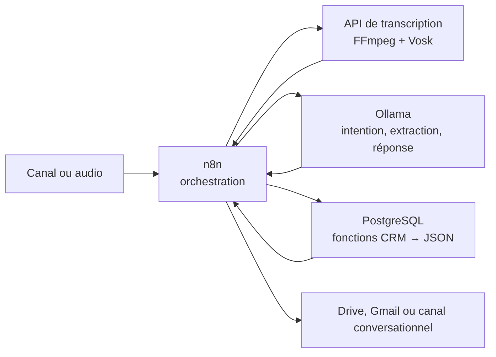

# Transcription locale et CRM hypothécaire

Ce dépôt réunit une API de transcription locale et les composants d'un futur agent
conversationnel pour le courtage hypothécaire.

La solution actuelle sait :

- convertir un média avec FFmpeg et le transcrire localement avec Vosk;
- orchestrer un traitement en lot depuis Google Drive avec n8n;
- utiliser Ollama pour produire une synthèse et extraire une fiche client JSON;
- créer ou enrichir un client PostgreSQL, puis consigner l'interaction, les
  documents requis et les tâches de suivi;
- archiver les livrables dans Google Drive et notifier le représentant.

## Architecture v2

Les responsabilités sont volontairement séparées :

| Composant | Responsabilité |
| --- | --- |
| API Node.js | Exposer la transcription locale par HTTP |
| FFmpeg + Vosk | Normaliser l'audio et produire la transcription brute |
| Ollama | Comprendre l'intention, extraire les données et générer les réponses |
| n8n | Orchestrer les étapes, les intégrations et les reprises |
| PostgreSQL | Porter les données et les services métier CRM |
| Google Drive / Gmail | Entrées, archivage et notifications du workflow actuel |

PostgreSQL est la frontière métier. À terme, n8n ne doit plus assembler des
requêtes CRUD complexes : il appelle des fonctions CRM qui appliquent les règles
de déduplication, de validation et d'historisation et qui retournent un document
`json`/`jsonb` stable. n8n reste l'orchestrateur et ne devient pas la couche
métier.



Voir [ARCHITECTURE.md](./ARCHITECTURE.md) pour les frontières, les flux et
l'état actuel par rapport à la cible.

## Workflow de transcription existant

Le workflow historique
[`n8n-workflows/Transcription_Local_2026-06-03-0702.json`](./n8n-workflows/Transcription_Local_2026-06-03-0702.json)
enchaîne téléchargement Drive, transcription, synthèse Ollama et sauvegarde des
deux textes. Le workflow en lot
[`n8n-workflows/transcription_local_batch_google_drive.json`](./n8n-workflows/transcription_local_batch_google_drive.json)
ajoute la boucle Drive, l'extraction JSON, le CRM PostgreSQL, Gmail et le
déplacement du fichier traité.

Le workflow exporté est inactif par défaut : son import, ses identifiants Drive,
ses credentials et son activation restent des opérations d'environnement.

## Workflow CRM validé

Après l'extraction Ollama, le workflow en lot :

1. normalise le JSON client;
2. recherche le client par représentant et téléphone;
3. utilise le courriel, puis le nom comme repli;
4. refuse une création sans nom exploitable;
5. crée ou enrichit le client sans écraser une valeur existante par `null`;
6. crée une interaction pour chaque appel;
7. crée les documents requis et les tâches;
8. alerte et archive un diagnostic si l'extraction est insuffisante.

Ce flux constitue la référence fonctionnelle validée. Les nœuds PostgreSQL
contiennent encore du SQL direct. La prochaine étape d'architecture consiste à
encapsuler ce comportement dans les fonctions JSON décrites dans
[`docs/SERVICES_POSTGRESQL.md`](./docs/SERVICES_POSTGRESQL.md).

## Démarrage local

Prérequis : Docker Compose, ou Node.js 20+, FFmpeg et un moteur Vosk local.

```powershell
Copy-Item .env.example .env
docker compose up --build
```

Services par défaut :

- API : `http://localhost:3000`
- santé : `GET http://localhost:3000/health`
- PostgreSQL : `localhost:5432`, base `transcription_crm`

Exemple de transcription :

```powershell
curl.exe -X POST http://localhost:3000/transcribe/upload `
  -F "file=@C:\audio\appel.m4a" `
  -F "language=fr"
```

Réponse :

```json
{
  "outputDir": "/app/outputs/...",
  "transcriptPath": "/app/outputs/.../transcript.txt",
  "jsonPath": "/app/outputs/.../transcription.json",
  "metadataPath": "/app/outputs/.../metadata.json",
  "transcript": "..."
}
```

La transcription brute est la source de vérité. Ollama ne doit jamais inventer
une donnée absente; les valeurs inconnues restent `null` ou sont placées dans
`points_a_valider`.

## Documentation

- [Architecture](./ARCHITECTURE.md)
- [Feuille de route](./docs/ROADMAP.md)
- [Services métier PostgreSQL](./docs/SERVICES_POSTGRESQL.md)
- [Workflows n8n](./docs/WORKFLOWS_N8N.md)
- [ADR-001 — PostgreSQL comme couche métier](./docs/ADR/ADR-001-postgresql-couche-metier.md)
- [ADR-002 — n8n comme orchestrateur](./docs/ADR/ADR-002-n8n-orchestrateur.md)
- [ADR-003 — JSON comme format interne](./docs/ADR/ADR-003-json-format-interne.md)

Les guides historiques restent utiles pour l'exploitation et la reprise. En cas
de divergence sur l'architecture cible, les documents ci-dessus font foi.
