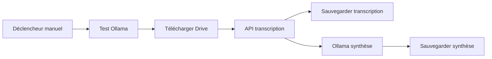
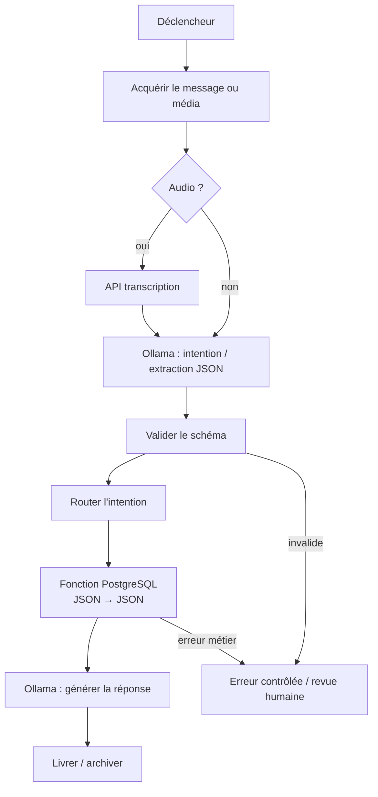

# Workflows n8n

## Rôle de n8n

n8n orchestre les déclencheurs, les appels de services, les branches, les
reprises et les intégrations. Il ne possède ni les règles CRM ni les décisions
d'autorisation. Les données structurées circulent en JSON.

## Exports présents

### Transcription simple

Fichier :
`n8n-workflows/Transcription_Local_2026-06-03-0702.json`

Le workflow manuel télécharge un fichier Drive, appelle
`/transcribe/upload`, sauvegarde la transcription originale, demande une
synthèse à Ollama et sauvegarde la synthèse. L'export contient aussi un test
Ollama initial.

### Traitement en lot et CRM

Fichier :
`n8n-workflows/transcription_local_batch_google_drive.json`

Le workflow manuel recherche les fichiers Drive, les traite un à un, extrait une
fiche client avec Ollama, exécute le flux CRM validé, envoie un courriel et
déplace le fichier. L'export est `active: false`; l'activation dépend de
l'environnement n8n.

Le flux contient actuellement du SQL dans les nœuds PostgreSQL. C'est l'état
fonctionnel de référence, pas la frontière cible.

## Workflow CRM validé

Entrée : résultat de `Parse JSON client` et métadonnées du fichier.

Ordre :

1. téléphone;
2. courriel;
3. nom normalisé comme recherche de repli;
4. création uniquement si le nom est valide;
5. création d'une interaction dans tous les chemins réussis;
6. création des documents et tâches;
7. alerte Gmail et fichier de diagnostic en cas d'extraction invalide.

Le code représentant métier actuel est fixé dans le workflow à
`2026999999`. Il doit devenir une donnée de contexte contrôlée avant un usage
multi-représentants.

Points à surveiller dans l'export :

- les noms de certains nœuds comportent des accents et doivent être conservés
  exactement dans les expressions;
- la logique contient deux chaînes de création d'interaction/documents, ce qui
  augmente le risque de divergence;
- la branche courriel et les comportements « toujours produire un item » doivent
  être testés à l'import;
- les identifiants Drive, adresses courriel et credentials sont propres à
  l'environnement;
- le déplacement du fichier ne doit arriver qu'après les sorties requises.

## Cible avec services PostgreSQL

Pour le flux CRM audio, plusieurs nœuds CRUD deviennent un seul appel à
`crm.enregistrer_interaction`. n8n conserve :

- l'acquisition du fichier;
- l'appel de transcription;
- l'extraction Ollama;
- la validation JSON;
- l'appel de service;
- l'archivage et la notification;
- la gestion explicite des erreurs et reprises.

## Politique d'erreur

| Catégorie | Exemple | Comportement |
| --- | --- | --- |
| Entrée invalide | média absent, JSON Ollama invalide | ne pas appeler le CRM; archiver pour revue |
| Erreur métier | nom requis, accès refusé | ne pas réessayer aveuglément; notifier |
| Erreur transitoire | service indisponible, timeout | retry borné avec délai |
| Replay | même fichier ou message | réutiliser la clé d'idempotence |
| Erreur de sortie | Drive/Gmail indisponible | reprendre la livraison sans rejouer l'écriture CRM |

## Checklist d'import

1. importer l'export dans l'environnement cible;
2. associer les credentials Google, Gmail, PostgreSQL et Ollama;
3. vérifier les URL selon le réseau (`host.docker.internal` ou nom de service);
4. remplacer les identifiants de dossiers et le représentant de test;
5. exécuter un audio connu;
6. vérifier transcription, synthèse, client, interaction, documents et tâches;
7. rejouer le même cas et contrôler l'idempotence attendue;
8. tester la branche sans nom;
9. activer le déclencheur planifié seulement après validation.

## Validation future

Les workflows doivent pouvoir être vérifiés automatiquement :

- JSON exporté parseable;
- aucun secret en clair;
- noms des nœuds critiques présents;
- schémas d'entrée et de sortie conformes;
- jeu de tests couvrant client nouveau, existant, incomplet et replay;
- promotion dev → test → production sans modifier la logique métier.
