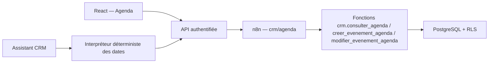

# Agenda et rappels — MVP local

## Portée livrée

Le représentant dispose d’une vue hebdomadaire **Agenda** dans le CRM. Il peut :

- naviguer entre les semaines;
- créer une rencontre, un appel, un suivi, une échéance ou un rappel;
- modifier une planification existante et ses rappels;
- rattacher l’événement à un client, à son dossier principal et à une étape du parcours hypothécaire;
- ouvrir directement le dossier client depuis l’événement;
- ajouter un rappel dans l’interface;
- consulter les événements et rappels avec l’assistant en langage naturel.

Exemples pris en charge sans appel au LLM :

- « Qu’ai-je dans mon agenda aujourd’hui? »
- « Affiche mes rencontres de la semaine. »
- « Quels sont mes rappels demain? »
- « Quels rappels sont en retard? »

Une demande de mutation comme « rappelle-moi d’appeler le client » n’est pas exécutée directement. L’assistant renvoie vers le formulaire **Agenda > Ajouter**. Cette limite évite qu’un modèle crée un engagement sans confirmation explicite.

## Architecture



La période et l’intention sont interprétées par du code déterministe. Ollama n’est donc pas requis pour répondre aux questions factuelles d’agenda.

## Sécurité

- Le `representant_id` vient exclusivement du jeton Keycloak validé par l’API.
- n8n initialise `app.role=representant` et `app.representant_id` avant chaque appel PostgreSQL.
- Les tables `evenements_agenda` et `rappels_evenement` utilisent RLS forcée.
- Les clés UUID ne sont pas exposées au navigateur; l’interface reçoit un `code_evenement` métier.
- L’écriture accepte une clé d’idempotence pour éviter les doublons lors d’un double clic ou d’une reprise réseau.
- Un nom de client ambigu est refusé; le représentant doit alors fournir le code client.
- La modification recherche l’événement par son code métier et par le représentant authentifié; un représentant ne peut donc pas modifier l’agenda d’un autre.

## Validation du formulaire

Le formulaire présente ensemble tous les champs à compléter. Le titre et le début sont toujours requis. Une fin est requise pour une rencontre, un appel, un suivi ou un événement de type « autre ». Lorsqu’une étape du parcours est choisie, un client doit aussi être indiqué afin que l’événement soit relié au dossier principal de ce client.

## Installation locale

Pour une base déjà initialisée, depuis PowerShell dans la racine du projet :

```powershell
./scripts/installer_agenda_local.ps1
```

Le script exécute les commandes suivantes (elles restent documentées pour le diagnostic) :

```powershell
docker cp database/017_agenda_rappels.sql postgres-crm:/tmp/017_agenda_rappels.sql
docker exec postgres-crm sh -c 'psql --username="$POSTGRES_USER" --dbname="$POSTGRES_DB" --set ON_ERROR_STOP=1 --file=/tmp/017_agenda_rappels.sql'
docker cp n8n-workflows/crm_agenda_mvp.json N8N_Local:/tmp/crm_agenda_mvp.json
docker exec N8N_Local n8n import:workflow --input=/tmp/crm_agenda_mvp.json
docker exec N8N_Local n8n update:workflow --id=CrmAgendaV1 --active=true
docker restart N8N_Local
docker compose -p transcription-api up -d --build --no-deps transcription-api
```

Pour une installation neuve, la migration est montée par `docker-compose.yml`; elle sera appliquée au premier démarrage de PostgreSQL.

## Vérification

```powershell
npm.cmd run check
npm.cmd test
npm.cmd run web:build
Invoke-RestMethod http://localhost:3000/health
```

Le bilan attendu est `72` tests réussis et les indicateurs `calendarConfigured`, `calendarWriteConfigured` et `calendarUpdateConfigured` à `true`.

## Suite recommandée

1. annulation d’un événement avec motif et journal d’audit;
2. confirmation conversationnelle avant création;
3. notifications courriel via n8n avec journal d’envoi;
4. synchronisation Microsoft 365 ou Google Calendar, activée par représentant;
5. événements de dossier générés automatiquement à partir des échéances métier.
