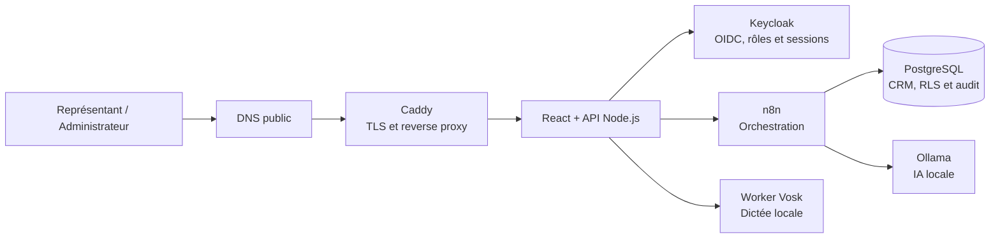
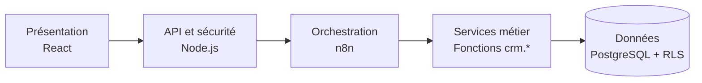
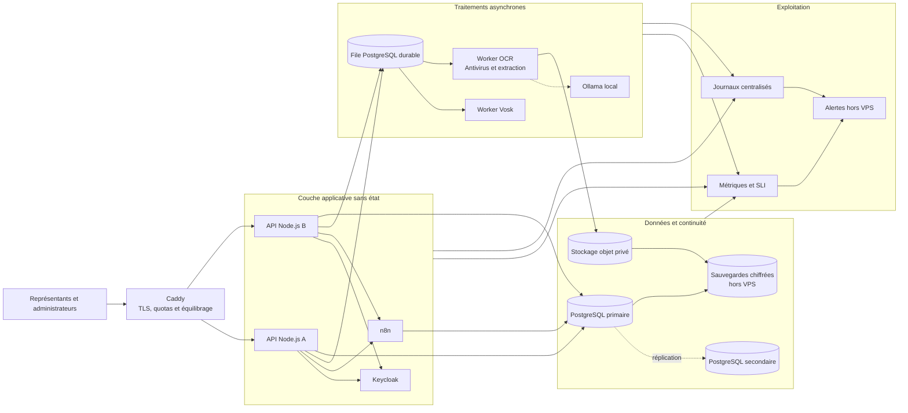

# Architecture de la solution selon les volets de conception de systèmes

**Solution :** CRM hypothécaire Tonia Conseil  
**Version analysée :** `8dba2d8` (`feature/reprise-travaux-crm`)  
**Date :** 6 septembre 2026  
**Référentiel :** [System Design — Karan Pratap Singh](https://github.com/karanpratapsingh/system-design)

## 1. Objet et portée

Ce document décrit l'architecture du CRM hypothécaire en reprenant les thèmes du
référentiel ouvert [System Design](https://github.com/karanpratapsingh/system-design).
Le référentiel sert à structurer l'analyse; les constats d'implantation proviennent
du code, des migrations SQL, des vues C4 et de la configuration Docker du projet.

L'objectif n'est pas d'ajouter systématiquement chaque patron d'architecture. Le
document précise plutôt :

- ce qui est actuellement implanté;
- ce qui est présent de manière partielle;
- ce qui constitue une cible d'évolution;
- ce qui serait inutilement complexe pour le volume actuel.

### Légende

| Statut | Signification |
|---|---|
| **Implanté** | Présent dans le code ou dans le déploiement de référence. |
| **Partiel** | Le principe existe, mais sans infrastructure complète. |
| **Cible** | Évolution recommandée lorsque le besoin le justifiera. |
| **Non requis** | Patron disproportionné ou sans cas d'usage actuel. |

## 2. Vue d'ensemble

La production est un monolithe modulaire conteneurisé sur un VPS Hostinger. Les
responsabilités sont réparties entre sept services principaux, mais tous reposent
sur le même hôte physique et la même installation Docker Compose.

---

# Chapitre I — Réseau, disponibilité et stockage

Référence générale : [chapitre Réseau et infrastructure du guide System Design](https://github.com/karanpratapsingh/system-design#ip).

## IP

**Statut : Implanté**

Le VPS possède une adresse IP publique vers laquelle pointent les domaines de la
plateforme. Docker isole les services dans deux réseaux privés :

- `172.30.0.0/24` pour le réseau frontal;
- `172.31.0.0/24` pour le réseau backend.

Seul Caddy publie les ports de l'hôte. PostgreSQL, Ollama, n8n, Keycloak, l'API
et le worker Vosk communiquent principalement au moyen d'adresses privées et des
noms de services Docker.

## Modèle OSI

**Statut : Implanté par les technologies utilisées**

| Couche | Application dans la solution |
|---|---|
| 7 — Application | React, API REST, OIDC, webhooks n8n, PostgreSQL et protocoles Ollama. |
| 6 — Présentation | JSON, JWT, encodage audio, TLS et certificats. |
| 5 — Session | Sessions Keycloak et cycle d'authentification du navigateur. |
| 4 — Transport | TCP pour HTTP/HTTPS et UDP pour HTTP/3/QUIC. |
| 3 — Réseau | IP publique du VPS et sous-réseaux privés Docker. |
| 2 — Liaison | Interfaces et ponts virtuels Docker. |
| 1 — Physique | Infrastructure de virtualisation et réseau Hostinger. |

## TCP et UDP

**Statut : Implanté**

- HTTP et HTTPS utilisent TCP sur les ports 80 et 443.
- Caddy expose également UDP 443 pour HTTP/3/QUIC.
- Les communications internes entre conteneurs utilisent principalement TCP.
- La dictée ne diffuse pas un flux audio continu en UDP : le navigateur envoie
  un fichier audio compressé à l'API par HTTPS.

Cette approche simplifie la sécurité, les reprises et la compatibilité avec les
pare-feu des utilisateurs.

## Système de noms de domaine — DNS

**Statut : Implanté**

| Domaine | Destination fonctionnelle |
|---|---|
| `crm.toniaconseil.com` | Interface React et API CRM. |
| `auth.toniaconseil.com` | Endpoints publics OIDC de Keycloak. |
| `n8n.toniaconseil.com` | Interface n8n protégée par une authentification additionnelle. |

À l'intérieur de Docker, les services utilisent la découverte DNS native de
Compose : `postgres-crm`, `keycloak`, `n8n`, `ollama` et `dictation-worker`.

## Équilibrage de charge

**Statut : Partiel**

Caddy distribue les requêtes selon le domaine demandé et vérifie la santé de
l'API. Il n'existe toutefois qu'une instance de chaque service. Caddy agit donc
comme reverse proxy, mais pas encore comme équilibreur entre plusieurs instances.

Pour évoluer horizontalement, il faudrait notamment :

1. rendre l'API complètement sans état partagé local;
2. déployer plusieurs répliques de l'API;
3. externaliser les files et les données persistantes;
4. configurer plusieurs upstreams Caddy avec des contrôles de santé;
5. adapter n8n et PostgreSQL à une topologie multi-instance.

## Clustering

**Statut : Non requis actuellement**

PostgreSQL, Keycloak, n8n, Ollama et l'API fonctionnent en instance unique. Le
clustering deviendra pertinent si la charge, le nombre de représentants ou les
exigences de disponibilité excèdent la capacité du VPS.

## Mise en cache

**Statut : Implanté avec une portée limitée**

La stratégie actuelle privilégie la simplicité et évite de conserver des données
CRM sensibles inutilement :

- les fichiers statiques peuvent être conservés une heure par le navigateur;
- les documents HTML et les réponses JSON utilisent `Cache-Control: no-store`;
- les clés JWKS de Keycloak sont réutilisées en mémoire;
- les noms du portefeuille servant à corriger la dictée sont conservés cinq
  minutes par représentant;
- les modèles Vosk et Ollama sont conservés sur disque et chargés localement.

Aucun cache Redis n'est actuellement nécessaire. Si plusieurs instances d'API
sont ajoutées, le cache de noms devra être supprimé, toléré comme cache local ou
déplacé vers un cache partagé avec une durée de vie courte.

## Réseau de diffusion de contenu — CDN

**Statut : Non requis actuellement**

Le build React est servi directement par l'API derrière Caddy. Un CDN pourrait
réduire le temps de chargement des ressources publiques pour des utilisateurs
géographiquement dispersés. Les réponses CRM authentifiées, les jetons et les
données clients ne doivent pas être mis en cache dans un CDN.

## Proxy

**Statut : Implanté**

Caddy est le reverse proxy public. Il :

- termine TLS;
- redirige les domaines vers le bon service;
- vérifie la santé de l'API;
- applique HSTS et plusieurs en-têtes de sécurité;
- autorise le microphone uniquement pour l'origine CRM;
- bloque l'interface `/admin` publique de Keycloak;
- ajoute une authentification HTTP devant n8n.

## Disponibilité

**Statut : Partiel**

Les conteneurs utilisent `restart: unless-stopped` et les services critiques ont
des contrôles de santé. Cela permet de reprendre automatiquement après l'arrêt
d'un processus ou un redémarrage du VPS.

Les points uniques de défaillance sont toutefois :

- le VPS Hostinger;
- l'instance PostgreSQL;
- les volumes Docker locaux;
- l'unique instance de chaque service.

La disponibilité actuelle convient à une bêta contrôlée, mais ne constitue pas
une architecture de haute disponibilité.

## Évolutivité

**Statut : Verticale aujourd'hui, horizontale en cible**

Le profil actuel est adapté à une évolution verticale : ajout de CPU, de mémoire
ou d'espace disque. Les traitements coûteux sont contrôlés :

- worker de dictée limité à un cœur CPU et 512 Mo;
- une transcription courte à la fois;
- maximum de trois dictées en attente;
- appels Ollama limités aux cas où l'IA est réellement nécessaire;
- traitements de transcription et d'extraction séquentiels.

L'évolution horizontale nécessitera un stockage partagé, une file durable, une
base hautement disponible et une stratégie de répartition des requêtes.

## Stockage

**Statut : Implanté pour le CRM; cible définie pour les documents**

PostgreSQL conserve les données structurées. Des volumes Docker persistants
conservent les données de PostgreSQL, n8n, Ollama, Keycloak/Caddy et les sorties
de transcription.

Les futurs fichiers hypothécaires ne devraient pas être stockés dans les tables
PostgreSQL. La cible prévoit un stockage objet privé et versionné, tandis que
PostgreSQL conservera seulement les métadonnées, empreintes, statuts et audits.

---

# Chapitre II — Bases de données et cohérence

Référence générale : [chapitre Bases de données du guide System Design](https://github.com/karanpratapsingh/system-design#databases-and-dbms).

## Bases de données et SGBD

**Statut : Implanté**

PostgreSQL 16 est le SGBD principal. Une base contient le domaine CRM et une
autre contient les données Keycloak dans la même instance. n8n conserve sa
configuration et ses workflows dans son volume persistant.

## Bases de données SQL

**Statut : Choix principal**

Le modèle relationnel convient aux relations fortes entre représentants,
clients, dossiers, participants, documents, tâches, parcours et événements. Il
permet aussi les contraintes, transactions, clés étrangères et politiques RLS.

## Bases de données NoSQL

**Statut : Non utilisées**

Certaines fonctions utilisent `jsonb` comme contrat de service ou comme champ
flexible. PostgreSQL reste néanmoins l'autorité relationnelle; `jsonb` n'est pas
utilisé comme remplacement d'une base NoSQL.

## SQL contre NoSQL

Le choix SQL est justifié par :

- l'intégrité des dossiers hypothécaires;
- les relations entre plusieurs participants et dossiers;
- les transactions et contraintes;
- l'isolation RLS par représentant;
- les besoins d'audit et d'idempotence.

Une base NoSQL pourrait éventuellement accueillir des journaux techniques très
volumineux ou des résultats temporaires, sans remplacer le modèle CRM.

## Réplication de base de données

**Statut : Non implanté**

Il n'existe actuellement ni réplique de lecture ni nœud PostgreSQL de secours.
Une réplication ou un service PostgreSQL géré sera nécessaire avant de promettre
une haute disponibilité.

## Indices

**Statut : Implanté**

Les migrations créent notamment des indices sur :

- les représentants et clients;
- les relations client-dossier;
- les codes métier uniques;
- les dates et statuts d'événements;
- les rappels à envoyer;
- les participants, consentements et historiques.

Les principaux accès restent à surveiller avec `EXPLAIN ANALYZE` et les
statistiques PostgreSQL lorsque le volume réel augmentera.

## Normalisation et dénormalisation

**Statut : Équilibre implanté**

Les tables métier sont majoritairement normalisées. Les fonctions `crm.*`
assemblent ensuite des objets JSON dénormalisés adaptés à chaque écran ou outil
de l'agent. Cette séparation évite de dupliquer les données officielles tout en
réduisant le nombre d'allers-retours applicatifs.

## Modèles de consistance ACID et BASE

**Statut : ACID implanté; BASE non utilisé**

Les créations et modifications importantes reposent sur les garanties ACID de
PostgreSQL. La solution ne choisit pas une cohérence éventuelle de type BASE
pour ses données métier officielles.

## Théorème CAP

**Statut : Peu applicable à l'instance unique**

La base n'est pas distribuée. En cas de perte de connexion avec PostgreSQL,
l'API échoue plutôt que d'accepter une donnée potentiellement incohérente. Une
future réplication devra formaliser le compromis entre cohérence et disponibilité
pendant une partition réseau.

## Théorème PACELC

**Statut : Non déterminant aujourd'hui**

Lorsque le réseau fonctionne, l'architecture actuelle favorise une faible
latence locale entre les conteneurs et une cohérence forte. Une architecture
multi-région obligerait à arbitrer explicitement entre latence et cohérence.

## Transactions

**Statut : Implanté**

Les fonctions SQL exécutent les validations, changements, contrôles RLS et
journaux d'audit dans le contexte transactionnel de PostgreSQL. L'API transmet
le contexte du représentant avant d'appeler les fonctions autorisées.

## Transactions distribuées

**Statut : Non utilisées**

Keycloak, n8n et PostgreSQL ne partagent pas de transaction globale. Les
opérations interservices doivent donc être idempotentes, compensables ou
rejouables. L'introduction d'un protocole de commit distribué n'est pas
recommandée pour le MVP.

## Sharding

**Statut : Non requis**

Le volume ne justifie pas de répartir physiquement les clients sur plusieurs
bases. L'isolation logique est assurée par `representant_id` et les politiques
RLS forcées.

## Hachage cohérent

**Statut : Non requis**

Il n'existe aucun cluster de cache ou ensemble de nœuds entre lesquels distribuer
les données. Ce patron ne deviendrait utile qu'avec une infrastructure
horizontalement répartie.

## Fédération de bases de données

**Statut : Séparation de domaines, sans fédération de requêtes**

Le CRM et Keycloak utilisent des bases logiquement séparées. Chaque composant
demeure propriétaire de son domaine; aucune jointure applicative directe ne doit
être créée entre leurs données.

---

# Chapitre III — Architecture applicative et intégration

Référence générale : [chapitre Architecture et intégration du guide System Design](https://github.com/karanpratapsingh/system-design#n-tier-architecture).

## Architecture à n niveaux

**Statut : Implanté**

L'interface ne communique jamais directement avec PostgreSQL. L'agent et Ollama
ne décident jamais de l'identité ou des permissions.

## Courtiers de messages

**Statut : Non implanté**

Aucun RabbitMQ, Kafka ou NATS n'est déployé. Les communications utilisent des
appels HTTP, webhooks et fonctions SQL.

## Files d'attente de messages

**Statut : Partiel**

La dictée possède une file en mémoire limitée à trois demandes et traite une
demande à la fois. Cette file protège les ressources, mais elle n'est pas
durable après un redémarrage. Le module documentaire cible prévoit une file
persistante pour l'OCR.

## Publier–s'abonner

**Statut : Non implanté**

Les changements ne sont pas publiés dans un bus à plusieurs abonnés. Les besoins
actuels sont couverts par des webhooks directs. Un modèle pub/sub pourrait servir
plus tard aux notifications, audits externes et synchronisations calendaires.

## Bus de services d'entreprise — ESB

**Statut : n8n comme orchestrateur léger**

n8n coordonne les appels SQL, l'IA et les réponses. Il ne doit pas devenir un
ESB contenant toute la logique métier. Les règles officielles demeurent dans les
fonctions SQL et les modules de l'API.

## Monolithes et microservices

**Statut : Architecture hybride**

React et l'API constituent un monolithe modulaire. Keycloak, n8n, PostgreSQL,
Ollama et Vosk sont des services spécialisés séparés. Cette architecture garde
un déploiement simple tout en isolant les charges importantes.

## Architecture événementielle — EDA

**Statut : Partiel**

Les webhooks déclenchent des workflows n8n, mais il n'existe pas de bus
d'événements durable ni de catalogue officiel d'événements métier.

## Approvisionnement en événements — Event sourcing

**Statut : Non implanté**

Le système conserve l'état courant avec des journaux de modifications et des
historiques de statut. Ces journaux aident à l'audit, mais ils ne reconstruisent
pas l'intégralité de l'état comme le ferait l'event sourcing.

## Séparation des commandes et requêtes — CQRS

**Statut : Partiel et pragmatique**

Les fonctions de lecture et de mutation sont séparées, mais utilisent le même
modèle PostgreSQL. Aucun magasin de lecture distinct n'est nécessaire pour le
volume actuel.

## Passerelle API

**Statut : Partiel**

Caddy constitue la porte d'entrée réseau et l'API Node la façade métier. La
solution ne dispose pas encore d'une passerelle complète offrant quotas,
catalogue, transformation et analytique centralisée.

## REST, GraphQL et gRPC

**Statut : REST implanté**

L'application utilise REST/JSON et des webhooks HTTP. GraphQL et gRPC ne sont
pas nécessaires au MVP; leur introduction augmenterait le coût d'exploitation
sans corriger une contrainte actuelle.

## Long polling, WebSockets et Server-Sent Events — SSE

**Statut : Non utilisés par le CRM**

Les interactions utilisent des requêtes HTTP classiques. SSE serait une option
simple pour afficher progressivement les traitements longs. WebSockets ne sont
recommandés que si de véritables fonctions temps réel bidirectionnelles sont
introduites.

---

# Chapitre IV — Résilience, exploitation et sécurité

Référence générale : [chapitre Résilience et sécurité du guide System Design](https://github.com/karanpratapsingh/system-design#geohashing-and-quadtrees).

## Géohachage et quadtrees

**Statut : Non applicable**

Le CRM ne réalise pas de recherche spatiale ou de rapprochement géographique à
grande échelle. PostgreSQL/PostGIS pourrait être ajouté si un futur module de
recherche de propriétés nécessite des requêtes géospatiales.

## Disjoncteur — Circuit breaker

**Statut : Partiel**

Les appels vers n8n, l'agenda, l'agent et le worker de dictée possèdent des délais
maximaux et utilisent l'annulation des requêtes. Il n'existe pas de disjoncteur
avec états fermé, ouvert et semi-ouvert.

Une cible raisonnable serait d'ajouter un disjoncteur autour d'Ollama et de n8n,
avec un repli déterministe lorsque l'IA est indisponible.

## Limitation de débit

**Statut : Implantée pour la dictée; cible pour l'API générale**

La dictée limite :

- le fichier reçu à 2 Mo;
- l'enregistrement à environ 35 secondes;
- le nombre de demandes en attente à trois;
- le worker à une transcription active, un cœur CPU et 512 Mo.

L'API générale devrait ajouter une limitation par utilisateur et par IP,
particulièrement pour la connexion, l'administration et l'assistant.

## Découverte de services

**Statut : Implanté**

Docker Compose fournit la découverte DNS interne. Les services utilisent des
noms stables plutôt que des adresses IP de conteneurs.

## SLA, SLO et SLI

**Statut : À formaliser**

Les indicateurs recommandés sont :

| SLI | Mesure proposée |
|---|---|
| Disponibilité | Pourcentage de réponses réussies de `/health` et des routes CRM. |
| Fiabilité | Taux de réponses HTTP 5xx et d'échecs n8n. |
| Performance | Latence p50/p95/p99 des consultations et mutations. |
| Dictée | Taux de réussite et durée de transcription. |
| Données | Âge de la dernière sauvegarde vérifiée. |
| Authentification | Taux d'échec Keycloak hors erreurs de mot de passe utilisateur. |

Pour une bêta, un SLO initial de 99,5 % de disponibilité mensuelle serait plus
réaliste qu'un engagement de 99,9 % sur une architecture à VPS unique.

## Reprise après sinistre

**Statut : Procédures présentes, protection à renforcer**

Les procédures couvrent PostgreSQL, Keycloak et n8n. Les sauvegardes doivent être
chiffrées, copiées hors du VPS et restaurées régulièrement dans un environnement
de test.

Objectifs initiaux proposés :

- **RPO :** 24 heures;
- **RTO :** 4 heures;
- sauvegarde complète avant chaque déploiement majeur;
- test de restauration au minimum chaque trimestre.

## Machines virtuelles et conteneurs

**Statut : Implanté**

Hostinger fournit une VM KVM. Docker Compose exécute les services avec des
limites de ressources :

| Service | Limite de référence |
|---|---|
| PostgreSQL | 2 Go de mémoire |
| Keycloak | 2 Go de mémoire |
| n8n | 2 Go de mémoire |
| Ollama | 9 Go de mémoire |
| API Node.js | 4 Go de mémoire |
| Worker Vosk | 512 Mo et 1 CPU |

## OAuth 2.0 et OpenID Connect — OIDC

**Statut : Implanté avec Keycloak**

React utilise Authorization Code avec PKCE. L'API vérifie :

- la signature RS256;
- l'émetteur du jeton;
- l'audience `crm-api`;
- le rôle `representant` ou `admin`;
- l'attribut `representant_id` pour les représentants.

Le navigateur ne choisit jamais lui-même le représentant utilisé pour filtrer
les données.

## Authentification unique — SSO

**Statut : Partiel**

Keycloak fournit une session commune aux fonctions CRM. n8n conserve une
authentification additionnelle et ne participe pas au même SSO public, ce qui est
approprié pour une interface technique d'exploitation.

## SSL, TLS et mTLS

**Statut : TLS public implanté; mTLS non implanté**

Caddy automatise les certificats TLS et applique HSTS. Les communications entre
conteneurs utilisent HTTP sur des réseaux Docker privés. Le mTLS interne serait
pertinent dans une future architecture multi-hôtes, mais apporte peu de valeur
sur un unique hôte Docker correctement isolé.

---

# Chapitre V — Mise en perspective avec les études de conception

Référence générale : [exemples de conception du guide System Design](https://github.com/karanpratapsingh/system-design#system-design-interviews).

Les sujets suivants sont des études de cas permettant de comparer les patrons.
Ils ne représentent pas des composants à ajouter automatiquement au CRM.

## Entretiens de conception de systèmes

Pour présenter la solution lors d'un exercice de conception :

1. préciser les utilisateurs, fonctions et données sensibles;
2. estimer le nombre de représentants et de requêtes;
3. établir les exigences de sécurité, disponibilité et fonctionnement local;
4. présenter les conteneurs et les flux d'identité;
5. identifier les points uniques de défaillance;
6. expliquer les compromis entre simplicité, coût et évolutivité;
7. proposer une trajectoire mesurable plutôt qu'une architecture maximale dès
   le départ.

## Raccourcisseur d'URL

Le CRM applique un principe analogue avec ses codes métier lisibles :
`CLI-*`, `DOS-*` et `EVT-*`. Les UUID demeurent les clés techniques internes,
tandis que les codes lisibles peuvent être affichés ou dictés.

## WhatsApp

L'assistant possède une interface conversationnelle, mais pas les garanties
d'une plateforme de messagerie : livraison différée, accusés de lecture,
présence, synchronisation multiappareils ou file de messages durable.

## Twitter/X

Le portefeuille ressemble superficiellement à un fil trié par priorité. Il est
toutefois produit par des requêtes SQL déterministes, sans abonnements, fan-out
ou génération de fils mis en cache.

## Netflix

La solution traite de l'audio, mais ne diffuse pas de contenu multimédia en
continu. La dictée est courte, téléversée à l'API, convertie en WAV puis
transcrite localement. Aucun CDN vidéo, transcodage adaptatif ou segmentation de
flux n'est nécessaire.

## Uber

L'agenda et le parcours hypothécaire suivent des activités dans le temps, mais
il n'existe ni géolocalisation, rapprochement temps réel, tarification dynamique
ni moteur de répartition.

---

# 3. Priorités architecturales recommandées

Avant d'introduire Kafka, Kubernetes, le sharding ou une architecture
multi-région, les améliorations offrant le meilleur rapport valeur/coût sont :

1. automatiser les sauvegardes hors VPS et tester les restaurations;
2. définir les SLI/SLO et centraliser les journaux et alertes;
3. ajouter une limitation de débit générale par utilisateur et par IP;
4. rendre durables les traitements longs, particulièrement le futur OCR;
5. ajouter des stratégies de reprise et un circuit breaker autour de n8n et
   Ollama;
6. préparer une réplication PostgreSQL ou une migration vers un service géré si
   les exigences de disponibilité augmentent;
7. conserver l'API sans état avant toute réplication horizontale.

# 4. Feuille de route vers l'architecture cible

## Architecture cible

La cible conserve les composants éprouvés du MVP, mais retire progressivement
les principaux points uniques de défaillance. Elle ne nécessite ni Kubernetes,
ni Kafka, ni sharding à court terme.

### Principes directeurs

1. Les données doivent être récupérables avant de chercher la haute
   disponibilité.
2. Chaque évolution doit être mesurée par des SLI et des critères d'acceptation.
3. Les traitements longs doivent survivre au redémarrage de leurs workers.
4. L'API doit devenir sans état avant d'être répliquée.
5. PostgreSQL reste l'autorité transactionnelle et la frontière RLS.
6. L'IA, la dictée et l'OCR continuent de fonctionner localement, sans service
   d'intelligence artificielle externe.
7. Les sauvegardes et les alertes doivent quitter le domaine de panne du VPS,
   même si leur destination est une infrastructure privée de l'organisation.
8. La complexité distribuée n'est introduite qu'après validation d'un besoin de
   capacité ou de disponibilité.

## Phase 1 — Protection et capacité de restauration

**Priorité : P0**  
**Effort estimé : 5 à 8 jours**

### Travaux

- automatiser les sauvegardes quotidiennes du CRM, de Keycloak et de n8n;
- chiffrer et dédupliquer les archives avec un outil tel que Restic;
- copier les sauvegardes vers un deuxième domaine de panne;
- conserver séparément une copie chiffrée des secrets et configurations;
- appliquer une rétention quotidienne, hebdomadaire et mensuelle;
- créer un script de restauration dans un environnement vide;
- effectuer une restauration mensuelle et un exercice de sinistre trimestriel;
- préparer l'archivage WAL et la restauration PostgreSQL à un instant précis.

### Critères de passage

- une sauvegarde complète date de moins de 26 heures;
- toute erreur de sauvegarde génère une alerte;
- CRM, Keycloak et n8n ont été restaurés avec succès;
- le temps réel de restauration respecte un RTO initial de quatre heures;
- la perte maximale mesurée respecte un RPO initial de 24 heures;
- aucun secret n'apparaît dans les journaux ou dans Git.

## Phase 2 — Observabilité, SLI et SLO

**Priorité : P0**  
**Effort estimé : 5 à 8 jours**

### Travaux

- produire des journaux JSON structurés dans l'API Node.js;
- propager un `request_id` entre Caddy, l'API, n8n et les workers;
- exclure les jetons, transcriptions, fichiers audio et renseignements clients;
- collecter les métriques système, Docker, PostgreSQL, API, n8n et workers;
- déployer une pile légère Prometheus, Loki, Grafana et Alloy avec des limites
  de mémoire et une rétention courte;
- créer des tableaux de bord pour la disponibilité, la latence, les erreurs, la
  saturation, les sauvegardes et les files;
- transmettre les alertes critiques à une destination extérieure au VPS;
- mesurer les SLO pendant au moins quatre semaines avant de les transformer en
  engagements contractuels.

### SLO initiaux proposés

| Fonction | Objectif initial |
|---|---|
| Disponibilité mensuelle du CRM | 99,5 % |
| Consultations déterministes | 95 % sous 2 secondes |
| Mutations de dossier et d'agenda | 95 % sous 3 secondes |
| Dictée courte | 95 % sous 20 secondes |
| Assistant local | 95 % sous 60 secondes |
| Taux d'erreurs serveur | Moins de 1 % |
| Âge de la dernière sauvegarde | Moins de 26 heures |

### Critères de passage

- une requête peut être suivie de l'entrée Caddy jusqu'à son traitement final;
- une panne simulée déclenche une alerte en moins de cinq minutes;
- les tableaux de bord couvrent tous les services critiques;
- les journaux ont été vérifiés pour l'absence de renseignements sensibles;
- les seuils sont ajustés à partir de mesures réelles du VPS.

## Phase 3 — Protection contre la saturation

**Priorité : P0/P1**  
**Effort estimé : 3 à 5 jours**

### Travaux

- ajouter un limiteur de débit dans l'API Node.js;
- identifier les utilisateurs authentifiés par le claim `sub` de Keycloak;
- limiter les routes publiques par adresse IP validée par Caddy;
- définir des budgets distincts pour les consultations, mutations, appels à
  l'assistant, dictées et fonctions administratives;
- retourner `429 Too Many Requests` et `Retry-After`;
- limiter la taille du corps, la durée et la concurrence par catégorie;
- tester les rafales, la remise à zéro des compteurs et l'isolation entre
  utilisateurs;
- activer et valider la protection contre la force brute dans Keycloak.

### Limites de départ

| Catégorie | Limite initiale |
|---|---|
| Routes publiques | 30 requêtes/minute/IP |
| Consultation CRM | 120 requêtes/minute/utilisateur |
| Mutation CRM ou agenda | 30 requêtes/minute/utilisateur |
| Assistant | 20 requêtes/minute/utilisateur |
| Dictée | 6 requêtes/5 minutes/utilisateur |
| Administration | 30 requêtes/minute/administrateur |

Ces valeurs doivent rester configurables et être ajustées au moyen des SLI.
Tant que l'API est unique, les compteurs peuvent résider en mémoire. Une
interface de stockage doit toutefois permettre de passer à un compteur partagé
si plusieurs API sont déployées.

### Critères de passage

- un utilisateur en surcharge ne ralentit pas les autres;
- aucun dépassement normal ne produit d'erreur HTTP 500;
- l'adresse IP ne peut pas être falsifiée par un en-tête non fiable;
- les limites peuvent être modifiées sans changer le code;
- les refus sont visibles dans les métriques sans exposer le contenu envoyé.

## Phase 4 — Traitements asynchrones durables

**Priorité : P1**  
**Effort estimé : 8 à 12 jours pour l'infrastructure, hors module OCR complet**

### Travaux

- créer une table PostgreSQL `travaux_asynchrones` protégée par RLS;
- réserver les travaux avec `FOR UPDATE SKIP LOCKED`;
- enregistrer statut, progression, tentatives, prochaine tentative, verrou,
  expiration, battement de cœur et erreur nettoyée;
- utiliser une clé d'idempotence pour chaque demande;
- créer le travail dans la même transaction que l'événement métier, selon le
  patron outbox;
- reprendre automatiquement un travail dont le verrou a expiré;
- appliquer des reprises exponentielles et une file d'échecs définitifs;
- limiter initialement la concurrence OCR à un;
- stocker les fichiers dans un stockage objet privé;
- analyser les fichiers par antivirus avant l'extraction et l'OCR;
- conserver les résultats OCR et IA comme candidats jusqu'à validation humaine;
- retourner `202 Accepted` avec un code de suivi pour les traitements longs.

### Critères de passage

- un redémarrage du worker ne perd aucun travail;
- un travail interrompu est repris sans duplication;
- un document invalide ne bloque pas le reste de la file;
- l'arrêt d'Ollama n'empêche pas l'extraction OCR déterministe;
- aucun fichier permanent ne reste dans un répertoire temporaire;
- la profondeur, l'âge et les échecs de la file sont supervisés.

## Phase 5 — API sans état et prête à être répliquée

**Priorité : P1**  
**Effort estimé : 5 à 8 jours**

### Travaux

- rendre le cache des noms de dictée facultatif ou reconstructible;
- déplacer toute sortie persistante vers PostgreSQL ou le stockage objet;
- garantir la suppression des fichiers temporaires par requête;
- conserver les sessions exclusivement dans les jetons Keycloak;
- persister l'idempotence dans PostgreSQL;
- ne lancer aucune tâche longue uniquement en mémoire;
- ajouter des endpoints distincts de vivacité et de disponibilité;
- implanter l'arrêt gracieux et le drainage des requêtes;
- charger toute configuration par variables d'environnement et secrets montés;
- exécuter les tests avec deux instances simultanées sans affinité de session.

Le cache JWKS peut rester local à chaque instance, puisqu'il est reconstructible
et ne contient aucun état métier.

### Critères de passage

- la suppression d'une instance ne déconnecte pas les utilisateurs;
- aucune donnée métier n'est perdue lors d'un redémarrage;
- une mutation rejouée ne crée pas de doublon;
- deux instances donnent les mêmes réponses autorisées;
- les contrôles de santé distinguent processus vivant et service prêt;
- aucune route ne dépend d'un disque local permanent.

## Phase 6 — PostgreSQL hautement disponible

**Priorité : préparation P1, activation P2**  
**Effort estimé : 5 jours de préparation, puis 5 à 10 jours d'implantation**

### Préparation commune

- utiliser une chaîne de connexion entièrement configurable;
- tester les migrations sur une nouvelle instance;
- activer l'archivage WAL et la restauration à un instant précis;
- superviser connexions, verrous, requêtes lentes et retard de réplication;
- documenter extensions, rôles, politiques RLS et fonctions `crm.*`;
- vérifier que l'application change de serveur PostgreSQL sans modification de
  code;
- évaluer PgBouncer lorsque le nombre de connexions augmente.

### Option A — PostgreSQL géré

Option recommandée si une dépendance externe est acceptée : réplication,
sauvegardes, mises à jour et basculement sont alors opérés par le fournisseur.
La région, la résidence des données, le chiffrement et les ententes de service
doivent être validés avant la migration.

### Option B — Infrastructure autogérée

Si la solution doit rester entièrement sous le contrôle de l'organisation :

- déployer un deuxième VPS dans un domaine de panne distinct;
- configurer une réplication PostgreSQL asynchrone;
- utiliser TLS entre les deux serveurs;
- conserver les WAL dans une troisième destination;
- commencer par un basculement manuel documenté;
- simuler périodiquement la promotion et le retour au primaire.

Un réplica sur le même VPS ne protège pas contre la perte de l'hôte.

### Critères de passage

- une instance peut être reconstruite à partir de la sauvegarde et des WAL;
- le retard du réplica est mesuré et alerté;
- une panne du primaire a été simulée et chronométrée;
- le RPO et le RTO de la nouvelle architecture sont respectés;
- les rôles minimaux, la RLS et les fonctions métier survivent au basculement;
- une procédure de retour arrière a été testée.

## Phase 7 — Réplication horizontale de l'API

**Priorité : P2, seulement après les phases 1 à 6**  
**Effort estimé : 3 à 5 jours après préparation**

### Travaux

- démarrer au moins deux instances de l'API;
- configurer Caddy avec plusieurs upstreams et contrôles de santé;
- distribuer les requêtes sans session collante;
- imposer des limites partagées lorsque cela est nécessaire;
- effectuer des essais de retrait d'une instance en cours de trafic;
- mesurer l'augmentation de charge sur PostgreSQL, n8n et Keycloak;
- documenter le déploiement progressif et le retour à l'image précédente.

### Critères de passage

- la perte d'une instance n'interrompt pas les nouvelles requêtes;
- les mutations restent idempotentes;
- les SLO sont respectés pendant un déploiement ou une panne simulée;
- PostgreSQL, n8n et Keycloak ne deviennent pas les nouveaux goulots;
- le retour à la version précédente est automatisé et testé.

## Synthèse du séquencement

| Phase | Résultat attendu | Dépend principalement de |
|---|---|---|
| 1. Protection | Données restaurables hors VPS | Infrastructure actuelle |
| 2. Observabilité | Santé et incidents mesurables | Phase 1 pour l'alerte des sauvegardes |
| 3. Saturation | Charge contrôlée par utilisateur | Phase 2 pour ajuster les seuils |
| 4. Durabilité | Traitements longs rejouables | Phases 1 et 2 |
| 5. API sans état | API réplicable sans perte | Phases 3 et 4 |
| 6. PostgreSQL HA | Données disponibles après panne du primaire | Phases 1 et 2 |
| 7. API horizontale | Perte d'une instance applicative tolérée | Phases 5 et 6 |

L'effort total indicatif représente **34 à 56 jours** de développement et
d'exploitation, sans compter la réalisation fonctionnelle complète de l'OCR.
Les phases 1 à 3 doivent précéder l'ouverture à un nombre important de
représentants. Les phases 6 et 7 doivent être déclenchées par des SLO plus
exigeants ou des mesures de charge réelles, et non uniquement par anticipation.

# 5. Documents internes associés

- [Architecture générale](../../ARCHITECTURE.md)
- [Vues C4](c4/README.md)
- [Déploiement de production](../../deploy/production/README.md)
- [Dictée vocale hors ligne](../dictee-vocale-hors-ligne.md)
- [Agenda et rappels](../agenda-rappels.md)
- [Architecture documentaire cible](c4/07-cible-documentaire.md)
- [Référentiel externe System Design](https://github.com/karanpratapsingh/system-design)

# 6. Conclusion

La solution actuelle privilégie une architecture sobre : un VPS, des conteneurs
spécialisés, une base relationnelle fortement protégée et des traitements IA
locaux. Cette approche est cohérente avec un MVP ou une bêta et limite les coûts
d'exploitation.

Les principaux risques ne sont pas un manque de microservices ou de sharding,
mais la dépendance envers un seul VPS, l'absence de réplication de la base, les
files non durables et l'absence de SLO formalisés. La trajectoire recommandée
consiste donc à renforcer d'abord la sauvegarde, l'observabilité, la résilience
et les limites de charge avant d'augmenter la complexité distribuée.
