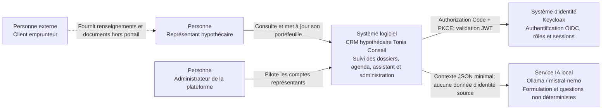

# C4 niveau 1 — Contexte du système

Le CRM permet aux représentants hypothécaires de piloter clients, dossiers,
parcours, documents attendus, tâches, agenda et assistant conversationnel. Les
administrateurs gèrent les comptes et accès des représentants.

## Frontière du système

Keycloak et Ollama sont opérés avec la plateforme mais restent des systèmes
spécialisés. Le client emprunteur n’a actuellement aucun accès direct au CRM.
Google Drive et Gmail apparaissent dans des workflows de transcription
historiques; ils ne sont pas requis par le parcours CRM de production.
