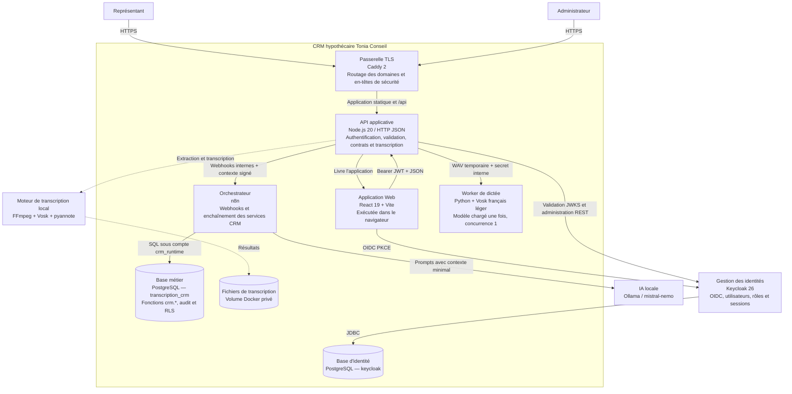

# C4 niveau 2 — Conteneurs

Les flèches représentent les communications autorisées. Les traits pointillés
indiquent une fonction spécialisée ou une intégration interne, pas un accès
public.

## Responsabilités et frontières

| Conteneur | Responsabilité principale | Exposition |
|---|---|---|
| Caddy | Terminaison TLS et reverse proxy | Seul service publié sur `80/443` |
| Application Web | Expérience représentant et administration | Servie par le conteneur API |
| API Node.js | Frontière de confiance et contrats HTTP | Via `crm.toniaconseil.com` |
| Keycloak | Identité, rôles `representant`/`admin`, sessions | Via `auth.toniaconseil.com`; console admin bloquée publiquement |
| n8n | Orchestration déterministe et IA | Webhooks privés; éditeur via domaine protégé |
| PostgreSQL | Données métier, fonctions de service, RLS et identité | Réseau Docker privé uniquement |
| Ollama | Génération locale non autoritative | Réseau Docker privé uniquement |
| Transcription | FFmpeg, Vosk et diarisation optionnelle | Appel interne au processus API |
| Worker de dictée | Reconnaissance courte, locale et séquentielle | Réseau Docker privé uniquement |
