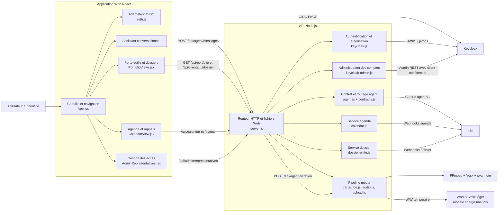
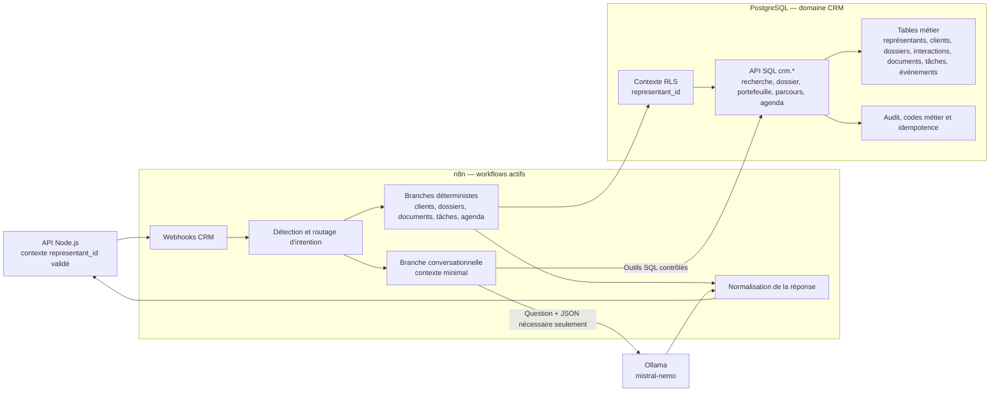

# C4 niveau 3 — Composants

## Application Web et API

## Orchestration et données métier

La logique métier demeure dans les fonctions SQL versionnées. n8n orchestre et
formate; Ollama ne décide ni de l’identité ni de l’autorisation.
