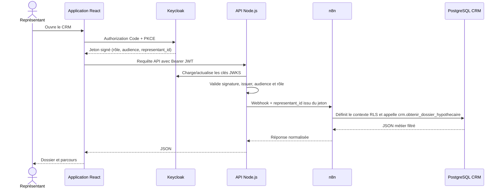
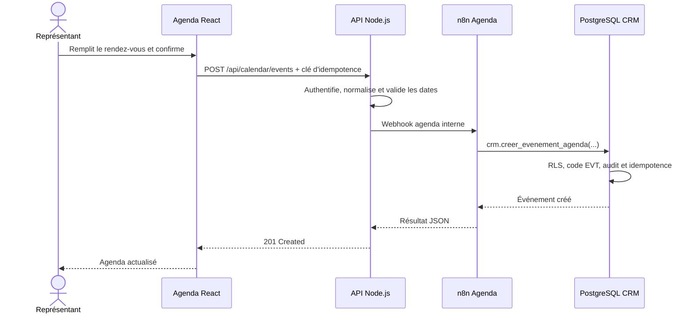
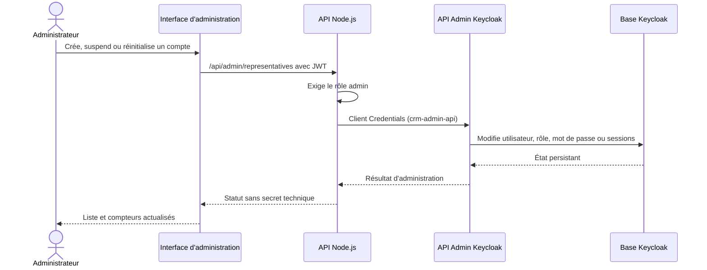
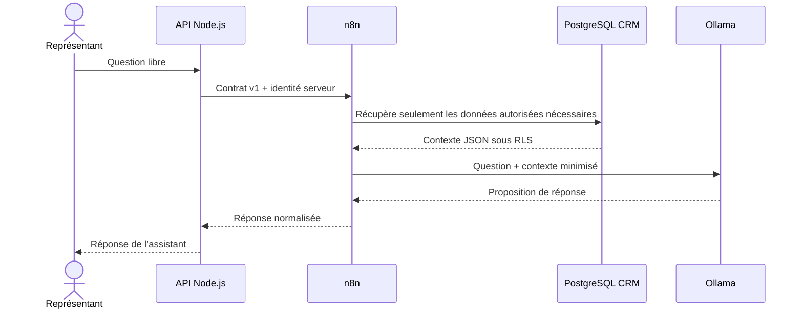

# Vues dynamiques C4

## 1. Connexion et consultation d’un dossier

```mermaid
sequenceDiagram
    actor R as Représentant
    participant W as Application React
    participant K as Keycloak
    participant A as API Node.js
    participant N as n8n
    participant P as PostgreSQL CRM

    R->>W: Ouvre le CRM
    W->>K: Authorization Code + PKCE
    K-->>W: Jeton signé (rôle, audience, representant_id)
    W->>A: Requête API avec Bearer JWT
    A->>K: Charge/actualise les clés JWKS
    A->>A: Valide signature, issuer, audience et rôle
    A->>N: Webhook + representant_id issu du jeton
    N->>P: Définit le contexte RLS et appelle crm.obtenir_dossier_hypothecaire
    P-->>N: JSON métier filtré
    N-->>A: Réponse normalisée
    A-->>W: JSON
    W-->>R: Dossier et parcours
```

## 2. Création d’un rendez-vous

```mermaid
sequenceDiagram
    actor R as Représentant
    participant W as Agenda React
    participant A as API Node.js
    participant N as n8n Agenda
    participant P as PostgreSQL CRM

    R->>W: Remplit le rendez-vous et confirme
    W->>A: POST /api/calendar/events + clé d'idempotence
    A->>A: Authentifie, normalise et valide les dates
    A->>N: Webhook agenda interne
    N->>P: crm.creer_evenement_agenda(...)
    P->>P: RLS, code EVT, audit et idempotence
    P-->>N: Événement créé
    N-->>A: Résultat JSON
    A-->>W: 201 Created
    W-->>R: Agenda actualisé
```

## 3. Gestion d’un accès représentant

```mermaid
sequenceDiagram
    actor D as Administrateur
    participant W as Interface d'administration
    participant A as API Node.js
    participant K as API Admin Keycloak
    participant I as Base Keycloak

    D->>W: Crée, suspend ou réinitialise un compte
    W->>A: /api/admin/representatives avec JWT
    A->>A: Exige le rôle admin
    A->>K: Client Credentials (crm-admin-api)
    K->>I: Modifie utilisateur, rôle, mot de passe ou sessions
    I-->>K: État persistant
    K-->>A: Résultat d'administration
    A-->>W: Statut sans secret technique
    W-->>D: Liste et compteurs actualisés
```

## 4. Question libre à l’assistant

```mermaid
sequenceDiagram
    actor R as Représentant
    participant A as API Node.js
    participant N as n8n
    participant P as PostgreSQL CRM
    participant O as Ollama

    R->>A: Question libre
    A->>N: Contrat v1 + identité serveur
    N->>P: Récupère seulement les données autorisées nécessaires
    P-->>N: Contexte JSON sous RLS
    N->>O: Question + contexte minimisé
    O-->>N: Proposition de réponse
    N-->>A: Réponse normalisée
    A-->>R: Réponse de l’assistant
```
