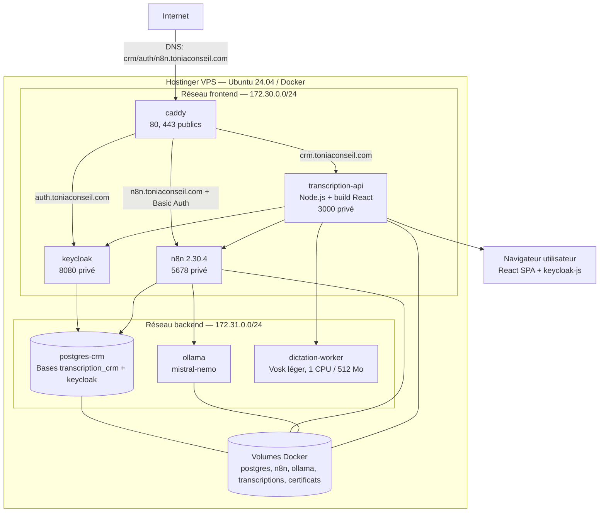
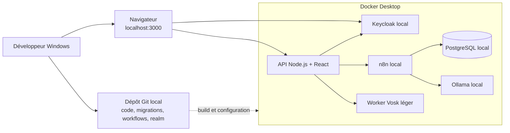

# Vues de déploiement C4

## Production — Hostinger VPS

Seul Caddy publie des ports sur l’hôte. La console `/admin` de Keycloak est
bloquée par le proxy public; l’administration applicative utilise le canal
serveur privé.

## Développement local

La topologie locale reproduit les frontières essentielles de production, mais
les noms DNS, certificats, secrets et volumes sont propres à chaque environnement.
