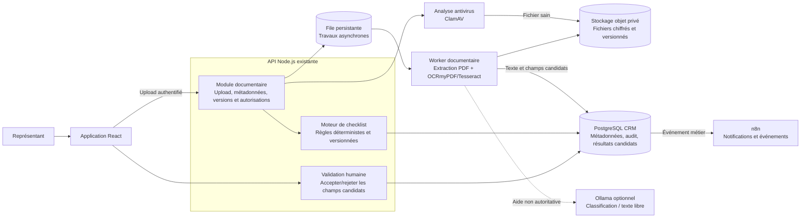

# Architecture cible — Gestion documentaire et OCR

> **Statut : cible acceptée, non déployée.** Cette vue ne décrit pas l’état
> actuel de la production. Elle matérialise l’ADR-006.

## Invariants de la cible

- Les fichiers ne sont pas stockés dans PostgreSQL.
- Aucun document n’est traité avant contrôle antivirus.
- Les résultats OCR et IA sont des candidats jusqu’à validation humaine.
- Le moteur de checklist est déterministe; Ollama reste facultatif.
- Les accès suivent la même identité Keycloak et la même isolation par
  représentant que le reste du CRM.
- La file rend l’OCR asynchrone et permet de séparer le worker sans changer le
  contrat Web.

## Éléments à décider avant réalisation

1. Produit de stockage objet et politique de chiffrement/rétention.
2. Technologie de file persistante et stratégie de reprise.
3. Limites de taille, formats acceptés et durée de conservation.
4. Capacité CPU du worker OCR et fenêtre de traitement.
5. Événements n8n autorisés et informations minimales transportées.
