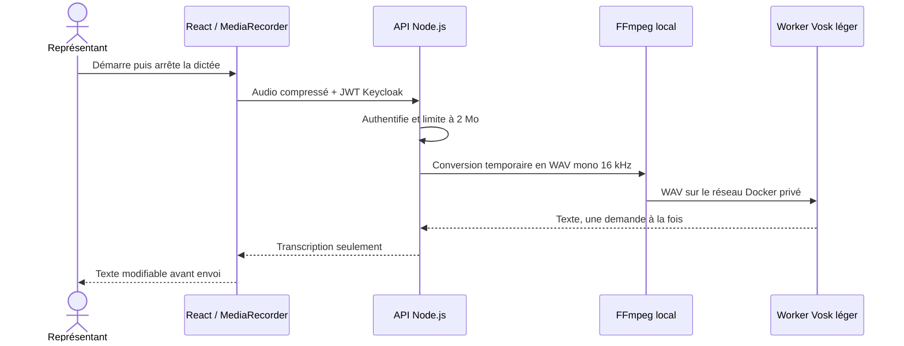

# Dictée vocale locale de l’assistant

## Statut

La première version est intégrée au code local. Elle capte une instruction
courte dans le navigateur, la transcrit sur le serveur privé et place le texte
dans le compositeur. Elle ne transmet jamais automatiquement le texte à
l’agent.

## Flux

## Budget de ressources

- enregistrement maximal dans le navigateur : 30 secondes;
- durée maximale vérifiée par le worker : 35 secondes;
- fichier reçu par l’API : 2 Mo au maximum;
- worker : un cœur CPU, 512 Mo de mémoire et une seule transcription active;
- file API : trois demandes, surcharge refusée avec HTTP 429;
- modèle : `vosk-model-small-fr-0.22`, chargé une seule fois au démarrage;
- diarisation et Ollama : non utilisés;
- audio et WAV : répertoire temporaire supprimé après chaque tentative.

## Précision de la reconnaissance

Le navigateur enregistre la voix en mono à 64 kbit/s et demande une capture à
48 kHz. Avant la reconnaissance, FFmpeg ramène le signal à 16 kHz, atténue le
bruit constant, filtre les fréquences hors de la voix et normalise le volume.
Vosk calcule jusqu’à trois hypothèses dans une seule passe; le worker privilégie
ensuite, à confiance comparable, celle qui contient le vocabulaire courant du
CRM hypothécaire.

Ce réglage conserve le modèle français léger et ne charge aucun second modèle.
Les noms propres rares et les montants doivent toujours être relus avant
l’envoi.

## Fonctionnement sans Internet

À l’exécution, la chaîne n’appelle aucun fournisseur externe. Les images Docker
et le modèle Vosk doivent être construits ou importés avant l’isolement du
réseau. Le navigateur doit conserver un accès réseau au CRM et à Keycloak. En
production, HTTPS demeure requis pour obtenir la permission du microphone.

## Sécurité

- `POST /api/agent/dictation` exige un jeton de représentant valide;
- le navigateur ne choisit ni commande, ni chemin, ni modèle;
- le worker n’expose aucun port sur l’hôte;
- l’API et le worker utilisent un secret partagé;
- seuls les types audio autorisés sont acceptés;
- aucun chemin interne ou fichier audio n’est retourné;
- la politique HTTP autorise le microphone pour l’origine CRM et désactive la
  caméra.

## Configuration

| Variable | Valeur de référence |
|---|---|
| `DICTATION_WORKER_URL` | `http://dictation-worker:2701` |
| `DICTATION_WORKER_TOKEN` | secret aléatoire propre à l’environnement |
| `DICTATION_MAX_UPLOAD_MB` | `2` |
| `DICTATION_MAX_PENDING` | `3` |
| `DICTATION_TIMEOUT_MS` | `45000` |

## Validation fonctionnelle

1. Autoriser le microphone dans le navigateur.
2. Dicter une instruction de moins de 30 secondes.
3. Arrêter avec le carré ou attendre l’arrêt automatique.
4. Vérifier que le texte apparaît sans être envoyé.
5. Corriger les noms propres ou montants au besoin, puis envoyer.
6. Refuser la permission et vérifier qu’un message explicite apparaît.
7. Couper l’accès Internet tout en conservant le réseau local, puis répéter le
   scénario.
