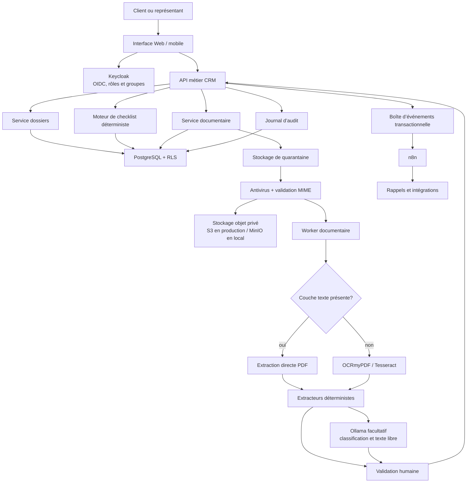

# Gestion documentaire et OCR

**Statut :** architecture cible approuvée pour développement incrémental  
**Dernière mise à jour :** 2026-08-25

## Objectif

Ajouter au CRM une collecte documentaire complète, reliée aux demandeurs et au
parcours hypothécaire, sans rendre Ollama nécessaire à la lecture des documents.
La plateforme doit distinguer quatre opérations :

1. déterminer les documents applicables avec des règles métier;
2. recevoir et sécuriser les fichiers;
3. transformer les PDF ou images en texte;
4. extraire des données candidates, puis les faire valider par un humain.

La checklist métier issue du processus québécois est détaillée dans
[`checklist-documents-hypothecaires.md`](./checklist-documents-hypothecaires.md).

## Architecture cible



## Décisions structurantes

- L’API métier autorise les opérations et applique les transitions de statut.
- Le moteur de checklist est déterministe, versionné et explicable.
- n8n orchestre les rappels et intégrations; il ne décide ni de l’accès ni de
  la conformité d’un document.
- L’OCR ne dépend pas d’Ollama. Un PDF textuel est extrait directement; une
  numérisation passe par OCRmyPDF/Tesseract.
- Ollama intervient seulement pour une classification ambiguë, une lettre en
  texte libre ou une suggestion d’extraction. Il ne valide jamais un document.
- Les fichiers binaires ne sont pas stockés dans PostgreSQL. La base conserve
  les métadonnées, les statuts, les empreintes et l’audit.
- Seules les données validées par un humain alimentent les champs officiels du
  dossier.

## Modèle de données cible

### `catalogue_types_documents`

Décrit un type stable tel que `LETTRE_EMPLOI`, `T4`,
`RELEVE_BANCAIRE_90_JOURS` ou `PROMESSE_ACHAT`.

Champs principaux : code, nom, catégorie, étape du parcours, niveau de
confidentialité, durée de validité et nombre attendu.

### `regles_documents`

Versionne les conditions d’application selon le type d’emploi, la transaction,
le type de propriété, la provenance de la mise de fonds, le prêteur et le profil
du participant. Les conditions peuvent être représentées en JSON, mais doivent
être évaluées par du code testé et non par un prompt.

### `checklist_dossier`

Matérialise les exigences d’un dossier et les relie à `dossier_id`, `client_id`
et, si nécessaire, `participant_id`. Une ligne conserve le document attendu,
la règle source, la période, l’échéance, le motif et le statut.

Statuts autorisés :

```text
A_FOURNIR
RECU
EN_ANALYSE
ACCEPTE
REFUSE
EXPIRE
NON_APPLICABLE
```

### `fichiers_documents`

Conserve la version, le nom original, le type MIME détecté, la taille,
l’empreinte SHA-256, la clé de stockage, le résultat antivirus et l’auteur du
téléversement. Une checklist peut avoir plusieurs versions de fichier.

### `extractions_documents`

Conserve pour chaque champ candidat : valeur, méthode, page, extrait source,
confiance, moteur et version. Les suggestions ne remplacent pas la donnée CRM
avant validation.

### `validations_documents` et `journal_audit`

Enregistrent les acceptations, corrections et refus ainsi que l’acteur,
l’horodatage, la ressource, l’adresse IP et le contexte de la décision.

## API cible

```http
POST   /api/dossiers/{code}/checklist/generate
GET    /api/dossiers/{code}/documents
POST   /api/dossiers/{code}/documents/upload-url
POST   /api/documents/{id}/complete-upload
GET    /api/documents/{id}/status
GET    /api/documents/{id}/download-url
POST   /api/documents/{id}/analyze
POST   /api/documents/{id}/validate
POST   /api/documents/{id}/reject
DELETE /api/documents/{id}
```

Les routes reçoivent le code métier du dossier. Le serveur établit le
`representant_id` depuis le JWT et applique la RLS; le navigateur ne transmet
jamais un identifiant de représentant faisant autorité.

## Pipeline asynchrone

1. L’API vérifie le JWT, le rôle et l’accès au dossier.
2. Elle émet une URL de téléversement courte durée vers la quarantaine.
3. Le fichier est contrôlé : taille, MIME réel, format, SHA-256 et antivirus.
4. Le fichier conforme est déplacé dans le stockage privé.
5. Le worker extrait la couche texte ou exécute l’OCR.
6. Les extracteurs déterministes produisent des champs candidats.
7. Ollama peut compléter les cas ambigus avec un JSON sous contrat.
8. Le représentant accepte, corrige ou refuse les résultats.
9. L’API publie un événement; n8n peut envoyer un rappel ou une notification.

L’API répond rapidement avec `ANALYSE_EN_COURS`; elle n’attend pas la fin de
l’OCR ou d’Ollama dans la requête de téléversement.

## Sécurité et vie privée

- stockage objet privé, chiffré et versionné;
- liens de téléchargement signés et à courte durée;
- antivirus avant mise à disposition;
- journalisation de toute consultation, validation et suppression;
- RLS sur toutes les métadonnées documentaires;
- sauvegardes chiffrées hors du VPS;
- politique de conservation et suppression logique auditée;
- NAS, numéros de comptes et pièces d’identité masqués avant un prompt;
- aucun secret, NAS ou contenu documentaire dans les logs n8n;
- Ollama n’obtient que les pages et champs nécessaires.

Le NAS ne doit pas être ajouté dans un champ libre. Si sa conservation devient
nécessaire, elle exige un stockage chiffré ou tokenisé, un affichage masqué et un
audit renforcé à valider avec le responsable de la conformité.

## Local et production

Le contrat de l’API et le `compose.yml` restent communs. Seule la configuration
change :

| Besoin | Local | Production |
|---|---|---|
| Stockage objet | MinIO | Fournisseur S3 privé externe recommandé |
| OCR | Worker Docker | Même image et mêmes versions |
| Antivirus | ClamAV Docker | ClamAV Docker |
| Ollama | Facultatif | Facultatif et limité |
| Secrets | `.env` local non versionné | Gestionnaire de secrets / fichier `600` |

## Déploiement incrémental

1. Catalogue, règles et checklist sans fichiers.
2. Téléversement, stockage, antivirus et versionnement.
3. Extraction PDF et OCR avec validation humaine.
4. Événements, rappels n8n et portes documentaires du parcours.
5. Classification et extraction Ollama pour les cas non déterministes.

Chaque phase doit fonctionner si Ollama est indisponible.
